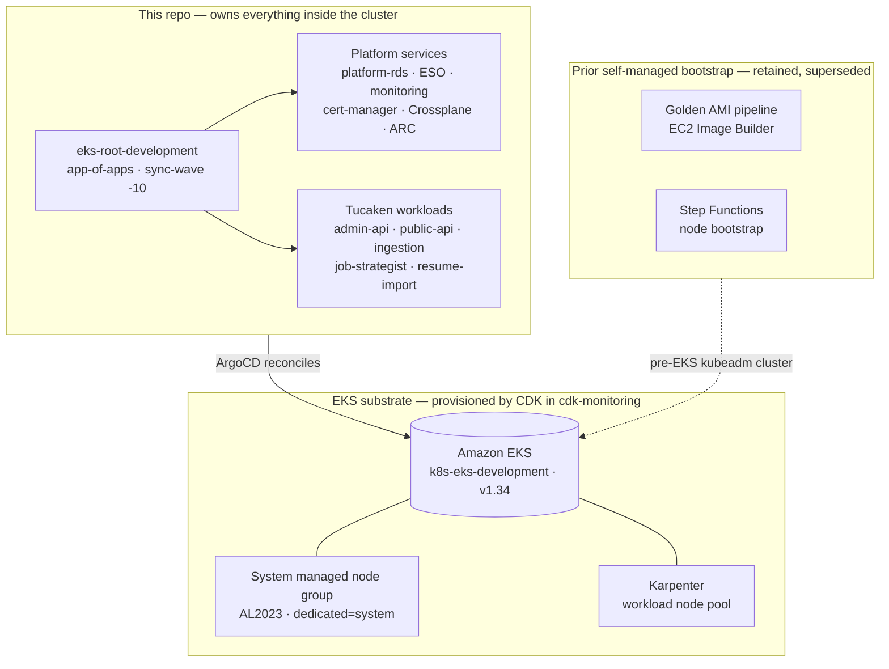

# kubernetes-bootstrap

**The Kubernetes platform layer for [Tucaken](https://tucaken.io) — a SaaS that
turns a developer's real code into a job-tailored, evidence-backed resume.** A
job-seeker connects their GitHub account; Tucaken verifies which skills they can
prove from their repositories and generates a resume tailored to a specific role
using only defensible skills.

**This repo's role:** it owns everything that runs *inside* the cluster — the
ArgoCD GitOps tree and every in-cluster service (database access, secrets,
observability, ingress) plus the Tucaken backend workloads. The product runs on a
**managed Amazon EKS** cluster (`k8s-eks-development`, Kubernetes 1.34, eu-west-1,
verified live on 2026-06-16); the EKS control plane and node infrastructure are
provisioned by AWS CDK in the sibling `cdk-monitoring` repo, while this repo is
the source of truth for what ArgoCD reconciles onto it. The AI/ML backend lives
in `ai-applications`; the web app and authenticated API live in `tucaken-app`.

[](https://github.com/Nelson-Lamounier/kubernetes-bootstrap/actions/workflows/ci.yml)

## What it does

ArgoCD, bootstrapped onto the EKS cluster, reconciles an app-of-apps tree from
`argocd-apps/eks/development/` — the platform services (PgBouncer data tier,
External Secrets, the LGTM observability stack, cert-manager, Crossplane,
ARC runners) and the Tucaken backend workloads (admin-api, public-api, ingestion,
job-strategist, resume-import, and more). Nodes are split into a **system managed
node group** (AL2023, pinned by the `dedicated=system:NoSchedule` taint so
platform pods land there) and a **Karpenter-provisioned workload pool** that
scales application nodes on demand
([charts/argocd-eks/values.yaml](charts/argocd-eks/values.yaml); node group and
running nodes verified live on 2026-06-16).

The repository also retains a complete **self-managed kubeadm bootstrap stack** in
`infra/` and `sm-a/` — a golden-AMI pipeline and an event-driven Step Functions
node bootstrap — from the architecture that ran before the migration to managed
EKS. It is documented below as prior work; the live cluster is EKS.

## Why this exists

The platform layer is owned in-repo, rather than left to managed defaults, so the
parts that matter for this product stay under version control and review: a single
connection-pooled database ingress shared across every service, a full self-hosted
observability stack, GitOps-driven progressive delivery, and developer-facing AWS
resource abstractions via Crossplane. Splitting ownership — CDK provisions the EKS
substrate in `cdk-monitoring`, this repo owns everything reconciled inside it —
keeps in-cluster changes as pure-git pull requests reviewed alongside the
manifests they affect.

## Highlights

- **GitOps app-of-apps on managed EKS** — ArgoCD reconciles the entire platform
  and workload set from `argocd-apps/eks/development/`; a root app
  (`sync-wave: -10`) seeds every other Application, and ArgoCD Image Updater
  git-writes new ECR tags back so CI image pushes auto-promote
  ([argocd-apps/eks/root-app-development.yaml](argocd-apps/eks/root-app-development.yaml)).
- **Shared connection-pooled data tier** — every pod reaches RDS PostgreSQL only
  through an in-cluster PgBouncer pooler (transaction mode), and an idempotent
  ArgoCD PostSync Job pipeline keeps the schema current on every sync
  ([docs/projects/platform-rds-data-tier.md](docs/projects/platform-rds-data-tier.md)).
- **Full LGTM observability stack as one custom Helm chart** — Prometheus v3.3.0,
  Grafana 11.6.0, Loki 3.5.0, Tempo v2.7.2, Grafana Alloy v1.8.2, Pyroscope
  1.13.0, node-exporter, and kube-state-metrics, on a dedicated tainted node pool
  ([charts/monitoring/chart/](charts/monitoring/chart/)).
- **Crossplane golden-path platform abstractions** — `XEncryptedBucket` and
  `XMonitoredQueue` XRDs expose production-ready S3 and SQS as developer-facing
  Kubernetes CRDs; each claim composes several Crossplane managed resources
  automatically
  ([charts/crossplane-xrds/chart/templates/](charts/crossplane-xrds/chart/templates/)).
- **Prior self-managed bootstrap, retained** — a content-hash driven golden-AMI
  pipeline (EC2 Image Builder) and an event-driven Step Functions node bootstrap
  (`EC2InstanceLaunchSuccessful` to a router Lambda to an SSM poll loop) ran the
  pre-EKS kubeadm cluster, and a TypeScript orchestrator seeded ArgoCD across 20+
  idempotent steps
  ([infra/lib/constructs/ssm/bootstrap-orchestrator.ts](infra/lib/constructs/ssm/bootstrap-orchestrator.ts),
  [sm-a/argocd/bootstrap_argocd.ts](sm-a/argocd/bootstrap_argocd.ts)).

## Architecture



ArgoCD runs on the EKS system nodes and reconciles `argocd-apps/eks/development/`
onto the cluster. CDK in the sibling `cdk-monitoring` repo owns the EKS control
plane, the system managed node group, and Karpenter; this repo owns the GitOps
tree and every in-cluster manifest. The golden-AMI and Step Functions stacks in
`infra/` and `sm-a/` bootstrapped the earlier self-managed kubeadm cluster and are
kept for reference.

## Tech stack

**Cluster (live):** Amazon EKS 1.34 (`k8s-eks-development`, eu-west-1, platform
`eks.24`), AL2023 system managed node group, Karpenter workload autoscaling, AWS
Load Balancer Controller (ALB) ingress.

**GitOps:** ArgoCD, app-of-apps, Argo Rollouts Blue/Green, ArgoCD Image Updater,
ArgoCD Notifications.

**Data tier:** AWS RDS PostgreSQL, PgBouncer connection pooler, idempotent DDL
migration Jobs ([docs/projects/platform-rds-data-tier.md](docs/projects/platform-rds-data-tier.md)).

**Secret management:** External Secrets Operator, Stakater Reloader, AWS Secrets
Manager, AWS SSM Parameter Store.

**Certificate management:** cert-manager, Let's Encrypt ACME certificates.

**Observability:** Prometheus v3.3.0, Grafana 11.6.0, Loki 3.5.0, Tempo v2.7.2,
Grafana Alloy v1.8.2, Pyroscope 1.13.0, Promtail v3.5.0, node-exporter,
kube-state-metrics, Steampipe (AWS cost visibility).

**Platform engineering:** Crossplane, `XEncryptedBucket` XRD, `XMonitoredQueue`
XRD, OpenCost.

**Prior self-managed bootstrap (CDK, TypeScript):** AWS EC2 Image Builder, AWS
Step Functions, AWS SSM Automation and Run Command, AWS EventBridge, AWS Lambda,
AWS CDK v2, cdk-nag, kubeadm, Calico CNI — the pre-EKS architecture, retained in
`infra/` and `sm-a/`.

**Language and toolchain:** TypeScript, tsx, Yarn v4 workspaces, Python, Vitest,
Ruff, ESLint, GitHub Actions (12 workflows), just.

## Key design decisions

- **Single connection-pooled database ingress** — all pods connect to PgBouncer,
  never RDS directly; bootstrap and migration Jobs bypass the pooler because it
  may not be Ready on first deploy
  ([docs/projects/platform-rds-data-tier.md](docs/projects/platform-rds-data-tier.md)).
- **Grafana datasource on the master user, with documented debt** — the read-only
  `grafana_ro` role fails SASL auth through PgBouncer, so the observability
  datasource stays on `postgres` until PgBouncer is configured to authenticate it
  ([docs/decisions/grafana-datasource-bypasses-pgbouncer.md](docs/decisions/grafana-datasource-bypasses-pgbouncer.md)).
- **Split ownership of the EKS substrate vs in-cluster state** — CDK in
  `cdk-monitoring` provisions EKS; this repo owns everything ArgoCD reconciles, so
  in-cluster changes are pure-git
  ([charts/argocd-eks/values.yaml](charts/argocd-eks/values.yaml)).
- **Prometheus over CloudWatch EMF for cache observability**
  ([docs/decisions/cache-observability-prometheus-over-emf.md](docs/decisions/cache-observability-prometheus-over-emf.md)).

## Repository structure

```text
charts/         21 Helm charts — platform services and Tucaken workloads
argocd-apps/    ArgoCD app-of-apps (eks/<env> tree is active; top-level is legacy kubeadm)
gitops/         Raw manifests — DR, cert-manager, ARC, notifications
infra/          CDK app — golden AMI + SSM automation (prior self-managed bootstrap)
sm-a/           TypeScript bootstrap orchestrator (prior self-managed bootstrap)
scripts/        TypeScript CD tooling — bootstrap trigger, observe, smoke tests
docs/           Concept, decision, runbook, troubleshooting, and project docs
.github/        12 CI/CD workflows
justfile        Operational entry point — cluster health, AMI build, lint, build
```

## Running locally

```bash
yarn install            # Yarn 4 workspaces (infra, scripts, sm-a/argocd)
yarn build              # build all workspaces
yarn test               # Vitest
yarn synth              # cdk synth the infra app (prior self-managed bootstrap)
helm template platform-rds charts/platform-rds/chart \
  -f charts/platform-rds/chart/values-development.yaml   # render a chart
```

`just` is the operational entry point — run `just` to list recipes (cluster
health, lint, typecheck, build, secret bootstrap).

## Deploying

Platform and workload changes deploy by committing to `argocd-apps/eks/development/`
and the charts they reference; ArgoCD reconciles them onto the EKS cluster, and
ArgoCD Image Updater promotes new ECR image tags by writing them back to Git. The
EKS substrate itself is managed by CDK in the sibling `cdk-monitoring` repo. See
[docs/runbooks/](docs/runbooks/) for operational procedures, including
[argocd-on-eks.md](docs/runbooks/argocd-on-eks.md).

## Related projects

| Repository | Role |
| --- | --- |
| `cdk-monitoring` | Provisions the Amazon EKS substrate (control plane, system node group, Karpenter) and bootstraps ArgoCD onto it |
| `ai-applications` | The AI/ML backend — GitHub ingestion, skill-evidence extraction, JD-strategist, multi-agent Bedrock resume synthesis |
| `tucaken-app` | The user-facing web app, dashboard, and authenticated API |
| `kubernetes-bootstrap` (this repo) | The in-cluster GitOps platform and workloads ArgoCD reconciles onto EKS |

## License

MIT — see [pyproject.toml](pyproject.toml).

<!--
Evidence trail (auto-generated):
- Live: aws eks describe-cluster --name k8s-eks-development (run on 2026-06-16, profile dev-account)
    -> version 1.34, status ACTIVE, platform eks.24, eu-west-1
- Live: aws eks describe-nodegroup SystemMng (run on 2026-06-16) -> AL2023, t3.large, min1/max3
- Live: aws ec2 describe-instances (run on 2026-06-16) -> running nodes k8s-eks-system / k8s-eks-workload only; no kubeadm bootstrap-role instances
- Source: charts/argocd-eks/values.yaml (read on 2026-06-16) — repo owns in-cluster; CDK owns substrate; Karpenter + system MNG
- Source: argocd-apps/eks/root-app-development.yaml (read on 2026-06-16)
- Source: ai-applications/README.md, ai-applications/CLAUDE.md (read on 2026-06-16) — product pitch + README authoring rules
- Source: charts/monitoring/chart/values.yaml (read on 2026-06-16) — observability versions
- Source: charts/platform-rds/chart/templates/ (read on 2026-06-16) — data tier
- Source: infra/ + sm-a/ (prior self-managed kubeadm bootstrap, retained)
-->
