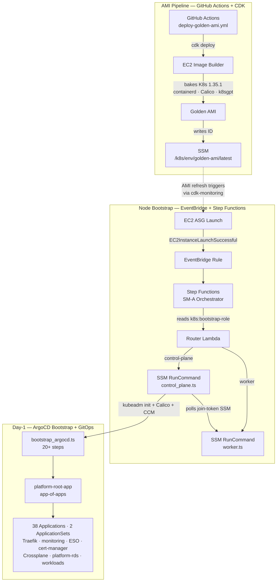

# kubernetes-bootstrap

Self-managed Kubernetes 1.35.1 on AWS EC2 — golden AMI pipeline, event-driven node bootstrap via AWS Step Functions, and GitOps-managed platform stack via ArgoCD.

[](https://github.com/Nelson-Lamounier/kubernetes-bootstrap/actions/workflows/ci.yml)

## What it does

This repository bootstraps and operates a kubeadm-based Kubernetes cluster on self-managed EC2 instances. It provisions golden AMIs via AWS EC2 Image Builder, orchestrates node bootstrap (control-plane init and worker join) through an AWS Step Functions state machine triggered by EC2 launch events, and seeds ArgoCD to take over all day-2 operations via GitOps. Once bootstrap completes, ArgoCD manages 40 platform and workload applications from this Git repository.

## Why this exists

EKS removes the bootstrap orchestration problem but adds cost and reduces control — particularly for custom CNI (Calico with VXLAN encapsulation), a custom ingress tier (Traefik v3 as a DaemonSet with `hostNetwork: true` for single-node EIP failover), and platform engineering abstractions (Crossplane XRDs for developer-facing AWS resource APIs). This repository builds the bootstrap layer from scratch: the CDK stack that bakes the Kubernetes toolchain into an AMI, the Step Functions state machine that routes ASG launch events to the correct bootstrap script, and the TypeScript orchestrator that installs ArgoCD and seeds the app-of-apps in 20+ sequential, idempotent steps — each reporting status to SSM for live observability without a management cluster.

Self-managed kubeadm also enables capabilities that EKS complicates: etcd snapshots to S3 on a systemd timer, k8sgpt baked into the AMI for AI-assisted cluster diagnostics, and full control over node taints and pool topology for workload isolation.

## Highlights

- **Event-driven bootstrap with zero manual steps** — EventBridge fires on `EC2InstanceLaunchSuccessful`, a Lambda router resolves the ASG's `k8s:bootstrap-role` tag, and the Step Functions state machine runs the correct SSM RunCommand script (`control_plane.ts` or `worker.ts`) then polls for completion every 30 s rather than sleeping a fixed interval ([`infra/lib/constructs/ssm/bootstrap-orchestrator.ts`](infra/lib/constructs/ssm/bootstrap-orchestrator.ts))
- **Content-hash driven golden AMI pipeline** — EC2 Image Builder bakes Kubernetes 1.35.1, containerd 1.7.24, Calico v3.29.3, and k8sgpt v0.4.31 into a versioned AMI; a SHA-256 hash of the entire `sm-a/` source tree drives CDK invalidation so AMI rebuilds trigger automatically on code changes ([`infra/lib/stacks/golden-ami-stack.ts`](infra/lib/stacks/golden-ami-stack.ts))
- **Full LGTM observability stack as a single custom Helm chart** — Prometheus v3.3.0, Grafana 11.6.0, Loki 3.5.0, Tempo v2.7.2, Alloy v1.8.2, node-exporter v1.9.1, kube-state-metrics v2.15.0, a GitHub Actions exporter, and Steampipe for AWS cost visibility — all on a dedicated tainted node pool ([`charts/monitoring/chart/`](charts/monitoring/chart/))
- **Crossplane golden-path platform abstractions** — `XEncryptedBucket` and `XMonitoredQueue` XRDs expose production-ready S3 (SSE, versioning, public-access-block, lifecycle) and SQS as developer-facing Kubernetes CRDs; each claim composes 4–5 Crossplane managed resources automatically ([`charts/crossplane-xrds/chart/templates/`](charts/crossplane-xrds/chart/templates/))
- **Blue/Green progressive delivery on all production workloads** — admin-api, nextjs, and start-admin use Argo Rollouts Blue/Green with AnalysisTemplates; ArgoCD Image Updater writes new ECR image tags back to Git automatically via a write-enabled deploy key ([`charts/admin-api/chart/templates/rollout.yaml`](charts/admin-api/chart/templates/rollout.yaml))
- **20+ step ArgoCD bootstrap in TypeScript** — `sm-a/argocd/bootstrap_argocd.ts` installs ArgoCD, restores the signing key, seeds the app-of-apps, injects Helm parameters, provisions Crossplane and ARC credentials, configures the CI bot, and backs up TLS certificates — each step logging status to SSM for external observability ([`sm-a/argocd/bootstrap_argocd.ts`](sm-a/argocd/bootstrap_argocd.ts))

## Architecture



The AMI pipeline ([`infra/lib/stacks/golden-ami-stack.ts`](infra/lib/stacks/golden-ami-stack.ts)) bakes the full Kubernetes toolchain into an AMI and writes the resulting ID to SSM, where it feeds an AMI refresh state machine in the sibling `cdk-monitoring` repo. On EC2 launch, EventBridge routes to the Step Functions orchestrator ([`infra/lib/constructs/ssm/bootstrap-orchestrator.ts`](infra/lib/constructs/ssm/bootstrap-orchestrator.ts)) which executes the TypeScript bootstrap scripts baked into the AMI at `/opt/k8s-bootstrap/`. Control-plane bootstrap ends with `bootstrap_argocd.ts` ([`sm-a/argocd/`](sm-a/argocd/)), which seeds the app-of-apps and hands all further reconciliation to ArgoCD.

## Tech stack

**Cluster:** Kubernetes 1.35.1 · kubeadm · containerd 1.7.24 · Calico v3.29.3 (VXLAN) · AWS Cloud Controller Manager · AWS EBS CSI driver

**Ingress:** Traefik v3 (Helm chart 36.x) — DaemonSet + `hostNetwork: true`, IP allowlist middleware, rate limit middleware, basicauth middleware

**Bootstrap infrastructure (CDK TypeScript):** AWS EC2 Image Builder · AWS Step Functions · AWS SSM Automation + Run Command · AWS EventBridge · AWS Lambda · AWS CDK v2 · cdk-nag

**GitOps:** ArgoCD · 38 Applications · 2 ApplicationSets · Argo Rollouts Blue/Green · ArgoCD Image Updater · ArgoCD Notifications

**Secret management:** External Secrets Operator v~0.10.0 · Stakater Reloader · AWS Secrets Manager · AWS SSM Parameter Store

**Certificate management:** cert-manager v1.x · Let's Encrypt (90-day ACME certs)

**Observability:** Prometheus v3.3.0 · Grafana 11.6.0 · Loki 3.5.0 · Tempo v2.7.2 · Grafana Alloy v1.8.2 · Promtail v3.5.0 · node-exporter v1.9.1 · kube-state-metrics v2.15.0 · GitHub Actions Exporter v0.8.0 · Steampipe (AWS cost visibility)

**Platform engineering:** Crossplane v1.18.1 · XEncryptedBucket XRD · XMonitoredQueue XRD · cluster-autoscaler · PgBouncer (connection pooling) · Descheduler · OpenCost

**Disaster recovery:** etcd snapshots to S3 via systemd timer ([`gitops/dr/etcd-backup.sh`](gitops/dr/etcd-backup.sh))

**Language / toolchain:** TypeScript · tsx · Yarn v4 workspaces · Python 3.12 · Vitest · Ruff · ESLint · GitHub Actions (11 workflows) · just

## Key design decisions

- **SSM as cross-stack service registry** — all inter-stack references go through SSM parameters rather than CloudFormation exports, keeping stacks independently deployable and avoiding hard CloudFormation dependency chains ([`infra/lib/config/ssm-paths.ts`](infra/lib/config/ssm-paths.ts))
- **Step Functions poll loop instead of fixed sleep** — the CP→worker sequencing polls SSM for the join-token (40 × 30 s = 20-min ceiling) rather than sleeping a fixed interval; failure enrichment embeds a ready-to-paste `aws logs tail` command in the execution failure cause ([`infra/lib/constructs/ssm/bootstrap-orchestrator.ts`](infra/lib/constructs/ssm/bootstrap-orchestrator.ts))
- **Scripts baked into AMI + S3 sync override** — bootstrap scripts are baked at `/opt/k8s-bootstrap/` for version-locking; the SSM RunCommand syncs the full `sm-a/` tree from S3 at runtime to enable hot-fixes without a full AMI re-bake ([`infra/lib/stacks/ssm-automation-stack.ts`](infra/lib/stacks/ssm-automation-stack.ts))
- **PostSync patcher for runtime-only values** — IP CIDRs and CloudFront origin secrets cannot live in Git; PostSync hook Jobs read ESO-managed secrets and patch live resources; `RespectIgnoreDifferences` prevents ArgoCD selfHeal from reverting those patches ([`charts/monitoring/chart/templates/traefik/allowlist-patcher.yaml`](charts/monitoring/chart/templates/traefik/allowlist-patcher.yaml))
- **Content-hash driven AMI invalidation** — a SHA-256 hash of all `sm-a/` source files is embedded in the Image Builder component YAML; any source change produces a new hash, which changes the component version, which forces CDK to create a new `CfnImage` and trigger a re-bake ([`infra/lib/stacks/golden-ami-stack.ts`](infra/lib/stacks/golden-ami-stack.ts))

## Repository structure

```
.
├── infra/                 CDK TypeScript — Golden AMI stack, SSM Automation stack
│   └── lib/
│       ├── constructs/    Reusable L3 CDK constructs (Image Builder, Step Functions, SSM)
│       ├── stacks/        Stack entry points (GoldenAmiStack, K8sSsmAutomationStack)
│       └── config/        K8s version config, SSM path registry
├── sm-a/
│   ├── argocd/            TypeScript ArgoCD bootstrap orchestrator (20+ steps)
│   └── boot/              TypeScript node bootstrap steps (control_plane, worker)
├── argocd-apps/           38 Applications + 2 ApplicationSets (app-of-apps)
├── charts/                Custom Helm charts (monitoring, platform-rds, crossplane-xrds, workloads)
├── gitops/                Raw Kubernetes manifests (Calico PDBs, DR timer, ARC, priority classes)
├── scripts/               TypeScript CI/CD helpers (AMI log fetch, bootstrap trigger, smoke tests)
├── tests/                 Vitest test suite
├── docs/                  Architecture and operational docs
└── justfile               Task runner (synth, deploy, ssm-run, ami-build-logs, k8s-tunnel)
```

## Running locally

```bash
# Install all workspace dependencies (infra, scripts, sm-a/argocd)
yarn install

# Type-check all TypeScript workspaces
just typecheck

# Run tests
yarn test

# Lint
just lint

# Synthesise CDK (requires AWS context)
just synth development
```

## Deploying

Deployment is split across four purpose-built workflows:

| Workflow | Trigger | What it does |
|:---------|:--------|:-------------|
| [`deploy-golden-ami.yml`](.github/workflows/deploy-golden-ami.yml) | `workflow_dispatch` | CDK deploy → EC2 Image Builder bake → validate → optional promote to prod |
| [`deploy-ssm-automation.yml`](.github/workflows/deploy-ssm-automation.yml) | `workflow_dispatch` | Deploy Step Functions + SSM documents without AMI re-bake |
| [`deploy-full.yml`](.github/workflows/deploy-full.yml) | `workflow_dispatch` | Full stack deploy (AMI + SSM automation in sequence) |
| [`gitops-k8s.yml`](.github/workflows/gitops-k8s.yml) | `push` to `develop`/`main` | Validate Helm charts and manifests before ArgoCD auto-sync picks them up |

All AWS access uses OIDC (no long-lived credentials). CDK reads VPC ID from SSM before `cdk deploy` via `just synth`.

## Related projects

| Repository | Role |
|:-----------|:-----|
| [`cdk-monitoring`](https://github.com/Nelson-Lamounier/cdk-monitoring) | VPC, EC2 ASGs, Launch Templates, AMI refresh Step Functions — the compute layer this repo bootstraps |
| [`kubernetes-platform`](https://github.com/Nelson-Lamounier/kubernetes-platform) | Upstream Helm charts and ArgoCD app definitions (referenced but not in scope for this repo) |

## License

Private — Nelson Lamounier

<!--
Evidence trail (auto-generated):
- Source: infra/lib/config/kubernetes/configurations.ts (KUBERNETES_VERSION=1.35.1, containerd=1.7.24, calico=v3.29.3, k8sgpt=0.4.31)
- Source: infra/lib/constructs/ssm/bootstrap-orchestrator.ts (Step Functions state machine, poll loop, Router Lambda)
- Source: infra/lib/stacks/golden-ami-stack.ts (Image Builder, content hash, SSM outputs)
- Source: infra/lib/stacks/ssm-automation-stack.ts (SSM documents, bootstrap runner, timeout rationale)
- Source: sm-a/argocd/bootstrap_argocd.ts (20+ step ArgoCD bootstrap)
- Source: charts/monitoring/chart/values.yaml (Prometheus v3.3.0, Grafana 11.6.0, Loki 3.5.0, Tempo v2.7.2, Alloy v1.8.2, Promtail v3.5.0, node-exporter v1.9.1, kube-state-metrics v2.15.0, github-actions-exporter v0.8.0, Steampipe ECR image)
- Source: charts/crossplane-xrds/chart/templates/x-encrypted-bucket.yaml (XEncryptedBucket XRD + Composition)
- Source: charts/crossplane-xrds/chart/templates/x-monitored-queue.yaml (XMonitoredQueue XRD)
- Source: charts/admin-api/chart/templates/rollout.yaml (blueGreen strategy — no canary)
- Source: charts/nextjs/chart/templates/rollout.yaml (blueGreen strategy)
- Source: charts/start-admin/chart/templates/rollout.yaml (blueGreen strategy)
- Source: argocd-apps/ (38 Application manifests + 2 ApplicationSet manifests, counted)
- Source: argocd-apps/traefik.yaml (Helm chart targetRevision 36.*, hostNetwork DaemonSet confirmed)
- Source: charts/traefik/traefik-values.yaml (DaemonSet, hostNetwork: true, tolerations, Prometheus metrics, OTLP tracing)
- Source: argocd-apps/cert-manager.yaml (targetRevision v1.*)
- Source: charts/cert-manager-config/ops-certificate.yaml (Let's Encrypt, 90-day certs, letsencrypt ClusterIssuer)
- Source: argocd-apps/crossplane.yaml (targetRevision 1.18.1)
- Source: argocd-apps/external-secrets.yaml (targetRevision ~0.10.0)
- Source: gitops/dr/etcd-backup.sh (etcd backup to S3)
- Source: infra/lib/config/ssm-paths.ts (SSM as cross-stack registry)
- Source: charts/monitoring/chart/templates/traefik/allowlist-patcher.yaml (PostSync patcher pattern)
- Source: package.json (yarn workspaces: infra, scripts, sm-a/argocd)
- Source: justfile (task runner recipes verified)
- Anti-hallucination corrections: "30+ ApplicationSets" → 38 Applications + 2 ApplicationSets; "canary" → blue-green only (no canary strategy found)
- Generated: 2026-04-28
-->
