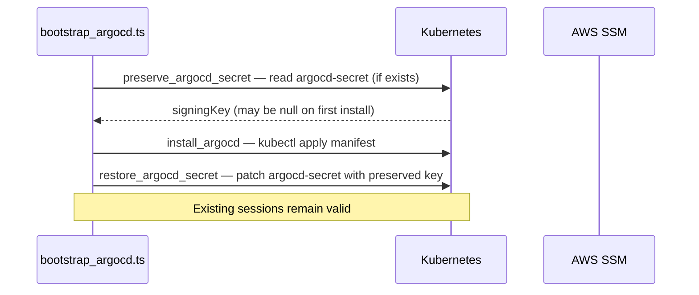

# ArgoCD Bootstrap Pattern

How `bootstrap_argocd.ts` seeds a GitOps-managed Kubernetes cluster from zero: preserving the OIDC signing key across re-installs, resolving CRD timing races through explicit pre-install ordering, and using non-fatal steps for eventual-consistency components.

## The bootstrap problem

Installing ArgoCD via `kubectl apply` on a fresh cluster is straightforward. The hard part is:

1. **Signing key continuity** — ArgoCD uses an internal OIDC signing key to issue session tokens. If the key changes between installs, all existing browser sessions are invalidated. On a production re-bootstrap (e.g., after a control plane replacement), losing the signing key forces every user to log in again — including CI bots.
2. **CRD timing races** — The app-of-apps applies 38 child Applications at once. Several of those Applications manage CRD installations (Traefik, cert-manager, ARC). If any Application's controller tries to create resources using those CRDs before the CRD-installing Application has synced, the controller crash-loops.
3. **Secret seeding before GitOps** — Secrets like Prometheus basic auth, ECR credentials, and Crossplane AWS credentials cannot live in Git. They must be seeded into the cluster before ArgoCD syncs the Applications that depend on them; if ArgoCD syncs first, pods crash-loop until the secret appears.

`bootstrap_argocd.ts` ([`sm-a/argocd/bootstrap_argocd.ts`](../../sm-a/argocd/bootstrap_argocd.ts)) solves all three.

## Signing key preservation

ArgoCD stores its OIDC signing key in the `argocd-secret` Secret in the `argocd` namespace. The key is generated once at install time and used to sign all session tokens. The bootstrap pattern preserves it across re-installs:



Step 5 (`preserve_argocd_secret`) reads the current signing key from the `argocd-secret` Secret **before** the `kubectl apply` that overwrites the manifest. Step 7 (`restore_argocd_secret`) patches the Secret **after** install to restore the preserved key. On a first-time install the key is null and ArgoCD generates a new one; on any subsequent install the key is preserved and sessions survive.

This is complemented by `backup_argocd_secret_key` (step 30), which writes the signing key to SSM SecureString so it survives even a full namespace deletion.

## App-of-apps seeding

Step 12 (`apply_root_app`) applies the `platform-root-app.yaml` Application, which points ArgoCD at the `argocd-apps/` directory. ArgoCD discovers and reconciles all 38 child Applications from that single file.

```
platform-root (app-of-apps)
└── argocd-apps/*.yaml — 38 Applications + 2 ApplicationSets
    ├── sync-wave -3: cert-manager, external-secrets, crossplane
    ├── sync-wave -2: traefik, cluster-autoscaler
    ├── sync-wave -1: cert-manager-config, crossplane-xrds
    ├── sync-wave  0: monitoring, platform-rds, workloads
    └── sync-wave  2: arc-controller, argocd-image-updater
```

Sync waves ensure that infrastructure Applications (CRD-installing) reconcile before Applications that consume those CRDs.

## ARC CRD pre-install — the sync-wave ordering constraint

`arc-controller` (sync-wave 2) immediately attempts to use `actions.github.com/v1alpha1` types when ArgoCD first reconciles it. If those CRDs don't exist yet, the controller pod crash-loops.

The naive fix — lowering `arc-controller`'s sync wave — doesn't work because ARC depends on cert-manager (wave -3) and external-secrets (wave -3). The ARC CRD installation Application itself must sync first, but ArgoCD reconciles all Applications in a wave simultaneously.

The solution is step 11 (`provision_arc_crds`): install the ARC CRDs **before** `apply_root_app`, outside ArgoCD's control:

```typescript
// bootstrap_argocd.ts, lines 72-76
// Apply ARC CRDs before applyRootApp so by the time ArgoCD reconciles
// arc-controller (sync-wave 2), the actions.github.com/v1alpha1 schemas
// are present and the controller pod doesn't crash-loop on startup.
await logger.step('provision_arc_crds', () => provisionArcCrds(cfg));
await logger.step('apply_root_app',     () => applyRootApp(cfg));
```

This makes the CRDs available before ArgoCD ever sees `arc-controller` in Git.

## Secret seeding before ArgoCD sync

Secrets that cannot live in Git are seeded between step 13 (`inject_monitoring_helm_params`) and step 18 (`restore_tls_cert`), before `wait_for_argocd` (step 20) polls for healthy status:

| Step | What is seeded | Used by |
|------|---------------|---------|
| `inject_monitoring_helm_params` | IP CIDRs, endpoint URLs as Helm params | monitoring Application |
| `seed_prometheus_basic_auth` | HTTP basic auth credentials | Prometheus ingress |
| `seed_ecr_credentials` | ECR pull secret | all namespaces pulling from ECR |
| `provision_crossplane_credentials` | AWS credentials Secret | Crossplane providers |
| `provision_arc_github_secret` | GitHub App private key | ARC runner registration |
| `restore_tls_cert` | TLS certificate from SSM backup | Traefik / cert-manager |

By the time ArgoCD begins reconciling child Applications, these Secrets already exist in the cluster. Applications that mount them as volumes or env vars start cleanly on first sync.

## Non-fatal step design for CRD timing races

Three Networking steps are wrapped in `try/catch` because their CRDs may not be ready at bootstrap time:

```typescript
// bootstrap_argocd.ts, lines 85-104
try {
    await logger.step('apply_cert_manager_issuer', () => applyCertManagerIssuer(cfg));
} catch (e) {
    log(`  ⚠ apply_cert_manager_issuer failed (non-fatal) — ArgoCD will reconcile: ${e}\n`);
}
// ... wait_for_argocd ...
try {
    await logger.step('apply_ingress', () => applyIngress(cfg));
} catch (e) {
    log(`  ⚠ apply_ingress failed (non-fatal) — ArgoCD will reconcile: ${e}\n`);
}
try {
    await logger.step('create_argocd_ip_allowlist', () => createArgocdIpAllowlist(cfg));
} catch (e) {
    log(`  ⚠ create_argocd_ip_allowlist failed (non-fatal) — ArgoCD will reconcile: ${e}\n`);
}
```

The reasoning: `apply_cert_manager_issuer` creates a `ClusterIssuer` resource, which requires cert-manager CRDs to be installed. At bootstrap time, cert-manager may be in the process of being synced by ArgoCD (wave -3). If the CRD isn't installed yet, the `kubectl apply` fails — but ArgoCD will reconcile the ClusterIssuer once cert-manager finishes installing.

Similarly, `apply_ingress` and `create_argocd_ip_allowlist` create Traefik `IngressRoute` and `Middleware` resources, which require Traefik CRDs installed at wave -2.

The pattern: **attempt it eagerly, tolerate failure, let GitOps reconcile it eventually**. This avoids needing to poll for CRD readiness in the bootstrap script itself.

## BootstrapLogger — SSM status for external observability

`BootstrapLogger` wraps every step with SSM status writes, providing live visibility into the 31-step sequence without a management cluster:

```
SSM path: {ssmPrefix}/bootstrap/status/argocd/{stepName}
Value:    { status: "running" | "success" | "failed" | "skipped", startedAt, finishedAt?, error? }
```

An operator can query step status during a running bootstrap:

```bash
aws ssm get-parameters-by-path \
  --path "/k8s/development/bootstrap/status/argocd" \
  --recursive --query 'Parameters[*].{Name:Name,Value:Value}'
```

## Full 31-step sequence

For the complete step list with function names and fatality classification, see the [Kubernetes Bootstrap Orchestrator](../projects/kubernetes-bootstrap-orchestrator.md#argocd-bootstrap--31-sequential-steps) project doc.

## Related

- [Kubernetes Bootstrap Orchestrator](../projects/kubernetes-bootstrap-orchestrator.md) — where this runs (step 7 of control plane)
- [SSM Automation bootstrap integration](ssm-automation-bootstrap.md) — SSM paths BootstrapLogger writes to
- [Idempotent step runner pattern](../patterns/idempotent-step-runner.md) — analogous pattern used in control_plane.ts/worker.ts

<!--
Evidence trail (auto-generated):
- Source: sm-a/argocd/bootstrap_argocd.ts (read 2026-04-28, 144 lines — preserve/restore signing key steps 5+7, provision_arc_crds comment at lines 72-75, non-fatal try/catch at lines 85-104, full 31-step main())
- Source: sm-a/boot/steps/control_plane.ts (read 2026-04-28 — step 7 invokes bootstrapArgocd())
- Generated: 2026-04-28
-->
