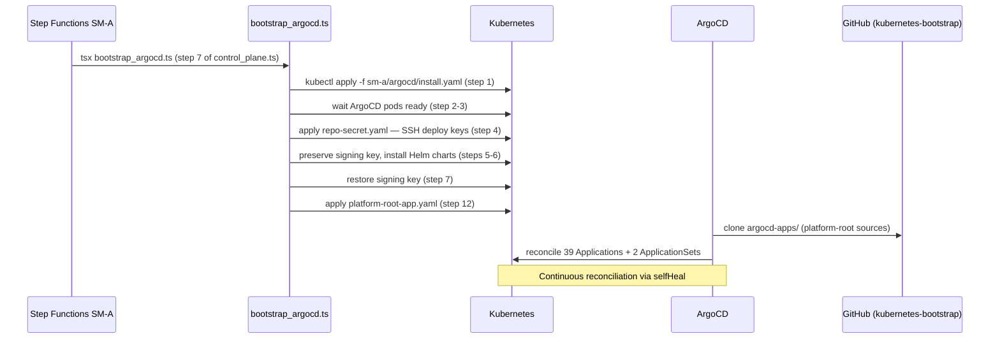
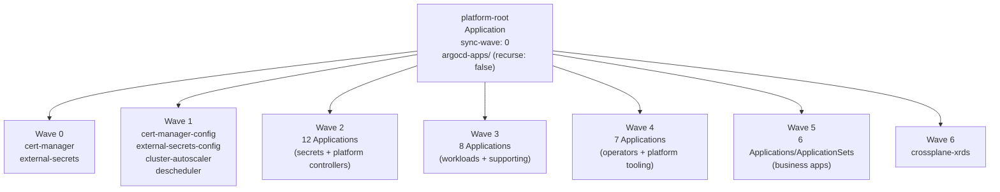

# ArgoCD GitOps Architecture

How the cluster's GitOps layer is structured: a single `platform-root` Application (app-of-apps) that discovers 39 child Applications and 2 ApplicationSets from `argocd-apps/`, with sync waves 0–6 enforcing dependency ordering, GitHub App notifications on every sync event, and universal `selfHeal + prune` reconciliation.

## Bootstrap chain



ArgoCD is installed imperatively by `bootstrap_argocd.ts` (31 sequential steps via `makeRunStep`) on first cluster boot. After step 12 (`apply_root_app`), ArgoCD takes over and all subsequent reconciliation is declarative. The script does not run again on steady-state resyncs — it is a one-time bootstrap entry point ([`sm-a/argocd/bootstrap_argocd.ts`](../../sm-a/argocd/bootstrap_argocd.ts), line 12: `apply_root_app`).

The ArgoCD signing key is preserved across the install (steps 5–7) to maintain stable resource tracking after upgrades. Without this, ArgoCD generates a new signing key and re-renders all managed Helm releases, triggering a full reconciliation storm.

## App-of-apps structure



`platform-root` is defined in [`sm-a/argocd/platform-root-app.yaml`](../../sm-a/argocd/platform-root-app.yaml). It uses `recurse: false` — ArgoCD enumerates only the top level of `argocd-apps/`, not subdirectories. Each file in `argocd-apps/` is either an `Application` or an `ApplicationSet`.

```yaml
# sm-a/argocd/platform-root-app.yaml
source:
  repoURL: git@github.com:nelsonlamounier/kubernetes-bootstrap.git
  path: argocd-apps
  directory:
    recurse: false
syncPolicy:
  automated:
    selfHeal: true
    prune: true
    allowEmpty: false
  syncOptions:
    - PruneLast=true
```

`PruneLast=true` ensures resource deletions happen after all creates and updates — prevents transient states where a dependent resource is deleted before its replacement exists.

The `kubernetes-platform` repo was archived and decommissioned on 2026-04-27; all manifests and charts were migrated into `kubernetes-bootstrap` ([comment in `platform-root-app.yaml`](../../sm-a/argocd/platform-root-app.yaml)).

## Sync waves and dependency ordering

Sync waves enforce a strict ordering within the `platform-root` sync. Later waves start only after earlier waves reach `Healthy`. This is the mechanism that prevents workloads from starting before their CRDs, ExternalSecrets, and Secrets exist.

### Wave 0 — CRD foundations

| Application | Chart source | Why wave 0 |
|-------------|-------------|------------|
| `cert-manager` | `charts.jetstack.io` | cert-manager CRDs must exist before any `Certificate` or `Issuer` resources |
| `external-secrets` | `charts.external-secrets.io` | ESO CRDs (`ExternalSecret`, `SecretStore`) must exist before wave-2 secrets |

### Wave 1 — Configuration for wave 0

| Application | Purpose |
|-------------|---------|
| `cert-manager-config` | `ClusterIssuer` resources — depend on cert-manager CRDs from wave 0 |
| `external-secrets-config` | `ClusterSecretStore` pointing at AWS SSM — depends on ESO CRDs |
| `cluster-autoscaler` | Reads EC2 ASG APIs; no CRD dependencies |
| `descheduler` | Node rebalancing policy; no ordering constraints |

### Wave 2 — Secrets and platform controllers (12 Applications)

Wave 2 is the densest wave. It deploys all `-secrets` Applications — each creates `ExternalSecret` resources that ESO resolves to Kubernetes `Secret` objects before wave-3 workloads start.

| Application | Type | Purpose |
|-------------|------|---------|
| `admin-api-secrets` | Application | ExternalSecrets for admin-api |
| `article-pipeline-secrets` | Application | ExternalSecrets for article-pipeline |
| `ingestion-secrets` | Application | ExternalSecrets for ingestion service |
| `job-strategist-secrets` | Application | ExternalSecrets for job-strategist |
| `monitoring-secrets` | Application | ExternalSecrets for monitoring stack (including `admin-ip-allowlist`) |
| `nextjs-secrets` | Application | ExternalSecrets for Next.js frontend |
| `platform-rds-secrets` | Application | ExternalSecrets for RDS credentials |
| `public-api-secrets` | Application | ExternalSecrets for public API |
| `start-admin-secrets` | Application | ExternalSecrets for start-admin service |
| `traefik` | Application | Ingress controller — must precede workloads that create IngressRoutes |
| `arc-controller` | Application | Actions Runner Controller — must precede `arc-runners` (wave 3) |
| `aws-cloud-controller-manager` | Application | EC2 node integration — deployed early to tag nodes before workloads schedule |

The `-secrets` pattern ensures ExternalSecrets reconcile (and Secrets exist) before wave-3 workloads mount them. A workload that starts before its Secret exists will crash-loop. Wave ordering prevents this without requiring retry logic in the workload.

### Wave 3 — Workloads and supporting controllers (8 Applications)

| Application | Notes |
|-------------|-------|
| `monitoring` | Prometheus + Grafana + Traefik middleware; reads `monitoring-secrets` Secret |
| `platform-rds` | RDS schema migrations; reads `platform-rds-secrets` Secret |
| `article-pipeline` | Batch processing workload |
| `ingestion` | Data ingestion service |
| `job-strategist` | Job matching workload |
| `argo-rollouts` | Blue/Green rollout controller — must exist before wave-5 apps with `Rollout` resources |
| `arc-runners` | GitHub Actions runner pods — depends on `arc-controller` from wave 2 |
| `metrics-server` | Cluster resource metrics; used by HPA and OpenCost |

### Wave 4 — Platform operators and tooling (7 Applications)

| Application | Purpose |
|-------------|---------|
| `argocd-image-updater` | Polls ECR, writes tag updates back to Git via deploy key |
| `argocd-notifications` | GitHub App commit status notifications |
| `aws-ebs-csi-driver` | EBS PersistentVolume provisioner |
| `crossplane` | Crossplane control plane — CRDs for XRDs arrive here |
| `ecr-token-refresh` | Periodic ECR token rotation (12h CronJob) |
| `opencost` | Kubernetes cost allocation |
| `reloader` | ConfigMap/Secret change detection → rolling restart |

`crossplane` installs in wave 4 rather than wave 0 because it provisions developer-facing AWS resources (S3, SQS via XRDs), not cluster-level infrastructure that other controllers depend on. `crossplane-providers` (wave 5) and `crossplane-xrds` (wave 6) form a three-wave chain.

### Wave 5 — Business applications and ApplicationSets (6 items)

| Item | Kind | Notes |
|------|------|-------|
| `admin-api` | ApplicationSet | List generator; ECR repo URI parameterized |
| `workload-generator` | ApplicationSet | Git Directory generator on `charts/*` |
| `crossplane-providers` | Application | provider-aws; depends on crossplane CRDs (wave 4) |
| `nextjs` | Application | Next.js frontend; uses Argo Rollouts Blue/Green |
| `public-api` | Application | REST API; Blue/Green |
| `start-admin` | Application | Admin frontend; Blue/Green |

### Wave 6 — Crossplane XRDs (1 Application)

| Application | Why wave 6 |
|-------------|------------|
| `crossplane-xrds` | `XEncryptedBucket` and `XMonitoredQueue` XRD + Composition — depend on provider-aws (wave 5) |

The three-wave Crossplane chain (wave 4: control plane → wave 5: providers → wave 6: XRDs) reflects strict CRD dependency: XRDs reference provider resource types that only exist after provider installation.

## ApplicationSets

Two ApplicationSets handle cases where generating child Applications from a template is more maintainable than hand-authoring each.

### admin-api — List generator

```yaml
# argocd-apps/admin-api.yaml
generators:
  - list:
      elements:
        - ecrAccount: "123456789012"
          ecrRegion: eu-west-1
          gitBranch: main
          namespace: admin-api
```

The List generator is used specifically because ArgoCD Image Updater writes ECR image tags as literal strings back to the Git repository (`.argocd-source-admin-api.yaml` writeback). These literal values must be parameterizable at the ApplicationSet level. A Git Directory generator cannot expose per-app parameters like `ecrAccount` — only the List generator provides the named element values Image Updater references.

### workload-generator — Git Directory generator

```yaml
# argocd-apps/workload-generator.yaml
generators:
  - git:
      directories:
        - path: charts/*
          exclude: false
        - path: charts/nextjs
          exclude: true
        - path: charts/start-admin
          exclude: true
        - path: charts/admin-api
          exclude: true
        # ... other exclusions
```

The Git Directory generator creates one Application per directory in `charts/`. Directories are excluded when they need custom annotations (Image Updater), non-standard sync options (Blue/Green Rollout resources), or explicit ECR parameterization. The generator handles the long tail of workloads that follow standard conventions.

## Repository configuration

Two Git repository Secrets are applied during bootstrap ([`sm-a/argocd/repo-secret.yaml`](../../sm-a/argocd/repo-secret.yaml)):

| Secret name | Repo URL | Key |
|-------------|----------|-----|
| `repo-kubernetes-bootstrap` | `git@github.com:nelsonlamounier/kubernetes-bootstrap.git` | `${DEPLOY_KEY}` |
| `repo-cdk-monitoring` | `git@github.com:nelsonlamounier/cdk-monitoring.git` | `${DEPLOY_KEY}` |

Both use the same `${DEPLOY_KEY}` placeholder — the bootstrap script substitutes the actual private key at apply time. The `cdk-monitoring` repo is registered because some Applications (traefik values, multi-source configurations) pull chart values from it.

`argocd.argoproj.io/secret-type: repository` on both Secrets registers them in ArgoCD's credential store rather than as generic Kubernetes Secrets.

## Notification configuration

ArgoCD notifications are configured via [`charts/argocd-notifications/notifications-cm.yaml`](../../charts/argocd-notifications/notifications-cm.yaml).

**Service:** GitHub App (not a personal access token) using `$github-appID`, `$github-installationID`, and `$github-privateKey` from the `argocd-notifications-secret` Secret in the `argocd` namespace. ESO syncs this Secret from SSM before ArgoCD notifications start.

**Templates:**

| Template | GitHub status | Commit status state |
|----------|--------------|-------------------|
| `app-sync-succeeded` | `success` | Links to ArgoCD application URL |
| `app-sync-failed` | `failure` | Links to ArgoCD application URL |
| `app-health-degraded` | `failure` | Links to ArgoCD application URL |

All three templates set the GitHub commit status URL to `https://ops.nelsonlamounier.com/argocd/applications/argocd/{{.app.metadata.name}}` — the ArgoCD UI deep-link for the application.

**`defaultTriggers`:** `[on-sync-succeeded, on-sync-failed, on-health-degraded]` are applied to every Application cluster-wide. No per-Application opt-in is required. Every deployment produces a GitHub commit status, making pull request CI checks reflect cluster reconciliation state.

## Self-heal and prune configuration

Nearly every Application in `argocd-apps/` has:

```yaml
syncPolicy:
  automated:
    selfHeal: true
    prune: true
```

`selfHeal: true` means ArgoCD will re-apply the Git-declared state whenever it detects drift — overriding any out-of-band `kubectl apply`, `kubectl patch`, or controller mutation. This is intentional: the cluster's authoritative state is Git, not the live cluster.

**The PostSync exception:** The `monitoring` Application uses `ignoreDifferences` on the Traefik `admin-ip-allowlist` Middleware plus `RespectIgnoreDifferences=true` to prevent selfHeal from reverting IP allowlist patches applied by a PostSync hook Job. Both halves are required — `ignoreDifferences` alone suppresses the diff display but does not prevent the sync from writing the Helm-rendered value. See [PostSync patcher pattern](../decisions/postsync-patcher-pattern.md) for the full analysis.

**The Image Updater exception:** `admin-api` has `selfHeal: true` but is managed by ArgoCD Image Updater, which writes ECR tags back to Git. Because the source of truth is Git (including Updater's writes), selfHeal correctly reconverges to whatever tag Updater last committed.

## Deeper detail

- [ArgoCD bootstrap pattern](argocd-bootstrap-pattern.md) — 31-step `bootstrap_argocd.ts` internals: signing key preserve, ARC CRD ordering constraint, secret seeding, non-fatal step handling
- [PostSync patcher pattern](../decisions/postsync-patcher-pattern.md) — `ignoreDifferences` + `RespectIgnoreDifferences` combination and why omitting either half creates silent security regression
- [Crossplane XRD golden paths](crossplane-xrd-golden-paths.md) — `XEncryptedBucket` and `XMonitoredQueue` detail and the CDK-vs-Crossplane boundary
- [ArgoCD installation runbook](../runbooks/argocd-installation.md) — full installation procedure, upgrade path, signing key lifecycle, `install.yaml` version pinning
- [ESO secret management](eso-secret-management.md) — ExternalSecret resource schema, ClusterSecretStore SSM integration, the `-secrets` Application pattern in depth
- [ArgoCD sync failures](../troubleshooting/argocd-sync-failures.md) — common sync failure modes: hook job failures, CRD ordering races, Image Updater write-back conflicts

<!--
Evidence trail (auto-generated):
- Source: sm-a/argocd/platform-root-app.yaml (read 2026-04-28, 57 lines — platform-root Application, wave "0", recurse: false, selfHeal, prune, allowEmpty, PruneLast, kubernetes-platform decommission comment)
- Source: sm-a/argocd/repo-secret.yaml (read 2026-04-28, 46 lines — two repo Secrets, ssh deploy key pattern, both repos registered)
- Source: charts/argocd-notifications/notifications-cm.yaml (read 2026-04-28, 86 lines — GitHub App service, 3 templates with commit status URLs, 3 triggers, defaultTriggers)
- Source: argocd-apps/ directory (surveyed 2026-04-28 — 39 files, wave table built via grep, admin-api.yaml ApplicationSet List generator, workload-generator.yaml Git Directory generator with exclusion list)
- Source: sm-a/argocd/bootstrap_argocd.ts (read in prior session — 31 steps, apply_root_app at step 12)
- Generated: 2026-04-28
-->
