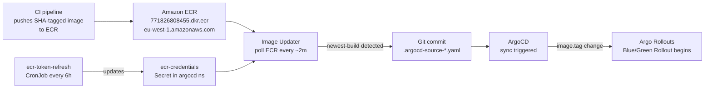
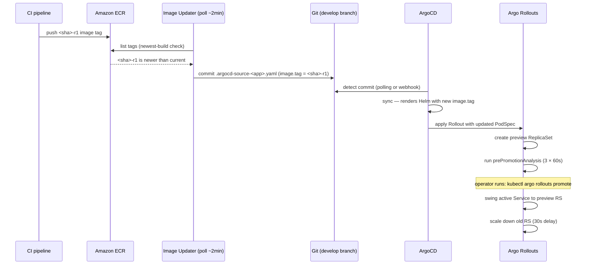

# ArgoCD Image Updater

How ArgoCD Image Updater automates container image promotion — polling ECR for new tags, committing updated image parameters back to Git, and triggering ArgoCD syncs that start Blue/Green Rollouts without any manual intervention.

## Architecture overview



Image Updater sits in the `argocd` namespace and watches ECR repositories on behalf of annotated Applications. When it finds a newer image, it commits a parameter override file to Git rather than patching the live Application directly — preserving the full GitOps audit trail.

## Installation

[`argocd-apps/argocd-image-updater.yaml`](../../argocd-apps/argocd-image-updater.yaml) installs chart `argocd-image-updater` version `0.11.0` from `https://argoproj.github.io/argo-helm` at wave 4 (Cluster Utilities — after the Argo Rollouts controller at wave 3, before wave 5 business apps).

Key configuration:

```yaml
config:
  argocd:
    grpcWeb: true
    insecure: true
    plaintext: true
    serverAddress: argocd-server.argocd.svc.cluster.local   # in-cluster, no TLS

  registries:
    - name: ECR
      api_url: https://771826808455.dkr.ecr.eu-west-1.amazonaws.com
      prefix: 771826808455.dkr.ecr.eu-west-1.amazonaws.com
      default: true
      credentials: pullsecret:argocd/ecr-credentials
      credsexpire: 4h    # ECR tokens last 12h; CronJob refreshes every 6h;
                         # cache must expire BEFORE the next CronJob run

resources:
  requests: { cpu: 50m, memory: 64Mi }
  limits:   { cpu: 100m, memory: 128Mi }

nodeSelector:
  node-pool: general    # lightweight controller — no monitoring pool needed

podDisruptionBudget:
  enabled: true
  minAvailable: 1       # prevents CA scale-down from halting image tag updates
```

**`grpcWeb: true` / `insecure: true` / `plaintext: true`** — Image Updater communicates with ArgoCD over the in-cluster Service (`argocd-server.argocd.svc.cluster.local`). The ArgoCD server inside the cluster does not require TLS for in-cluster clients.

**`credsexpire: 4h` reasoning:** ECR authorization tokens are valid for 12 hours. The ecr-token-refresh CronJob runs every 6 hours. Setting `credsexpire` to 4 hours ensures Image Updater's credential cache expires before the next CronJob run — the cached token is never older than 4 hours when Image Updater checks ECR, and the CronJob ensures a fresh token is always available when the cache expires.

## ECR credential chain

Image Updater authenticates to ECR using a Kubernetes docker-registry Secret (`ecr-credentials` in the `argocd` namespace), maintained by the `ecr-token-refresh` CronJob
([`charts/ecr-token-refresh/ecr-token-refresh.yaml`](../../charts/ecr-token-refresh/ecr-token-refresh.yaml)):

```
EC2 instance profile
  └─ IAM: ecr:GetAuthorizationToken
       └─ aws ecr get-login-password --region eu-west-1
            └─ builds docker-registry Secret (ecr-credentials)
                 └─ Image Updater: credentials: pullsecret:argocd/ecr-credentials
```

The CronJob runs on schedule `0 */6 * * *` (every 6 hours), uses `image: amazon/aws-cli:2.24.0`, inherits the EC2 instance profile via IMDS, and updates the `ecr-credentials` Secret in-place via the Kubernetes API (PUT if exists, POST if absent). No explicit AWS credentials are needed — the instance profile carries the `ecr:GetAuthorizationToken` permission.

CronJob resource limits: 10m/32Mi requests, 50m/64Mi limits. `backoffLimit: 3`, `activeDeadlineSeconds: 120`.

## Applications under Image Updater management

Four Applications carry Image Updater annotations:

| Application | ECR repository | Strategy | Write-back file |
|------------|---------------|----------|-----------------|
| `admin-api` | `admin-api` | `newest-build` | `charts/admin-api/chart/.argocd-source-admin-api.yaml` |
| `nextjs` | `nextjs-frontend` | `newest-build` | `charts/nextjs/chart/.argocd-source-nextjs.yaml` |
| `public-api` | `public-api` | `newest-build` | `charts/public-api/chart/.argocd-source-public-api.yaml` |
| `start-admin` | `start-admin` | `newest-build` | `charts/start-admin/chart/.argocd-source-start-admin.yaml` |

`admin-api`, `nextjs`, and `start-admin` use Argo Rollouts Blue/Green. `public-api` uses a standard Deployment — Image Updater triggers a rolling update instead of a Rollout.

## Annotation reference

Every managed Application carries this annotation set (shown for `nextjs`):

```yaml
annotations:
  # Image alias = "nextjs", ECR repository URI
  argocd-image-updater.argoproj.io/image-list: "nextjs=771826808455.dkr.ecr.eu-west-1.amazonaws.com/nextjs-frontend"

  # Pick the most recently pushed image by timestamp
  argocd-image-updater.argoproj.io/nextjs.update-strategy: newest-build

  # Only consider tags matching: 7-40 hex chars, optional -rN retry suffix
  argocd-image-updater.argoproj.io/nextjs.allow-tags: "regexp:^[0-9a-f]{7,40}(-r[0-9]+)?$"

  # Helm parameter names Image Updater must set when committing
  argocd-image-updater.argoproj.io/nextjs.helm.image-name: image.repository
  argocd-image-updater.argoproj.io/nextjs.helm.image-tag: image.tag

  # Write-back: commit to Git using this Secret's SSH key
  argocd-image-updater.argoproj.io/write-back-method: "git:secret:argocd/argocd-image-updater-writeback-key"

  # Target branch for the write-back commit
  argocd-image-updater.argoproj.io/git-branch: develop
```

**`newest-build` strategy** — selects the image with the most recent push timestamp among tags matching `allow-tags`. Alternatives (`semver`, `digest`, `alphabetical`) are not used here. Newest-build matches CI's "the latest commit to this branch is what should run" semantics.

**`allow-tags` regex: `^[0-9a-f]{7,40}(-r[0-9]+)?$`** — matches Git commit SHAs (7 to 40 hex characters) with an optional `-rN` retry suffix. The nextjs Application comment explains the suffix:
> "The -rN suffix prevents ECR tag overwrites on pipeline retries."

When a CI job retries (e.g. `-r1`, `-r2`), the image is pushed with a new tag rather than overwriting the previous `-r1` tag. Image Updater can then correctly identify the most-recent-build among multiple retry attempts.

## Write-back mechanism

When Image Updater detects a newer image tag, it does not patch the live Kubernetes Application directly. Instead it commits a Helm parameter override file to the `develop` branch of the Git repository:

```yaml
# charts/admin-api/chart/.argocd-source-admin-api.yaml (live file content)
helm:
  parameters:
  - name: image.repository
    value: 771826808455.dkr.ecr.eu-west-1.amazonaws.com/admin-api
    forcestring: true
  - name: image.tag
    value: 2b8ce5ecee37892c1cfb7a07a200897b02353128-r1
    forcestring: true
```

ArgoCD merges `.argocd-source-<app>.yaml` parameters over the chart's own `values.yaml` when rendering. The result: ArgoCD's `selfHeal: true` enforces the committed tag rather than reverting it — the write-back commit IS the desired state in Git.

**Why write-back rather than direct patch:** Without write-back, Image Updater would patch the live Application's `spec.source.helm.parameters`. On the next selfHeal cycle, ArgoCD would revert the patch to match Git (which still has the old tag). The write-back model solves this by making the image tag authoritative in Git.

A live example of an auto-generated commit from git history:
```
Author: argocd-image-updater <noreply@argoproj.io>
Date:   Tue Apr 28 12:01:56 2026

    build: automatic update of admin-api

    updates image admin-api tag 'b79469700434ec62d34404faafb98e4283bd680f-r1'
    to '2b8ce5ecee37892c1cfb7a07a200897b02353128-r1'
```

## Write-back deploy key

Image Updater's git write-back requires a **write-enabled** SSH deploy key. The key is stored in a Kubernetes Secret `argocd/argocd-image-updater-writeback-key`, provisioned during ArgoCD bootstrap from SSM SecureString `/k8s/development/argocd/image-updater-deploy-key`.

**The read-only key incident** (commit `8c8e7ee`, 2026-04-28): Image Updater was initially sharing the read-only deploy key used by ArgoCD for repository access. Every ECR push failed silently at the git push step:

```
Permission to Nelson-Lamounier/kubernetes-bootstrap.git denied to deploy key
```

Pods stayed pinned to the previous image until someone manually edited the `.argocd-source-*.yaml` file. The fix was a separate write-enabled SSH deploy key scoped only to Image Updater write-back, keeping ArgoCD's repo-sync key read-only (least privilege preserved).

The `write-back-method` annotation references this Secret:
```yaml
argocd-image-updater.argoproj.io/write-back-method: "git:secret:argocd/argocd-image-updater-writeback-key"
```

## End-to-end flow: ECR push to pods running



Total time from ECR push to rollout start: Image Updater polling interval (~2 minutes) + ArgoCD sync delay (selfHeal interval or webhook).

## Diagnosing Image Updater problems

```bash
# Check Image Updater pod is running
kubectl get pod -n argocd -l app.kubernetes.io/name=argocd-image-updater

# View live logs — shows each polling cycle and any errors
kubectl logs -n argocd -l app.kubernetes.io/name=argocd-image-updater --tail=100

# Verify ECR credentials exist and are fresh
kubectl get secret ecr-credentials -n argocd
kubectl get secret ecr-credentials -n argocd -o jsonpath='{.metadata.creationTimestamp}'

# Check if ecr-token-refresh CronJob ran recently
kubectl get jobs -n argocd | grep ecr-token-refresh
kubectl describe cronjob ecr-token-refresh -n argocd

# Verify write-back key exists
kubectl get secret argocd-image-updater-writeback-key -n argocd

# Check the current committed image tag for an app
cat charts/admin-api/chart/.argocd-source-admin-api.yaml
```

**Common failure — `Permission denied` in logs:** Write-back is using the wrong key or the write-enabled key has not been provisioned. Verify `argocd/argocd-image-updater-writeback-key` exists and matches the SSH key with write access to the repository.

**Common failure — `Unauthorized` when polling ECR:** The `ecr-credentials` Secret has expired. Check the CronJob's most recent job completion time. If the CronJob failed, run it manually via `kubectl create job --from=cronjob/ecr-token-refresh ecr-refresh-manual -n argocd`.

## Related

- [Progressive delivery with Argo Rollouts](progressive-delivery-rollouts.md) — Blue/Green mechanics, AnalysisTemplate structure; Image Updater is the trigger for every Blue/Green Rollout
- [Argo Rollouts analysis failing](../troubleshooting/argo-rollouts-analysis-failing.md) — diagnosing AnalysisRun failures that occur after Image Updater triggers a Rollout

<!--
Evidence trail (auto-generated):
- Source: argocd-apps/argocd-image-updater.yaml (read 2026-04-28 — chart 0.11.0, wave 4, grpcWeb/insecure/plaintext, ECR registry config, credsexpire: 4h with comment, 50m/64Mi req, 100m/128Mi lim, general node pool, PDB minAvailable: 1)
- Source: argocd-apps/nextjs.yaml (read 2026-04-28 — image-list, newest-build strategy, allow-tags regexp, helm.image-name/tag, write-back-method, git-branch develop, comment explaining -rN retry suffix and newest-build semantics)
- Source: argocd-apps/admin-api.yaml (read 2026-04-28 — same pattern, {{ecrAccount}}/{{ecrRegion}} template placeholders vs nextjs hardcoded URIs, write-back-method)
- Source: argocd-apps/public-api.yaml (read 2026-04-28 — same Image Updater annotation pattern, public-api uses Deployment not Rollout)
- Source: argocd-apps/start-admin.yaml (read 2026-04-28 — same pattern)
- Source: charts/ecr-token-refresh/ecr-token-refresh.yaml (read 2026-04-28 — schedule 0 */6 * * *, amazon/aws-cli:2.24.0, aws ecr get-login-password, builds dockerconfigjson, PUT/POST Kubernetes API, 10m/32Mi req, backoffLimit: 3, activeDeadlineSeconds: 120, IMDS instance profile comment)
- Source: argocd-apps/ecr-token-refresh.yaml (read 2026-04-28 — wave 4, comment "prerequisite for Image Updater")
- Source: charts/admin-api/chart/.argocd-source-admin-api.yaml (read 2026-04-28 — live write-back file format: helm.parameters[image.repository, image.tag], forcestring: true)
- Source: charts/nextjs/chart/.argocd-source-nextjs.yaml (read 2026-04-28 — same write-back format)
- Source: git log 58ec6d6 (read 2026-04-28 — actual Image Updater auto-commit: "build: automatic update of admin-api", author argocd-image-updater@, tag transition message)
- Source: git log 8c8e7ee (read 2026-04-28 — write-enabled deploy key commit, full incident description: read-only key silently blocking write-back, 'Permission denied', fix: separate write-enabled key from SSM /k8s/development/argocd/image-updater-deploy-key)
- Generated: 2026-04-28
-->
