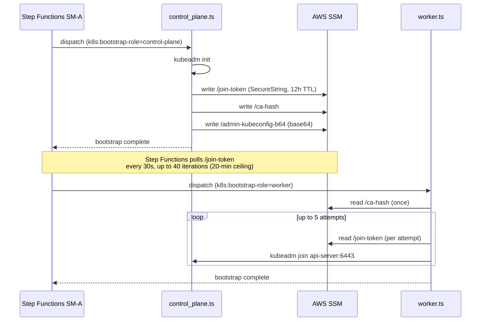

# Control Plane vs Worker Join Sequence

How the control plane and worker nodes coordinate through AWS SSM and Step Functions to form a cluster — covering the join token lifecycle, CA hash verification, 12-hour rotation, and the retry handling that makes joins robust to token expiry and CA mismatch.

## Coordination model

The control plane and workers run completely separate SSM RunCommand executions, triggered by separate EventBridge events (one per ASG launch). They coordinate exclusively through AWS SSM parameters — there is no direct network-level coordination during bootstrap.



## Join token lifecycle

`kubeadm` bootstrap tokens have the format `[a-z0-9]{6}.[a-z0-9]{16}` (e.g., `abcdef.0123456789abcdef`). They are created by `kubeadm init` and expire after 24 hours by default. This repo replaces the default expiry with a **12-hour systemd timer rotator** on the control plane.

### Token rotator

`installTokenRotator()` in `control_plane.ts` installs a systemd timer (`TOKEN_ROTATOR_MARKER` guards the install):

```
OnBootSec=10min     — runs 10 minutes after each boot
OnUnitActiveSec=12h — then every 12 hours
```

On each timer fire:
1. `kubeadm token create` generates a new token
2. `validateKubeadmToken(token)` (from `common.ts`) checks the regex `[a-z0-9]{6}.[a-z0-9]{16}` and strips any leading backslashes from shell escaping
3. The validated token is written to SSM SecureString at `{ssmPrefix}/join-token`

Workers fetch the token from SSM **per join attempt** (not once at script start), so they always use the most recently rotated token even if a previous attempt was made hours earlier.

### Why 12 hours

The 20-minute Step Functions ceiling (40 × 30 s) is intentional: if the control plane bootstrap takes more than 20 minutes, something has gone wrong and the execution should fail explicitly. The 12-hour token rotation keeps tokens fresh relative to the window between a control plane replacement and the first worker refresh cycle.

## CA hash — once per cluster lifetime

The CA hash (`sha256:<hex>`) identifies the cluster's certificate authority. Workers pass it to `kubeadm join` as `--discovery-token-ca-cert-hash` to prevent TOFU attacks.

Unlike the join token, the CA hash is **stable for the cluster's entire lifetime** — it only changes if you rotate the cluster CA (which requires re-joining all nodes). For this reason, `joinCluster()` in `worker.ts` fetches the CA hash **once** before the retry loop, not per attempt.

## CA mismatch — kubeadm reset and retry

When a worker instance is recycled (terminated and replaced with a new EC2 instance from the same ASG), the new instance may have leftover kubelet state from a previous cluster if it was launched from an AMI that was baked against an older cluster:

```typescript
// worker.ts — CA mismatch detection
const localCaHash = computeLocalCaHash(); // from /etc/kubernetes/pki/ca.crt
const ssmCaHash   = await ssmGet(`${cfg.ssmPrefix}/ca-hash`);

if (localCaHash !== ssmCaHash) {
  // Stale certificates from a different cluster — reset before joining
  run(['kubeadm', 'reset', '-f']);
}
```

On CA mismatch, `kubeadm reset -f` wipes the node's Kubernetes state (removes `/etc/kubernetes/`, empties the container runtime state). The join then proceeds cleanly with the correct cluster's credentials.

## TCP probe before join attempt

Before each join attempt, `tcpProbe(host, 6443)` verifies the API server is reachable using a direct `node:net` TCP connection (5 s timeout):

```typescript
// worker.ts — no subprocess overhead
await tcpProbe(cfg.apiDnsName, 6443);
```

Using `node:net` avoids shelling out to `nc` or `curl` — faster and no path dependency. If the probe fails (API server unreachable), the attempt is skipped and the next retry waits 30 s.

## Join retry loop

`joinCluster()` retries up to 5 attempts with 30 s intervals:

```
attempt 1:
  read /join-token from SSM → attempt kubeadm join
  success → return
  failure → wait 30s

attempt 2:
  read /join-token from SSM again (may have rotated)
  ...

attempt 5:
  final attempt
  failure → throw → classified as KUBEADM_FAIL → Step Functions execution fails
```

Fetching the token per attempt handles the edge case where the 12-hour rotator fires between bootstrap attempts.

## Step Functions CA-token poll loop

Before the Step Functions state machine dispatches a worker RunCommand, it polls SSM for the join token to confirm the control plane has completed `kubeadm init`:

```
InitCounter → Wait(30s) → GetParameter(/join-token) → CheckExists
  CheckExists:
    - token present → dispatch worker RunCommand
    - token absent  → IncrCount → CheckTimeout
  CheckTimeout:
    - count < 40  → Wait(30s) again
    - count >= 40 → fail execution (20-min ceiling)
```

This is enforced by the `BootstrapOrchestratorConstruct` in [`infra/lib/constructs/ssm/bootstrap-orchestrator.ts`](../../infra/lib/constructs/ssm/bootstrap-orchestrator.ts). Workers cannot start until the control plane writes the token — no worker will ever attempt to join before `kubeadm init` has completed.

## SSM parameter layout for join coordination

```
{ssmPrefix}/
  join-token          — SecureString, rotated every 12h by systemd timer
  ca-hash             — String, written once by kubeadm init
  admin-kubeconfig-b64 — SecureString, base64-encoded admin.conf
```

Workers use `admin-kubeconfig-b64` for `kubectl` operations that require cluster-admin (e.g., verifying their own node registration). The base64 encoding avoids issues with multiline strings in SSM.

## AMI validation — before any join attempt

`validateAmi()` (step 1 of worker bootstrap) runs before any join attempt and checks:

| Category | Values checked |
|----------|---------------|
| **Binaries** | `containerd`, `kubeadm`, `kubelet`, `kubectl`, `helm` |
| **Kernel modules** | `overlay`, `br_netfilter` |
| **Sysctl** | `net.bridge.bridge-nf-call-iptables=1`, `net.bridge.bridge-nf-call-ip6tables=1`, `net.ipv4.ip_forward=1` |

A worker that fails AMI validation throws immediately — it will never attempt to join a cluster that it is not correctly configured to participate in.

## Self-healing re-join (step 6)

`verifyClusterMembership()` (step 6) is the final worker step. It queries the cluster via the SSM-fetched admin kubeconfig to confirm the node appears in `kubectl get nodes`. If the node is missing (which can happen if the API server processed the join but a network glitch prevented the kubelet from registering), it re-runs `kubeadm join` against the live cluster state.

## Related

- [Kubernetes Bootstrap Orchestrator](../projects/kubernetes-bootstrap-orchestrator.md) — full control plane and worker step sequences
- [SSM Automation bootstrap integration](ssm-automation-bootstrap.md) — SSM parameter paths for coordination
- [Idempotent step runner pattern](../patterns/idempotent-step-runner.md) — how steps are wrapped for re-invoke safety

<!--
Evidence trail (auto-generated):
- Source: sm-a/boot/steps/worker.ts (read 2026-04-28, 1220 lines — joinCluster retry loop, CA mismatch kubeadm reset, tcpProbe node:net, per-attempt token fetch, validateAmi checks, verifyClusterMembership)
- Source: sm-a/boot/steps/control_plane.ts (read 2026-04-28 — installTokenRotator OnBootSec/OnUnitActiveSec, token write to SSM)
- Source: sm-a/boot/steps/common.ts (read 2026-04-28 — validateKubeadmToken regex, ssmGet/ssmPut)
- Source: infra/lib/constructs/ssm/bootstrap-orchestrator.ts (read in prior session — Step Functions CA-token poll loop, 40×30s ceiling)
- Generated: 2026-04-28
-->
