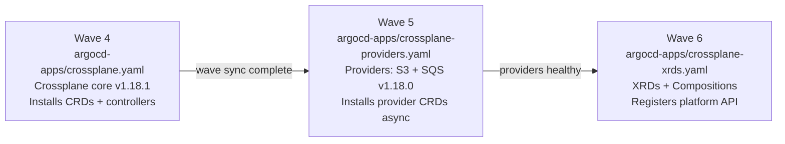
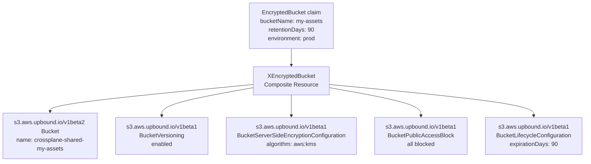

# Crossplane AWS Resource Integration

How this cluster manages AWS resources as Kubernetes objects — the three-wave ArgoCD deployment chain that installs Crossplane, the provider credential bootstrap, the `SkipDryRun` pattern for asynchronously-registered CRDs, and how the two XRDs (`XEncryptedBucket`, `XMonitoredQueue`) expose production-ready AWS infrastructure behind a minimal developer API.

## Why Crossplane instead of CDK or Terraform for these resources

The stack has a clear boundary between pre-cluster and post-cluster infrastructure:

- **CDK** manages the AWS resources that must exist before a Kubernetes cluster can run: VPC, subnets, EC2 instances, IAM roles, security groups, EBS volumes.
- **Crossplane** manages the AWS resources that applications request after the cluster exists: S3 buckets with encryption policies, SQS queues with DLQ wiring, secrets synced via ESO.

The motivation is not replacing CDK. It is giving Kubernetes workloads a declarative, GitOps-native way to request AWS resources without exiting the Kubernetes API. A developer creates an `EncryptedBucket` claim in the `nextjs-app` namespace; Crossplane reconciles the AWS resources; the resulting bucket name is patched back into the claim's `status.atProvider`. No Terraform plan, no CDK deploy, no IAM console — the entire lifecycle is driven by `kubectl apply` and ArgoCD sync.

## The three-wave ArgoCD deployment chain

Crossplane requires three separate ArgoCD Applications deployed in strict order. Each wave depends on the previous completing successfully before the next starts.



### Wave 4 — Crossplane core

[`argocd-apps/crossplane.yaml`](../../argocd-apps/crossplane.yaml) deploys Crossplane v1.18.1 from the Upbound Helm chart. Notable sync options:

```yaml
syncOptions:
  - ApplyOutOfSyncOnly=true   # skip resources that are already in sync
  - ServerSideApply=true      # required for Crossplane CRDs (large annotations)
```

`ServerSideApply=true` is required because Crossplane's CRD manifests exceed the `kubectl.kubernetes.io/last-applied-configuration` annotation size limit that client-side apply uses. Without it, ArgoCD's apply would fail with "metadata annotations too large."

`ApplyOutOfSyncOnly=true` prevents ArgoCD from re-applying every CRD on each sync, which matters because Crossplane CRDs are large and reapplying them causes unnecessary API server load.

Placed on the monitoring node pool (not worker) so Crossplane's controllers have access to the instance profile IAM role that authorises provider credential issuance.

### Wave 5 — Providers

[`argocd-apps/crossplane-providers.yaml`](../../argocd-apps/crossplane-providers.yaml) deploys `provider-aws-s3:v1.18.0` and `provider-aws-sqs:v1.18.0` from a local manifests directory (no Helm chart — raw YAML in `charts/crossplane-providers/manifests/`).

The comment in the Application explains the design choice:

```yaml
# Provider lifecycle decoupled from core upgrades.
# Providers can be updated independently of the Crossplane core chart.
```

Wave 5 uses `retryCount: 5` (vs wave 4's `retryCount: 3`) because provider pod startup is slower — the Provider pod pulls the OCI package, registers CRDs, and only then becomes healthy. ArgoCD needs more retries before declaring the sync failed.

### Wave 6 — XRDs

[`argocd-apps/crossplane-xrds.yaml`](../../argocd-apps/crossplane-xrds.yaml) deploys the `XEncryptedBucket` and `XMonitoredQueue` definitions from `charts/crossplane-xrds/chart`. Wave 6 cannot run before wave 5 because the XRD Compositions reference managed resource types (`s3.aws.upbound.io`, `sqs.aws.upbound.io`) that are only registered by the provider CRD packages installed in wave 5.

## Provider configuration: DeploymentRuntimeConfig

[`charts/crossplane-providers/manifests/providers.yaml`](../../charts/crossplane-providers/manifests/providers.yaml) configures both providers using `DeploymentRuntimeConfig` (v1beta1):

```yaml
apiVersion: pkg.crossplane.io/v1beta1
kind: DeploymentRuntimeConfig
metadata:
  name: crossplane-provider-config
spec:
  deploymentTemplate:
    spec:
      template:
        spec:
          nodeSelector:
            node-pool: monitoring
          tolerations:
            - key: workload
              operator: Equal
              value: monitoring
              effect: NoSchedule
          containers:
            - name: package-runtime
              resources:
                requests:
                  cpu: "100m"
                  memory: "128Mi"
                limits:
                  cpu: "100m"
                  memory: "128Mi"
```

`DeploymentRuntimeConfig` replaces the deprecated `ControllerConfig` (v1alpha1) introduced in Crossplane ≥ 1.14. Any Crossplane documentation predating ~2024 will reference `ControllerConfig` — it still works but is removed in a future version. `DeploymentRuntimeConfig` is the stable v1beta1 replacement and provides the same scheduling controls.

Both providers reference this config:

```yaml
spec:
  runtimeConfigRef:
    name: crossplane-provider-config
```

## ProviderConfig: credential binding and SkipDryRun

[`charts/crossplane-providers/manifests/provider-config.yaml`](../../charts/crossplane-providers/manifests/provider-config.yaml):

```yaml
apiVersion: aws.upbound.io/v1beta1
kind: ProviderConfig
metadata:
  name: default
  annotations:
    argocd.argoproj.io/sync-options: SkipDryRun=true
spec:
  credentials:
    source: Secret
    secretRef:
      namespace: crossplane-system
      name: crossplane-aws-creds
      key: credentials
```

### SkipDryRun=true — why it is required

ArgoCD's normal sync performs a dry-run before applying resources. The dry-run submits the manifest to the cluster's API server and checks whether the resource type exists (among other validation). The `ProviderConfig` resource type (`aws.upbound.io/v1beta1 ProviderConfig`) is registered by the provider pod — not by the Crossplane core chart. The provider pod must start, pull its OCI package, and register its CRDs before the API server knows about `ProviderConfig`.

Without `SkipDryRun=true`, ArgoCD's dry-run would run before the CRD exists and fail with `no matches for kind "ProviderConfig" in version "aws.upbound.io/v1beta1"`. `SkipDryRun=true` tells ArgoCD to skip the dry-run and attempt a live apply directly. By the time ArgoCD performs the actual sync (after wave 5 providers are healthy), the CRD is registered and the apply succeeds.

This is a general pattern for any Crossplane-managed CRD that is registered asynchronously by a provider pod.

### crossplane-aws-creds Secret

The credential file format expected by `provider-aws`:

```
[default]
aws_access_key_id=AKIA...
aws_secret_access_key=...
```

This Secret is seeded during cluster bootstrap by the `provision_crossplane_credentials` step in `sm-a/argocd/bootstrap_argocd.ts` — the same bootstrap sequence that installs ArgoCD and provisions ESO secrets. The bootstrap creates the Secret in `crossplane-system` before ArgoCD syncs the `ProviderConfig`, ensuring the credentials are available when Crossplane first tries to reconcile AWS resources.

## XRD and Composition — the two-object model

Crossplane's API extension model requires exactly two objects per resource type:

| Object | Kind | Purpose |
|--------|------|---------|
| `CompositeResourceDefinition` (XRD) | Defines the schema — the fields developers see in their claims | API contract |
| `Composition` | Maps claim fields to managed resources | Implementation |

The XRD is the API surface. The Composition is an implementation detail that platform engineers can change without breaking existing claims, as long as the XRD schema is backward compatible. Developers write claims (namespace-scoped); Crossplane creates a cluster-scoped Composite Resource; the Composition engine reconciles the managed resources.

## XEncryptedBucket — five managed resources behind three parameters

`XEncryptedBucket` ([`charts/crossplane-xrds/chart/templates/x-encrypted-bucket.yaml`](../../charts/crossplane-xrds/chart/templates/x-encrypted-bucket.yaml)) exposes three developer parameters:

| Claim parameter | Developer controls |
|----------------|-------------------|
| `bucketName` | The logical name (prefix `crossplane-shared-` is added automatically) |
| `retentionDays` | Lifecycle expiry in days |
| `environment` | Tag value (`dev` / `prod`) |

The Composition creates five managed resources:



### External name format transform

The `crossplane.io/external-name` annotation controls the AWS resource name. The Composition uses a `Format` transform to add the platform prefix:

```yaml
transforms:
  - type: string
    string:
      type: Format
      fmt: "crossplane-shared-%s"
```

The `%s` receives the `bucketName` from the claim. A claim with `bucketName: my-assets` creates an S3 bucket named `crossplane-shared-my-assets` in AWS. Developers never see this prefix — it is enforced by the Composition, not the XRD schema.

### retentionDays patch path

The lifecycle configuration resource receives `retentionDays` via:

```yaml
fromFieldPath: spec.parameters.retentionDays
toFieldPath: spec.forProvider.rule[0].expiration[0].days
```

`FromCompositeFieldPath` reads a field from the Composite Resource (populated from the claim's `spec.parameters`) and writes it to a field in the managed resource's `spec.forProvider`. The `toFieldPath` uses dot notation to navigate into nested arrays. Platform defaults are applied at the Composition level for the four other managed resources (versioning, encryption, public access block) — developers cannot disable them.

## XMonitoredQueue — two managed resources, DLQ wired automatically

`XMonitoredQueue` ([`charts/crossplane-xrds/chart/templates/x-monitored-queue.yaml`](../../charts/crossplane-xrds/chart/templates/x-monitored-queue.yaml)) exposes four developer parameters:

| Claim parameter | Developer controls |
|----------------|-------------------|
| `queueName` | Logical name (prefixed automatically) |
| `visibilityTimeoutSeconds` | Consumer visibility window |
| `messageRetentionSeconds` | How long messages stay in main queue |
| `environment` | Tag value |

The Composition creates two managed resources:

**DLQ** (`crossplane-shared-{queueName}-dlq`):

```yaml
spec:
  forProvider:
    messageRetentionSeconds: 1209600  # 14 days, hardcoded
    sqsManagedSseEnabled: true
    tags:
      queue-role: dlq
```

The DLQ retention (14 days) is hardcoded — developers cannot override it. `sqsManagedSseEnabled: true` enables SSE-SQS encryption on both the DLQ and the main queue without requiring a KMS key. The `queue-role: dlq` tag enables CloudWatch alarms to distinguish DLQ metrics from main queue metrics.

**Main queue** (`crossplane-shared-{queueName}`):

```yaml
transforms:
  - type: string
    string:
      type: Format
      fmt: "crossplane-shared-%s"
```

`visibilityTimeoutSeconds` is patched from the claim's parameters using `FromCompositeFieldPath`. The main queue's `redrivePolicy` references the DLQ ARN, which Crossplane resolves via a `bucketSelector.matchLabels` cross-resource reference — the DLQ resource has `queue-role: dlq` label, and the main queue composition engine resolves the ARN after the DLQ is created.

## API group and versioning

Both XRDs use the API group `platform.nelsonlamounier.com/v1alpha1`:

```yaml
group: platform.nelsonlamounier.com
versions:
  - name: v1alpha1
    served: true
    referenceable: true
```

`v1alpha1` signals that the API surface is not yet stable — parameters may change between cluster versions. When the team is confident in the schema, the version will progress to `v1beta1`. Claims are namespace-scoped; Composite Resources are cluster-scoped (auto-created by the Crossplane engine when a claim is applied).

## CDK vs Crossplane boundary

Both CDK and Crossplane create AWS resources. The boundary is cluster lifecycle:

| Concern | Tool | Reason |
|---------|------|--------|
| VPC, subnets, EC2, IAM, EBS | CDK | Must exist before the cluster boots |
| S3 buckets for workloads | Crossplane | Requested by applications running in the cluster |
| SQS queues for workloads | Crossplane | Requested by applications running in the cluster |
| Database credentials | ESO | Reads SSM/Secrets Manager, not AWS resource creation |
| Secrets provisioned at bootstrap | CDK + SSM | Seeded before ArgoCD runs |

Crossplane resources appear in the same `kubectl get` tree as Kubernetes objects. `kubectl get encryptedbuckets -n nextjs-app` returns the current reconciliation state including the AWS resource name and any errors. This is not available with CDK or Terraform resources — they exist outside the Kubernetes API.

## Related

- [Crossplane XRD golden paths](crossplane-xrd-golden-paths.md) — developer-facing claim syntax, full XRD schema details, claim lifecycle examples
- [ArgoCD GitOps architecture](argocd-gitops-architecture.md) — sync wave ordering that governs the Crossplane three-wave chain
- [ESO secret management](eso-secret-management.md) — the ESO boundary: reading existing AWS secrets, not creating AWS resources
- [Observability stack](../projects/observability-stack.md) — monitoring node pool that hosts Crossplane controllers

<!--
Evidence trail (auto-generated):
- Source: argocd-apps/crossplane.yaml (read 2026-04-28 — wave 4, ApplyOutOfSyncOnly, ServerSideApply, monitoring node pool, chart crossplane v1.18.1, retry 3)
- Source: argocd-apps/crossplane-providers.yaml (read 2026-04-28 — wave 5, retry 5, manifests path, "Provider lifecycle decoupled" comment)
- Source: argocd-apps/crossplane-xrds.yaml (read 2026-04-28 — wave 6, retry 5, charts/crossplane-xrds/chart path)
- Source: charts/crossplane-providers/manifests/providers.yaml (read 2026-04-28 — DeploymentRuntimeConfig v1beta1, provider-aws-s3 and provider-aws-sqs v1.18.0, 100m/128Mi limits, monitoring node placement, runtimeConfigRef)
- Source: charts/crossplane-providers/manifests/provider-config.yaml (read 2026-04-28 — SkipDryRun=true annotation, aws.upbound.io/v1beta1 ProviderConfig, crossplane-system/crossplane-aws-creds secretRef key: credentials)
- Source: charts/crossplane-xrds/chart/templates/x-encrypted-bucket.yaml (read 2026-04-28 — XRD xencryptedbuckets.platform.nelsonlamounier.com, 5 managed resources, Format transform crossplane-shared-%s, retentionDays toFieldPath rule[0].expiration[0].days)
- Source: charts/crossplane-xrds/chart/templates/x-monitored-queue.yaml (read 2026-04-28 — XRD xmonitoredqueues.platform.nelsonlamounier.com, DLQ 14 days sqsManagedSseEnabled queue-role:dlq, main queue visibilityTimeoutSeconds patch)
- Generated: 2026-04-28
-->
