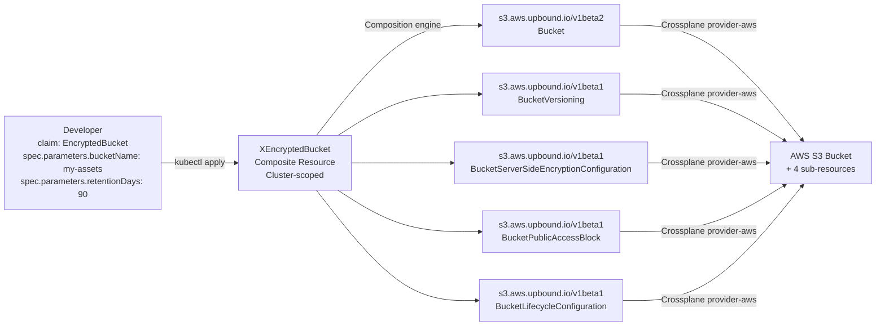

# Crossplane XRD Golden Paths

How `XEncryptedBucket` and `XMonitoredQueue` expose production-ready AWS S3 and SQS as developer-facing Kubernetes CRDs — hiding 4–5 Crossplane managed resources behind a 2–3 field claim.

## The golden-path model

"Golden path" means developers never interact with AWS directly for standard resource types. Instead of writing Terraform, CDK, or CloudFormation, a developer creates a Kubernetes YAML claim. The platform team controls the production defaults embedded in the Composition; developers control only the parameters they should tune.



## XEncryptedBucket — 3 parameters, 5 managed resources

**Developer interface** ([`charts/crossplane-xrds/chart/templates/x-encrypted-bucket.yaml`](../../charts/crossplane-xrds/chart/templates/x-encrypted-bucket.yaml)):

```yaml
apiVersion: platform.nelsonlamounier.com/v1alpha1
kind: EncryptedBucket        # namespace-scoped claim
metadata:
  name: my-app-assets
spec:
  parameters:
    bucketName: my-app-assets         # required, 3–40 chars
    retentionDays: 90                 # optional, default 90, max 3650
    environment: development          # optional, default development
```

**What the Composition creates automatically:**

| Resource | Crossplane kind | What it enforces |
|----------|----------------|-----------------|
| `bucket` | `s3.aws.upbound.io/v1beta2/Bucket` | Core bucket, tags with `environment` |
| `versioning` | `s3.aws.upbound.io/v1beta1/BucketVersioning` | `status: Enabled` — always on |
| `encryption` | `s3.aws.upbound.io/v1beta1/BucketServerSideEncryptionConfiguration` | AES256 SSE-S3, `bucketKeyEnabled: true` |
| `public-access-block` | `s3.aws.upbound.io/v1beta1/BucketPublicAccessBlock` | All four: blockPublicAcls, blockPublicPolicy, ignorePublicAcls, restrictPublicBuckets |
| `lifecycle` | `s3.aws.upbound.io/v1beta1/BucketLifecycleConfiguration` | `auto-expire` rule, expiry = `retentionDays` |

The bucket name in AWS is prefixed: `crossplane-shared-{bucketName}` (via a `Format` transform on the `crossplane.io/external-name` annotation).

## XMonitoredQueue — 3 parameters, 2 managed resources

**Developer interface** ([`charts/crossplane-xrds/chart/templates/x-monitored-queue.yaml`](../../charts/crossplane-xrds/chart/templates/x-monitored-queue.yaml)):

```yaml
apiVersion: platform.nelsonlamounier.com/v1alpha1
kind: MonitoredQueue           # namespace-scoped claim
metadata:
  name: order-processing
spec:
  parameters:
    queueName: order-processing        # required, 3–60 chars
    maxRetries: 3                      # optional, default 3, max 100
    visibilityTimeoutSeconds: 30       # optional, default 30, max 43200
    environment: development           # optional, default development
```

**What the Composition creates:**

| Resource | Crossplane kind | Notes |
|----------|----------------|-------|
| `dlq` | `sqs.aws.upbound.io/v1beta2/Queue` | Dead-letter queue, `{queueName}-dlq`, 14-day retention |
| `main-queue` | `sqs.aws.upbound.io/v1beta2/Queue` | Main queue with `sqsManagedSseEnabled: true`, redrive to DLQ |

The DLQ is created first (via Composition resource ordering) and linked to the main queue's redrive policy via `bucketSelector.matchLabels`. `maxRetries` maps to the SQS `maxReceiveCount` redrive threshold.

## XRD vs Composition — the two-object model

Each golden path is defined by two objects in the same YAML file:

1. **`CompositeResourceDefinition` (XRD)** — the API schema: group, kind, claim names, OpenAPI v3 validation. Defines what developers write. Also creates the cluster-scoped composite kind (`XEncryptedBucket`) and the namespace-scoped claim kind (`EncryptedBucket`).

2. **`Composition`** — the implementation: which Crossplane managed resources to create and how to map claim fields to resource fields via patches.

Separating schema from implementation means the team can ship a v2 schema (new XRD version) while keeping the v1 Composition intact, or swap the Composition implementation (e.g., switch from provider-aws to a different provider) without changing the developer-facing API.

## Patch mechanics

Crossplane Compositions use `FromCompositeFieldPath` patches to map claim fields to managed resource fields:

```yaml
# Map spec.parameters.bucketName → external-name annotation (with transform)
- type: FromCompositeFieldPath
  fromFieldPath: spec.parameters.bucketName
  toFieldPath: metadata.annotations[crossplane.io/external-name]
  transforms:
    - type: string
      string:
        type: Format
        fmt: "crossplane-shared-%s"

# Map spec.parameters.retentionDays → lifecycle rule expiry
- type: FromCompositeFieldPath
  fromFieldPath: spec.parameters.retentionDays
  toFieldPath: spec.forProvider.rule[0].expiration[0].days

# Map spec.parameters.environment → resource tag
- type: FromCompositeFieldPath
  fromFieldPath: spec.parameters.environment
  toFieldPath: spec.forProvider.tags.environment
```

Anything not in a patch uses the `base` object default — that's how production security settings (SSE, public access block) are enforced without exposing them as developer parameters.

## Design decision: XRDs for developers, CDK for ops

The platform uses two AWS resource provisioning systems side by side:

| Concern | Tool | Why |
|---------|------|-----|
| Cluster infrastructure (VPC, ASG, SG) | AWS CDK | Requires cross-stack coordination, runs before the cluster exists |
| Developer-facing resource APIs (S3, SQS) | Crossplane XRDs | Lives inside the cluster, declared via Git, GitOps-managed lifecycle |
| Bootstrap scripting (kubeadm, ArgoCD) | CDK + SSM | Must run before ArgoCD is installed |

Crossplane runs inside the cluster as a GitOps-managed Helm chart (managed by ArgoCD). Developers interact with it purely through `kubectl apply` on claims — no AWS console, no CDK, no Terraform. The CDK team controls the Composition defaults; developers control the claim parameters.

The tradeoff: Crossplane XRDs require the cluster to exist before they can create AWS resources, making them unsuitable for bootstrap-time infrastructure. CDK handles everything that must exist before the cluster; Crossplane handles everything that developers provision after the cluster is running.

## API group

Both XRDs live under `platform.nelsonlamounier.com/v1alpha1`. Labels follow a consistent platform engineering taxonomy:

```yaml
labels:
  platform.engineering/component: golden-path
  platform.engineering/resource-type: s3   # or sqs
```

The `v1alpha1` version signals that the API is not yet stable — claim schemas may evolve. Crossplane supports multiple `versions` in a single XRD for graduated stability.

## Related

- [Crossplane AWS resource integration](crossplane-aws-resources.md) — three-wave ArgoCD deployment chain, SkipDryRun pattern, credential bootstrap, CDK vs Crossplane boundary
- [Crossplane composition patches](crossplane-composition-patches.md) — full `FromCompositeFieldPath` patch reference, Format/array-index/cross-resource selector mechanics, platform default enforcement
- [Crossplane resource stuck deleting](../troubleshooting/crossplane-resource-stuck-deleting.md) — finalizer lifecycle, provider-gone scenario, Orphan deletionPolicy, composite resource cleanup
- [Crossplane provider upgrade](../runbooks/crossplane-provider-upgrade.md) — provider version bump procedure, CRD re-registration verification, resource limits reference
- [SSM Automation bootstrap integration](ssm-automation-bootstrap.md) — CDK-side provisioning that Crossplane complements
- [ArgoCD bootstrap pattern](argocd-bootstrap-pattern.md) — how `provision_crossplane_credentials` seeds the provider-aws credentials that Crossplane uses to create these resources

<!--
Evidence trail (auto-generated):
- Source: charts/crossplane-xrds/chart/templates/x-encrypted-bucket.yaml (read 2026-04-28 — XRD schema, Composition with 5 resources, patch paths, Format transforms, bucket name prefix)
- Source: charts/crossplane-xrds/chart/templates/x-monitored-queue.yaml (read 2026-04-28 — XRD schema, Composition with DLQ + main queue, redrive policy, 14-day DLQ retention, sqsManagedSseEnabled)
- Generated: 2026-04-28
-->
