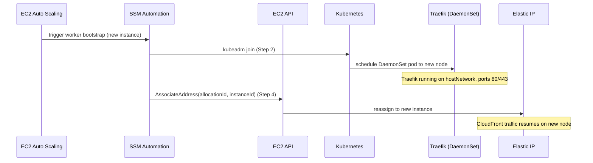

# EIP and Node Availability

How an Elastic IP (EIP) provides a stable external ingress address for the cluster, how it is provisioned and associated to worker nodes during bootstrap, and why the Traefik DaemonSet topology means any node replacement restores traffic without manual intervention.

## Role of the EIP

The EIP is the cluster's **static external ingress address** — used as the CloudFront origin so that CloudFront has a fixed IP to connect to regardless of which EC2 instance is currently running
([`infra/lib/config/ssm-paths.ts`](../../infra/lib/config/ssm-paths.ts) comment: "Elastic IP address (CloudFront origin)").

Two SSM parameters track it:

| SSM path | Value | Source |
|----------|-------|--------|
| `/k8s/{env}/elastic-ip` | EIP address (e.g. `3.252.x.x`) | CDK base infrastructure |
| `/k8s/{env}/elastic-ip-allocation-id` | Allocation ID (e.g. `eipalloc-…`) | CDK base infrastructure |

`useElasticIp: true` is set for all environments (`development`, `staging`, `production`) in
[`infra/lib/config/kubernetes/configurations.ts`](../../infra/lib/config/kubernetes/configurations.ts).

## EIP provisioning

The EIP is provisioned by the CDK base infrastructure stack. The address and allocation ID are stored in SSM at deploy time. This means the EIP exists before any EC2 instance runs — it is a static asset, not created per-instance.

The smoke test suite reads the EIP from SSM (`/k8s/{env}/elastic-ip`) and tests HTTP/HTTPS reachability on it as part of cluster validation
([`scripts/validation/smoke-tests-kubernetes.ts`](../../scripts/validation/smoke-tests-kubernetes.ts)).

## Worker bootstrap EIP association

The SSM Automation worker document is described as including "EIP association" as part of the worker bootstrap sequence
([`infra/lib/stacks/ssm-automation-stack.ts`](../../infra/lib/stacks/ssm-automation-stack.ts) line 83):

```
description: 'Run consolidated worker bootstrap (validate AMI, join cluster, CloudWatch, EIP association)'
```

The planned step-by-step execution order (from [`sm-a/boot/README.md`](../../sm-a/boot/README.md)):

```
Step 1:  Validate AMI                       → common.py
Step 2:  kubeadm join cluster               → join_cluster.py
Step 3:  Install CloudWatch agent           → common.py
Step 4:  Associate Elastic IP               → eip.py       ← reads allocationId from SSM, calls EC2 AssociateAddress
Step 5:  Clean stale PersistentVolumes      → stale_pvs.py
```

**Current implementation status:** The README describes a Python modular refactor. The current bootstrap entry point (`sm-a/boot/steps/worker.ts`) does not yet include EIP association code — `wk/eip.py` is planned but not yet present. The SSM Automation document description accurately names the intended capability.

When the EIP association step runs, the mechanism is:
1. Read the EIP allocation ID from SSM at `/k8s/{env}/elastic-ip-allocation-id`
2. Call EC2 `AssociateAddress` with the instance's own instance ID and the allocation ID
3. The EIP detaches from any previous instance automatically (EC2 allows only one association per EIP)

This means a node replacement cycle — old node terminates, new node bootstraps — ends with the EIP associated to the new instance. Because EIP reassociation is part of the bootstrap sequence rather than a separate Lambda or health-check trigger, no external automation is needed.

## Traefik DaemonSet and availability

Traefik runs as a DaemonSet with `hostNetwork: true` on every node ([`charts/traefik/traefik-values.yaml`](../../charts/traefik/traefik-values.yaml)):

```yaml
deployment:
  kind: DaemonSet

hostNetwork: true
```

This has a direct consequence for EIP failover: when a new node completes Step 2 of bootstrap (`kubeadm join`), it is immediately schedulable and Kubernetes deploys a Traefik pod to it as part of the DaemonSet. By the time Step 4 runs (EIP association), Traefik is already running and listening on ports 80 and 443 on the node's host network.

There is no scheduling delay between EIP association and traffic serving.



## NLB target group and port 80 health checks

The cluster uses a Network Load Balancer (NLB) with target groups for HTTP (port 80) and HTTPS (port 443). Worker nodes are registered as NLB targets. The NLB performs health checks on port 80 from the VPC CIDR
([`infra/lib/config/kubernetes/configurations.ts`](../../infra/lib/config/kubernetes/configurations.ts)):

```typescript
{ port: 80, protocol: 'tcp', source: 'vpcCidr', description: 'HTTP health checks from NLB' }
```

Because Traefik binds port 80 on the host network immediately after joining the cluster (DaemonSet), a newly joined node becomes NLB-healthy without any additional configuration.

## Control plane DNS

The control plane uses a separate DNS mechanism. `updateDns()` in
[`sm-a/boot/steps/control_plane.ts`](../../sm-a/boot/steps/control_plane.ts) (line 249) calls Route 53 to update the cluster API server's A record with the control plane node's **private IP** (from IMDS `local-ipv4`):

```typescript
// control_plane.ts — updateDns() at line 249
await r53Client(cfg.awsRegion).send(new ChangeResourceRecordSetsCommand({
    HostedZoneId: cfg.hostedZoneId,
    ChangeBatch: {
        Changes: [{
            Action: 'UPSERT',
            ResourceRecordSet: {
                Name: cfg.apiDnsName, Type: 'A', TTL: 30,
                ResourceRecords: [{ Value: privateIp }],
            },
        }],
    },
}));
```

This is the internal Kubernetes API server DNS (e.g. `k8s-api.k8s.internal`), not the external ingress. The EIP handles external traffic; Route 53 private hosted zone handles internal cluster communication.

## Related

- [Traefik tool doc](../tools/traefik.md) — DaemonSet architecture, hostNetwork binding, rolling update constraints, TLS setup
- [Control plane bootstrap](../runbooks/control-plane-bootstrap.md) — full node bootstrap sequence including DNS update
- [Traefik middleware not applying](../troubleshooting/traefik-middleware-not-applying.md) — diagnosing 403 responses once traffic reaches the node

<!--
Evidence trail (auto-generated):
- Source: infra/lib/config/ssm-paths.ts (read 2026-04-28 — elasticIp: /k8s/{env}/elastic-ip comment "CloudFront origin", elasticIpAllocationId: /k8s/{env}/elastic-ip-allocation-id)
- Source: infra/lib/config/kubernetes/configurations.ts (read 2026-04-28 — useElasticIp: true for all environments, NLB health check port 80 from vpcCidr)
- Source: infra/lib/stacks/ssm-automation-stack.ts (read 2026-04-28 — worker Automation description "validate AMI, join cluster, CloudWatch, EIP association")
- Source: sm-a/boot/README.md (read 2026-04-28 — Python refactor plan, Step 4: Associate Elastic IP → eip.py, wk/ directory listing)
- Source: sm-a/boot/steps/worker.ts (read 2026-04-28 — Step 4 is "Clean stale PVs", no EIP code present; eip.py does not exist in repo)
- Source: sm-a/boot/steps/control_plane.ts (read 2026-04-28 — updateDns() at line 249, privateIp from IMDS local-ipv4, Route53 UPSERT A record TTL 30)
- Source: scripts/validation/smoke-tests-kubernetes.ts (read 2026-04-28 — reads EIP from SSM /k8s/{env}/elastic-ip, tests HTTP/HTTPS reachability)
- Source: charts/traefik/traefik-values.yaml (read 2026-04-28 — DaemonSet kind, hostNetwork: true, ports 80/443)
- Generated: 2026-04-28
-->
