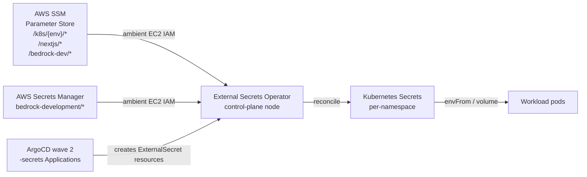
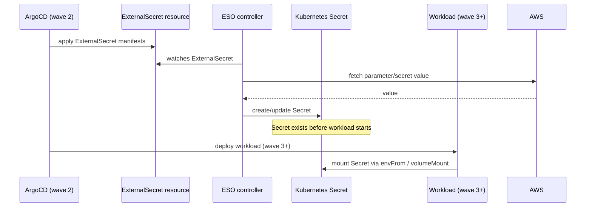

# ESO Secret Management

How External Secrets Operator (ESO) bridges AWS SSM Parameter Store and Secrets Manager into Kubernetes Secrets — covering the two ClusterSecretStores, ExternalSecret schema conventions, refresh intervals, deletion policies, and the `-secrets` Application pattern that enforces ordering via ArgoCD sync waves.

## Architecture overview



ESO runs on the control-plane node (forced via `nodeSelector` and `tolerations` in [`argocd-apps/external-secrets.yaml`](../../argocd-apps/external-secrets.yaml)) because the instance profile of the control-plane EC2 node carries the IAM policies for SSM and Secrets Manager. Worker nodes have a different (narrower) instance profile. No IRSA, no explicit credentials — ESO inherits the node's ambient credentials via IMDS.

## ClusterSecretStores

Two stores are defined in [`charts/external-secrets-config/`](../../charts/external-secrets-config/):

### aws-ssm — SSM Parameter Store

```yaml
# charts/external-secrets-config/cluster-secret-store.yaml
apiVersion: external-secrets.io/v1beta1
kind: ClusterSecretStore
metadata:
  name: aws-ssm
spec:
  provider:
    aws:
      service: ParameterStore
      region: eu-west-1
      # No auth block — ambient EC2 instance profile
```

Use for: configuration values, hostnames, ports, table names, non-sensitive string parameters. SSM supports versioning and parameter history natively. Required IAM: `ssm:GetParameter` on `arn:aws:ssm:eu-west-1:{account}:parameter/k8s/*`.

### aws-secretsmanager — Secrets Manager

```yaml
# charts/external-secrets-config/secretsmanager-store.yaml
apiVersion: external-secrets.io/v1beta1
kind: ClusterSecretStore
metadata:
  name: aws-secretsmanager
spec:
  provider:
    aws:
      service: SecretsManager
      region: eu-west-1
      # No auth block — ambient EC2 instance profile
```

Use for: secrets auto-generated by CDK (`fromGeneratedSecret`), RDS master passwords, GitHub PATs, structured JSON secrets. Required IAM: `secretsmanager:GetSecretValue` on `arn:aws:secretsmanager:eu-west-1:{account}:secret:bedrock-*`.

Both stores use `eu-west-1` — single-region deployment. Update both files when bootstrapping in a different region.

## ExternalSecret schema

Every ExternalSecret in the repo follows a consistent structure:

```yaml
apiVersion: external-secrets.io/v1beta1
kind: ExternalSecret
metadata:
  name: <secret-name>
  namespace: <workload-namespace>
spec:
  refreshInterval: <interval>          # how often ESO re-reads from AWS
  secretStoreRef:
    name: aws-ssm | aws-secretsmanager
    kind: ClusterSecretStore
  target:
    name: <kubernetes-secret-name>     # usually matches ExternalSecret name
    creationPolicy: Owner              # ESO owns the Secret lifecycle
    deletionPolicy: Delete | Retain    # see below
    template:                          # optional — for key transformation
      engineVersion: v2
      data:
        TARGET_KEY: "{{ .sourceKey }}"
  data:
    - secretKey: <internal-key>        # key name ESO stores internally
      remoteRef:
        key: <ssm-path-or-sm-name>
        property: <json-field>         # Secrets Manager only
```

**`creationPolicy: Owner`** — ESO creates the Kubernetes Secret and sets itself as the owner. The Secret is managed exclusively by ESO; manual writes are overwritten on next refresh.

## Refresh intervals

Intervals are chosen based on how frequently the source value rotates and how quickly drift must be corrected:

| Interval | Used for | Examples |
|----------|----------|---------|
| `5m` | Security-sensitive or frequently rotating values | `admin-ip-allowlist` (IP CIDRs), `admin-api-bedrock`, `nextjs-cloudfront-origin-secret`, `public-api-strategist` |
| `15m` | Database credentials (CDK auto-rotated every few hours) | All `platform-rds-credentials` ExternalSecrets across workloads |
| `1h` | Stable config values, admin credentials | `admin-api-secrets`, `grafana-credentials`, `nextjs-config`, `rds-config` |

The `admin-ip-allowlist` ExternalSecret ([`charts/monitoring/external-secrets/admin-ip-allowlist.yaml`](../../charts/monitoring/external-secrets/admin-ip-allowlist.yaml)) uses `5m` because IP rotations must propagate to the PostSync patcher Job promptly. An operator updating SSM will have the new CIDRs in the cluster Secret within 5 minutes and then a manual ArgoCD sync applies them to the Traefik Middleware.

## Deletion policies

**`deletionPolicy: Delete`** — ESO deletes the Kubernetes Secret when the ExternalSecret is deleted. Used for workload-owned Secrets that only one workload references. Prevents stale Secrets accumulating after a workload is decommissioned.

**`deletionPolicy: Retain`** — ESO leaves the Kubernetes Secret in place when the ExternalSecret is deleted. Used exclusively for RDS credential Secrets:

| ExternalSecret | Reason for Retain |
|---------------|------------------|
| `admin-api/platform-rds-credentials` | Shared RDS cluster; ingestion and article-pipeline may reference the same credentials |
| `article-pipeline/platform-rds-credentials` | Same shared RDS cluster |
| `ingestion/platform-rds-credentials` | Same shared RDS cluster |
| `job-strategist/platform-rds-credentials` | Same shared RDS cluster |
| `ingestion/ingestion-secrets` | GitHub PAT; deletion prevents app crash-loop during redeployment |

The pattern: `Retain` when the Secret is shared across multiple ExternalSecrets or when the downstream workload must not crash due to a momentary ExternalSecret absence.

## Template engine for key transformation

When the source key name differs from what the workload expects, or when a Secrets Manager JSON object must be unpacked, ESO's template engine (`engineVersion: v2`) handles the transformation:

```yaml
# charts/ingestion/external-secrets/ingestion-secrets.yaml
target:
  template:
    engineVersion: v2
    type: Opaque
    data:
      GITHUB_TOKEN: "{{ .token }}"      # unpack .token from JSON object
data:
  - secretKey: token
    remoteRef:
      key: bedrock-development/github-token
      property: token                   # JSON property path in Secrets Manager
```

The static literal pattern — injecting a known-at-deploy-time constant alongside dynamic values:

```yaml
# charts/monitoring/external-secrets/grafana-credentials.yaml
target:
  template:
    data:
      admin-user: "admin"               # static literal, not from AWS
      admin-password: "{{ .adminPassword }}"
```

This avoids storing static values in SSM when they never change and are not sensitive.

## The -secrets Application pattern

Each workload namespace has a corresponding `-secrets` Application in ArgoCD at sync wave 2. This Application manages only the `ExternalSecret` manifests for that namespace — it does not deploy the workload itself.



Example — [`argocd-apps/ingestion-secrets.yaml`](../../argocd-apps/ingestion-secrets.yaml):

```yaml
metadata:
  name: ingestion-secrets
  annotations:
    argocd.argoproj.io/sync-wave: "2"   # before ingestion workload at wave 3
spec:
  source:
    path: charts/ingestion/external-secrets  # just the ExternalSecret manifests
  destination:
    namespace: ingestion
  syncPolicy:
    automated:
      selfHeal: true
      prune: true
    syncOptions:
      - CreateNamespace=true            # creates namespace if absent
      - ServerSideApply=true
```

`CreateNamespace=true` on `-secrets` Applications means the namespace exists before wave-3 workloads try to deploy into it. `ServerSideApply=true` avoids field-manager conflicts when multiple controllers touch the same resource.

The source path `charts/<workload>/external-secrets/` contains only `ExternalSecret` YAML files — no Deployments, Services, or other workload resources. Separating ExternalSecrets into their own ArgoCD Application (rather than bundling them with the workload Helm chart) is what allows wave-2 ordering. A Helm chart renders everything at once; separate Applications enable wave control.

## ESO chart configuration

ESO is installed at [`argocd-apps/external-secrets.yaml`](../../argocd-apps/external-secrets.yaml), chart `external-secrets` version `~0.10.0` from `https://charts.external-secrets.io`, in the `external-secrets` namespace.

**Node placement:** All ESO components (controller, webhook, certController) run on the control-plane node:

```yaml
nodeSelector:
  node-role.kubernetes.io/control-plane: ""
tolerations:
  - key: node-role.kubernetes.io/control-plane
    operator: Exists
    effect: NoSchedule
```

This is how ESO inherits the control-plane instance profile without IRSA. The control-plane taint (`NoSchedule`) normally prevents pods from scheduling there; the explicit toleration overrides this for ESO.

**Resources:** Each ESO component is constrained to `10m/32Mi` requests and `100m/64Mi` limits — minimal footprint appropriate for a control-plane pod that does not serve user traffic.

## SSM parameter path conventions

Based on ExternalSecret `remoteRef.key` values surveyed across all charts:

| Path prefix | Owner | Used by |
|-------------|-------|---------|
| `/k8s/{env}/...` | kubernetes-bootstrap CDK stack | monitoring, grafana, IP allowlist |
| `/nextjs/{env}/auth/...` | nextjs CDK project | admin-api (Cognito pool IDs) |
| `/bedrock-dev/...` | ai-applications CDK stack | admin-api (DynamoDB table name) |
| `bedrock-development/...` | ai-applications CDK stack (SM) | ingestion (GitHub PAT in Secrets Manager) |

Cross-project SSM key references (e.g., `admin-api` reading `/nextjs/development/auth/cognito-user-pool-id`) represent deliberate coupling — admin-api reuses the same Cognito user pool as the Next.js frontend. The SSM path is the interface contract between CDK stacks.

## Related

- [External Secrets AWS integration](external-secrets-aws-integration.md) — ambient IAM auth vs IRSA, two-wave ArgoCD deployment chain, Secrets Manager JSON extraction, volumeMount and cross-stack event-driven consumption patterns
- [Reloader integration](reloader-integration.md) — how Stakater Reloader triggers rolling restarts when watched Secrets change; `ignoreDifferences` + `RespectIgnoreDifferences` pattern
- [ESO ExternalSecret not syncing](../troubleshooting/eso-external-secret-not-syncing.md) — debugging SecretSyncedError, missing SSM parameters, permission denials, webhook failures
- [ArgoCD GitOps architecture](argocd-gitops-architecture.md) — sync wave ordering that makes the `-secrets` pattern work
- [PostSync patcher pattern](../decisions/postsync-patcher-pattern.md) — `admin-ip-allowlist` ExternalSecret + Middleware patch interaction
- [ArgoCD sync failures troubleshooting](../troubleshooting/argocd-sync-failures.md) — ESO race conditions during CRD ordering and what happens when ExternalSecrets fail to resolve

<!--
Evidence trail (auto-generated):
- Source: charts/external-secrets-config/cluster-secret-store.yaml (read 2026-04-28 — aws-ssm store, ambient EC2 auth comment, eu-west-1, IAM requirement)
- Source: charts/external-secrets-config/secretsmanager-store.yaml (read 2026-04-28 — aws-secretsmanager store, ambient auth, bedrock-* IAM requirement)
- Source: argocd-apps/external-secrets.yaml (read 2026-04-28 — chart version ~0.10.0, control-plane nodeSelector/tolerations, resource limits, ServerSideApply, wave 0)
- Source: argocd-apps/ingestion-secrets.yaml (read 2026-04-28 — wave 2 annotation, CreateNamespace, ServerSideApply pattern, source path charts/ingestion/external-secrets)
- Source: charts/ingestion/external-secrets/ingestion-secrets.yaml (read 2026-04-28 — refreshInterval 15m, aws-secretsmanager store, template engine v2, GITHUB_TOKEN transform, deletionPolicy: Retain)
- Source: charts/monitoring/external-secrets/admin-ip-allowlist.yaml (read 2026-04-28 — refreshInterval 5m, aws-ssm, /k8s/development/monitoring/allow-ipv4 and allow-ipv6 keys)
- Source: charts/monitoring/external-secrets/grafana-credentials.yaml (read 2026-04-28 — refreshInterval 1h, static admin-user literal, deletionPolicy: Delete)
- Source: charts/admin-api/external-secrets/admin-api-secrets.yaml (read 2026-04-28 — refreshInterval 1h, cross-project SSM keys, /nextjs/ and /bedrock-dev/ paths)
- Source: grep survey of refreshInterval and deletionPolicy across all charts/*/external-secrets/*.yaml (2026-04-28 — full interval and deletion-policy tables)
- Generated: 2026-04-28
-->
