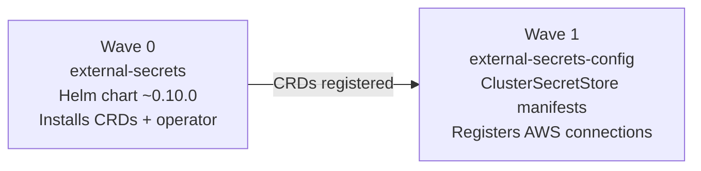

# External Secrets AWS Integration

How ESO connects to AWS — the EC2 instance profile authentication model (and why IRSA was not used), the two-wave ArgoCD deployment that installs the operator before the stores, the ClusterSecretStore as the single connection point per AWS service, and three distinct consumption patterns: `envFrom`, file-mounted volumes, and cross-stack event-driven secret propagation.

## Authentication model: ambient EC2 instance profile

ESO in this cluster authenticates to AWS using the EC2 instance profile of the control-plane node — not IRSA (IAM Roles for Service Accounts). Both stores have no `auth:` block:

```yaml
# charts/external-secrets-config/cluster-secret-store.yaml
spec:
  provider:
    aws:
      service: ParameterStore
      region: eu-west-1
      # No auth block = ESO uses ambient EC2 instance profile credentials
      # (IMDS / instance metadata service on the node where ESO runs)
```

When no auth block is present, ESO falls back to the AWS default credential chain: environment variables → shared credentials file → **EC2 instance metadata service (IMDS)**. Because the ESO pod runs on the control-plane node, it accesses `http://169.254.169.254/latest/meta-data/iam/security-credentials/` to obtain temporary credentials from the node's instance profile.

### Why not IRSA

IRSA (IAM Roles for Service Accounts) requires:
- An OIDC identity provider configured for the cluster
- An IAM role with a trust policy referencing the cluster's OIDC issuer
- The `eks.amazonaws.com/role-arn` annotation on the ServiceAccount

This cluster is self-managed Kubernetes (not EKS). The OIDC issuer URL is not automatically wired to IAM. Implementing IRSA on self-managed Kubernetes requires running a public OIDC endpoint and registering it with IAM — significant infrastructure overhead for a single-cluster deployment.

The ambient instance profile approach works because ESO is forced onto the control-plane node, which has the IAM policies attached:

```yaml
# argocd-apps/external-secrets.yaml — enforced for all three components
nodeSelector:
  node-role.kubernetes.io/control-plane: ""
tolerations:
  - key: node-role.kubernetes.io/control-plane
    operator: Exists
    effect: NoSchedule
```

All three ESO components (controller, webhook, certController) are on the control-plane node. The control-plane taint normally prevents pods from scheduling there; the explicit toleration overrides this for ESO.

### IAM requirements

The control-plane instance profile must carry two policies:

| AWS service | Required action | Scope |
|-------------|----------------|-------|
| SSM Parameter Store | `ssm:GetParameter` | `arn:aws:ssm:eu-west-1:{account}:parameter/k8s/*` |
| Secrets Manager | `secretsmanager:GetSecretValue` | `arn:aws:secretsmanager:eu-west-1:{account}:secret:bedrock-*` |

The `k8s/*` SSM scope covers all parameters published by the kubernetes-bootstrap CDK stack. The `bedrock-*` Secrets Manager scope covers CDK-generated RDS credentials and other secrets published by the AI applications stack.

## Two-wave deployment chain

ESO is installed via two separate ArgoCD Applications to enforce ordering:



**Wave 0** ([`argocd-apps/external-secrets.yaml`](../../argocd-apps/external-secrets.yaml)) installs the ESO Helm chart from `https://charts.external-secrets.io` at version `~0.10.0`. This registers the `ClusterSecretStore`, `ExternalSecret`, and related CRDs.

**Wave 1** ([`argocd-apps/external-secrets-config.yaml`](../../argocd-apps/external-secrets-config.yaml)) deploys the ClusterSecretStore manifests from `charts/external-secrets-config/`. Wave 1 cannot run before wave 0 — the `ClusterSecretStore` CRD must exist before ArgoCD can apply ClusterSecretStore objects.

Both Applications use `ServerSideApply=true` to avoid field-manager conflicts when the ESO controller also writes status fields onto the same objects.

## ClusterSecretStore: the single connection point

A `ClusterSecretStore` is a cluster-scoped resource — one definition serves all namespaces. This is the key design decision: instead of each namespace maintaining its own store connection (a `SecretStore`, namespace-scoped), two cluster-wide stores handle all AWS access from a single configuration point.

The consequence: adding a new workload with new secrets does not require any store changes. The workload's `ExternalSecret` just references `aws-ssm` or `aws-secretsmanager` by name.

### Store selection criteria

The two stores route to different AWS services with different data models:

| Use `aws-ssm` when | Use `aws-secretsmanager` when |
|---------------------|------------------------------|
| Value is a plain string | Value is a JSON object (multiple fields) |
| Published by a CDK stack via `ssm.StringParameter` | Published by CDK via `Credentials.fromGeneratedSecret` |
| Config value (hostname, port, URL, ID) | Credential value (password, token, key) |
| Sensitive string that fits in a single SSM parameter | Secret needs automatic rotation support |
| Non-sensitive string | Bedrock/AI stack generated secrets |

In practice: **SSM handles the majority** — 16 of 23 ExternalSecrets use `aws-ssm`. Secrets Manager is reserved for the 7 cases where CDK's `fromGeneratedSecret` generates a JSON blob with `{username, password, dbname, host, port}` structure, primarily RDS credentials.

### Extracting fields from Secrets Manager JSON

When a Secrets Manager secret contains a JSON object, the `property` field extracts a specific key:

```yaml
# charts/platform-rds/external-secrets/rds-credentials.yaml
data:
  - secretKey: PGPASSWORD
    remoteRef:
      key: k8s-development/platform-rds/credentials
      property: password    # extract .password from the JSON object
  - secretKey: PGUSER
    remoteRef:
      key: k8s-development/platform-rds/credentials
      property: username    # extract .username from the same secret
```

The single Secrets Manager secret `k8s-development/platform-rds/credentials` contains `{"username": "postgres", "password": "<auto>", "dbname": "...", "host": "...", "port": "5432"}`. ESO calls `GetSecretValue` once and extracts the two properties into separate Secret keys. Without `property`, ESO stores the raw JSON string — which would then require application-level JSON parsing.

## Per-chart secret structure

Each chart owns its secrets via a dedicated `external-secrets/` subdirectory. ArgoCD manages each chart's ExternalSecrets as a separate Application at wave 2, before the workload deploys at wave 3+. This convention — covered in detail in [ESO secret management](eso-secret-management.md) — ensures Secrets exist before pods start.

The `charts/*/external-secrets/` directory names are consistent across all 9 charts that use ESO:

```
charts/
├── admin-api/external-secrets/        # 4 files
├── article-pipeline/external-secrets/ # 1 file
├── ingestion/external-secrets/        # 3 files
├── job-strategist/external-secrets/   # 1 file
├── monitoring/external-secrets/       # 4 files
├── nextjs/external-secrets/           # 3 files
├── platform-rds/external-secrets/     # 2 files
├── public-api/external-secrets/       # 3 files
└── start-admin/external-secrets/      # 1 file
```

## Consumption patterns

### Pattern 1: envFrom (standard)

The majority of ExternalSecrets produce Kubernetes Secrets consumed via `envFrom.secretRef` in Deployment/Rollout pods. The entire Secret becomes environment variables at pod start:

```yaml
# In a Deployment/Rollout spec
envFrom:
  - secretRef:
      name: nextjs-config     # managed by nextjs-config ExternalSecret
  - secretRef:
      name: nextjs-secrets    # managed by nextjs-secrets ExternalSecret
```

Values are frozen at pod start. A Secret update (from ESO refresh) does not update running pods — the workload must restart to pick up new values. For `1h` and `15m` interval secrets, this is acceptable. For `5m` interval secrets, Stakater Reloader detects the Secret change and triggers a rolling restart automatically.

### Pattern 2: volumeMount for zero-restart propagation

`admin-api-job-images` ([`charts/admin-api/external-secrets/admin-api-job-images.yaml`](../../charts/admin-api/external-secrets/admin-api-job-images.yaml)) uses a different consumption model — the Secret is mounted as a directory of files rather than injected as env vars:

```yaml
# From the ExternalSecret comment block:
# Path of an image URI from CI to admin-api:
#   1. ai-applications GitHub Actions push image to ECR
#   2. Same workflow writes <repo>:<tag> to SSM /k8s/{env}/job-images/{app}
#   3. This ExternalSecret refreshes (refreshInterval 5m)
#   4. K8s Secret 'admin-api-job-images' rotates with the new key value
#   5. kubelet updates the mounted file at /etc/admin-api/images/{app}
#   6. Next admin-api Job-creation request reads the file → uses new URI
```

In the Rollout spec, the Secret is mounted as a volume:

```yaml
spec:
  template:
    spec:
      volumes:
        - name: job-images
          secret:
            secretName: admin-api-job-images
      containers:
        - volumeMounts:
            - name: job-images
              mountPath: /etc/admin-api/images
              readOnly: true
```

The kubelet automatically updates projected Secret files when the underlying Secret changes (~60 second eventual consistency). The admin-api process reads the file at Job-creation time — not at pod-start time — so it always gets the latest ECR image URI without any pod restart.

This pattern decouples CI image pushes from the Blue/Green Rollout cycle entirely. A new container image for `ingestion`, `article-pipeline`, or `job-strategist` propagates to admin-api through: ECR push → SSM write → ESO refresh → kubelet file update. No ArgoCD sync, no rollout, no downtime.

The ExternalSecret data for this pattern:

```yaml
# charts/admin-api/external-secrets/admin-api-job-images.yaml
spec:
  refreshInterval: 5m
  data:
    - secretKey: ingestion
      remoteRef:
        key: /k8s/development/job-images/ingestion
    - secretKey: article-pipeline
      remoteRef:
        key: /k8s/development/job-images/article-pipeline
    - secretKey: job-strategist
      remoteRef:
        key: /k8s/development/job-images/job-strategist
```

Each key becomes a file in `/etc/admin-api/images/` containing the ECR image URI string.

### Pattern 3: cross-stack event-driven deployment

`admin-api-bedrock` ([`charts/admin-api/external-secrets/admin-api-bedrock.yaml`](../../charts/admin-api/external-secrets/admin-api-bedrock.yaml)) demonstrates ESO as a cross-stack dependency signalling mechanism:

```yaml
# From the ExternalSecret comment block:
# Optional admin-api wiring that depends on the ai-applications/infra
# bedrock/ai-content-stack. Until the SSM key lands, ESO leaves the Secret
# absent and admin-api treats the missing value via the
# UNSET_BUCKET_SENTINEL pattern:
# routes that need S3 return HTTP 503 instead of crashing.
#
# When ai-content-stack deploys and publishes the SSM key:
#   1. ESO refreshes admin-api-bedrock within refreshInterval (5m).
#   2. Stakater Reloader detects the Secret content change.
#   3. Reloader rolls the admin-api Rollout.
#   4. New pods boot with the freshly-populated env var; assets routes go live.
#
# No manual ArgoCD sync, no CI step. Fully event-driven inside the cluster.
```

The SSM key `/bedrock-dev/assets-bucket-name` does not exist when `admin-api` is first deployed. ESO polls for it every 5 minutes. When the `ai-content-stack` in the `ai-applications` repository deploys and writes the SSM key, ESO picks it up within 5 minutes, creates the `admin-api-bedrock` Secret, and Reloader triggers a rolling restart of the admin-api Rollout.

This pattern avoids a deployment ordering dependency between two separate repositories. `admin-api` starts in a degraded-but-functional state (503 on assets routes), then self-heals when the dependency becomes available. No human intervention, no cross-repo CI coordination.

## Template engine: key renaming and static injection

For cases where the source key name differs from the environment variable name the workload expects, or where static values need to be co-located with dynamic ones, ESO's template engine composes the final Secret:

```yaml
# charts/platform-rds/external-secrets/rds-config.yaml
# SSM keys are named by the publishing CDK stack; workloads expect PGHOST etc.
target:
  template:
    type: Opaque
    data:
      PGHOST: "{{ .host }}"        # SSM key 'host' → env var 'PGHOST'
      PGPORT: "{{ .port }}"
      PGDATABASE: "{{ .database }}"
      PGUSER: "{{ .user }}"
data:
  - secretKey: host
    remoteRef:
      key: /k8s/development/platform-rds/host
```

The template renames `host` (SSM-side name) to `PGHOST` (workload-expected name) without requiring the CDK stack to publish under the exact env var name.

The `article-pipeline` chart takes this further — mixing hardcoded connection details with dynamic credentials:

```yaml
# charts/article-pipeline/external-secrets/platform-rds-credentials.yaml
target:
  template:
    engineVersion: v2
    data:
      PG_HOST: pgbouncer.platform.svc.cluster.local   # static — always PgBouncer
      PG_PORT: "5432"                                  # static
      PG_DATABASE: tucaken                             # static — per-app DB name
      PG_USER: "{{ .username }}"                       # dynamic from Secrets Manager
      PG_PASSWORD: "{{ .password }}"                   # dynamic from Secrets Manager
```

Article-pipeline pods always connect to PgBouncer, not RDS directly. The connection details (`PG_HOST`, `PG_PORT`, `PG_DATABASE`) are fixed at chart-time and do not require SSM lookups. Merging static and dynamic values in one Secret avoids having the workload `envFrom` multiple Secret sources for what is logically a single connection configuration.

## Resource footprint

All three ESO components run on the control-plane node with minimal resources ([`argocd-apps/external-secrets.yaml`](../../argocd-apps/external-secrets.yaml)):

| Component | CPU request | Memory request | CPU limit | Memory limit |
|-----------|-------------|----------------|-----------|-------------|
| Controller | 10m | 32Mi | 100m | 64Mi |
| Webhook | 10m | 32Mi | 100m | 64Mi |
| CertController | 10m | 32Mi | 100m | 64Mi |

The webhook handles admission validation for ExternalSecret resources — it must be available for any `kubectl apply` of ExternalSecret manifests to succeed. If the webhook pod is not running, ArgoCD syncs that apply ExternalSecret manifests will fail with a webhook timeout.

## Related

- [ESO secret management](eso-secret-management.md) — ExternalSecret schema conventions, refresh intervals, deletion policies, `-secrets` Application pattern, SSM path taxonomy
- [Reloader integration](reloader-integration.md) — how Stakater Reloader closes the gap between ESO Secret refresh and running pod env vars; the `admin-api-bedrock` event-driven chain
- [ESO ExternalSecret not syncing](../troubleshooting/eso-external-secret-not-syncing.md) — diagnosis for SecretSyncedError, permission denials, webhook failures, wave-ordering races
- [ArgoCD GitOps architecture](argocd-gitops-architecture.md) — sync wave ordering (waves 0–1 for ESO, wave 2 for secrets, waves 3+ for workloads)
- [Monitoring access control](monitoring-access-control.md) — `admin-ip-allowlist` ExternalSecret → PostSync patcher → Traefik Middleware update chain

<!--
Evidence trail (auto-generated):
- Source: argocd-apps/external-secrets.yaml (read 2026-04-28 — wave 0, chart ~0.10.0, control-plane nodeSelector + toleration for all 3 components, 10m/32Mi requests, 100m/64Mi limits, ServerSideApply, no auth block comment)
- Source: argocd-apps/external-secrets-config.yaml (read 2026-04-28 — wave 1, charts/external-secrets-config path, ServerSideApply, PruneLast)
- Source: charts/external-secrets-config/cluster-secret-store.yaml (read 2026-04-28 — aws-ssm, ParameterStore, eu-west-1, no auth block, IMDS comment, ssm:GetParameter IAM requirement)
- Source: charts/external-secrets-config/secretsmanager-store.yaml (read 2026-04-28 — aws-secretsmanager, SecretsManager, eu-west-1, no auth block, bedrock-* IAM scope)
- Source: charts/admin-api/external-secrets/admin-api-bedrock.yaml (read 2026-04-28 — cross-stack event-driven pattern, UNSET_BUCKET_SENTINEL, Reloader + ESO chain, refreshInterval 5m, full comment block)
- Source: charts/admin-api/external-secrets/admin-api-job-images.yaml (read 2026-04-28 — volumeMount pattern, file-mounted secret, CI→SSM→ESO→kubelet chain, 5m refresh, full comment block with CI flow)
- Source: charts/nextjs/external-secrets/nextjs-config.yaml (read 2026-04-28 — aws-ssm, refreshInterval 1h, deletionPolicy Delete, cross-project SSM paths /nextjs/ and /bedrock-dev/)
- Source: charts/platform-rds/external-secrets/rds-credentials.yaml (read 2026-04-28 — aws-secretsmanager, property field extraction, PGPASSWORD/PGUSER, 15m refresh)
- Source: charts/platform-rds/external-secrets/rds-config.yaml (read 2026-04-28 — template engine key renaming host→PGHOST, multiple SSM params into single Secret)
- Source: charts/article-pipeline/external-secrets/platform-rds-credentials.yaml (read 2026-04-28 — engineVersion v2 template, static PG_HOST/PG_PORT/PG_DATABASE mixed with dynamic username/password, deletionPolicy Retain)
- Source: charts/monitoring/external-secrets/admin-ip-allowlist.yaml (read 2026-04-28 — refreshInterval 5m, allow-ipv4/allow-ipv6 SSM keys)
- Source: grep survey of refreshInterval and secretStoreRef across all charts/*/external-secrets/*.yaml (read 2026-04-28 — 16 aws-ssm, 7 aws-secretsmanager, 5m/15m/1h interval distribution)
- Generated: 2026-04-28
-->
