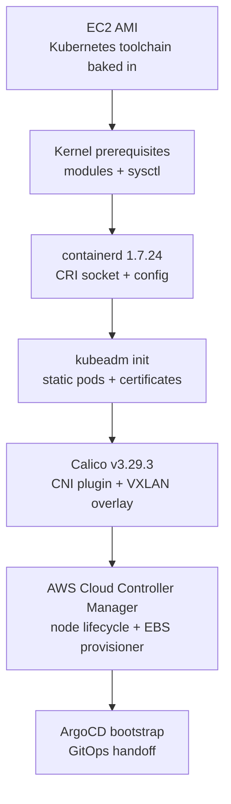

# kubeadm Init Flow at OS Level

The kernel, runtime, and network prerequisites that must be satisfied before `kubeadm init` or `kubeadm join` can succeed — and how `control_plane.ts` and `worker.ts` configure each layer.

## Layer model



## AMI — toolchain baked in

All Kubernetes toolchain components are baked into the golden AMI at image-build time by EC2 Image Builder ([`infra/lib/stacks/golden-ami-stack.ts`](../../infra/lib/stacks/golden-ami-stack.ts)):

| Component | Version | Purpose |
|-----------|---------|---------|
| Kubernetes (kubeadm, kubelet, kubectl) | 1.35.1 | Cluster management toolchain |
| containerd | 1.7.24 | Container runtime (CRI) |
| Calico | v3.29.3 | CNI plugin + NetworkPolicy |
| k8sgpt | v0.4.31 | AI-assisted cluster diagnostics |
| ECR credential provider | v1.31.0 | Kubelet ECR authentication |

Versions are pinned in [`infra/lib/config/kubernetes/configurations.ts`](../../infra/lib/config/kubernetes/configurations.ts).

## Kernel prerequisites

Both `worker.ts` and `control_plane.ts` require the following kernel state before any Kubernetes operation:

### Kernel modules

```bash
# Required modules
overlay       # overlayfs — used by containerd for container image layering
br_netfilter  # bridge netfilter — required for iptables to see bridged traffic
```

`br_netfilter` is the critical one: without it, `iptables` rules for `kube-proxy` Service routing cannot inspect packets that cross the Linux bridge used by container networking. `overlay` is required by containerd's storage driver.

The AMI bakes a `modprobe` call into the systemd startup sequence so these are always loaded before kubelet starts.

### Sysctl values

```bash
net.bridge.bridge-nf-call-iptables  = 1  # iptables sees bridged IPv4 traffic
net.bridge.bridge-nf-call-ip6tables = 1  # iptables sees bridged IPv6 traffic
net.ipv4.ip_forward                 = 1  # kernel forwards packets between interfaces
```

`ip_forward` is the most commonly missed prerequisite — without it, the kernel drops packets that arrive on one interface and are destined for another, which breaks all pod-to-pod and pod-to-service routing. The worker AMI validation step (`validateAmi()` in `worker.ts`) checks all three values and throws if any is unset, preventing a join that would produce a misconfigured node.

## containerd configuration

containerd 1.7.24 runs as a systemd service and exposes a CRI socket at `/run/containerd/containerd.sock`. The kubeadm config references this socket explicitly:

```yaml
# kubeadm InitConfiguration
nodeRegistration:
  criSocket: unix:///run/containerd/containerd.sock
```

containerd uses `overlayfs` as its snapshotter (requires the `overlay` kernel module). The ECR credential provider is configured via `/etc/kubernetes/image-credential-provider-config.yaml` (installed by `ensureEcrCredentialProvider()` in `common.ts`) so kubelet can pull images from ECR without static credentials baked into the AMI.

## kubeadm init — what it does

`kubeadm init` (called inside `initOrReconstruct()` in `control_plane.ts`) performs:

1. **Pre-flight checks** — verifies kernel modules, sysctl, swap, CRI connectivity
2. **Certificate generation** — creates the cluster CA and component certificates at `/etc/kubernetes/pki/`:
   - `ca.{crt,key}` — the cluster CA (used to sign all other certs)
   - `apiserver.{crt,key}` — API server TLS certificate
   - `apiserver-kubelet-client.{crt,key}` — API server → kubelet auth
   - `etcd/ca.{crt,key}` — etcd CA
   - `front-proxy-ca.{crt,key}` — aggregation layer CA
3. **kubeconfig generation** — writes admin.conf, controller-manager.conf, scheduler.conf to `/etc/kubernetes/`
4. **Static pod manifests** — writes manifests to `/etc/kubernetes/manifests/`:
   - `kube-apiserver.yaml`
   - `kube-controller-manager.yaml`
   - `kube-scheduler.yaml`
   - `etcd.yaml`
5. **Static pod startup** — kubelet watches `/etc/kubernetes/manifests/` and starts the static pods
6. **Bootstrap token creation** — creates the first join token
7. **RBAC bootstrap** — creates the system:bootstrappers ClusterRoleBinding

The kubeadm config used for init includes:

```yaml
kubernetesVersion: v1.35.1
networking:
  podSubnet: 192.168.0.0/16    # Calico pod CIDR
  serviceSubnet: 10.96.0.0/12  # Kubernetes service CIDR
```

These CIDRs must not overlap with the VPC CIDR or each other.

## Second-run maintenance path

`initOrReconstruct()` branches on `existsSync('/etc/kubernetes/admin.conf')`. If the file exists, `kubeadm init` has already run on this node and the function enters the maintenance path instead:

| Condition | Action |
|-----------|--------|
| API server DNS changed | Regenerate API server certificate with new SAN |
| Bootstrap token missing from SSM | Restore token to SSM from live cluster state |
| RBAC binding missing | Re-apply system:bootstrappers ClusterRoleBinding |
| Stale node objects | `kubectl delete node` for terminated instance IDs |

This makes it safe to re-invoke the control plane SSM document (e.g., for a hot-fix deployment) without risking a double-init.

## Calico CNI — VXLAN overlay

After `kubeadm init` the cluster has no CNI plugin. Pods are created but remain in `ContainerCreating` — the API server cannot schedule them because there is no network layer. `installCalico()` (step 4 of `control_plane.ts`) installs Calico v3.29.3 via the Tigera operator:

```bash
# 1. Install Tigera operator
kubectl apply -f tigera-operator.yaml

# 2. Apply Installation CR — triggers Calico deployment
kubectl apply -f calico-installation.yaml
```

The `Installation` CR configures:
- **encapsulation: VXLAN** — wraps pod traffic in UDP/VXLAN, works without BGP peer configuration
- **BGP: disabled** — no BGP daemon, simpler in single-AS AWS VPC environments
- **podCIDR: 192.168.0.0/16** — matches the kubeadm init config

The step polls for up to 6 minutes for the `calico-node` DaemonSet to reach `Ready` on all nodes before proceeding. Without a ready CNI, the next steps (CCM Helm install, kubectl operations) would see pods stuck in `ContainerCreating`.

## AWS Cloud Controller Manager

`installCcm()` (step 5) installs the AWS Cloud Controller Manager (CCM) via Helm. CCM is responsible for:

- Syncing EC2 instance metadata (instance type, availability zone, region) into Node objects
- Managing AWS Load Balancer lifecycle for `Service` objects of type `LoadBalancer`
- Removing the `node.cloudprovider.kubernetes.io/uninitialized` taint from nodes after they register

The step waits for the `node.cloudprovider.kubernetes.io/uninitialized` taint to be removed from the control plane node before continuing — this taint prevents pod scheduling until CCM has initialized the node with cloud provider metadata.

## ECR credential provider

`ensureEcrCredentialProvider()` (from `common.ts`) is called during kubelet setup. It installs the ECR credential provider binary (v1.31.0) and writes `/etc/kubernetes/image-credential-provider-config.yaml`:

```yaml
apiVersion: kubelet.config.k8s.io/v1
kind: CredentialProviderConfig
providers:
  - name: ecr-credential-provider
    matchImages:
      - "*.dkr.ecr.*.amazonaws.com"
    defaultCacheDuration: "12h"
    apiVersion: credentialprovider.kubelet.k8s.io/v1
```

This allows kubelet to pull from ECR using the EC2 instance profile's IAM role — no static registry credentials needed in the AMI or in Kubernetes Secrets.

## Related

- [Kubernetes Bootstrap Orchestrator](../projects/kubernetes-bootstrap-orchestrator.md) — where kubeadm init fits in the full bootstrap sequence
- [Control plane vs worker join sequence](cp-worker-join-sequence.md) — how workers join after init
- [ArgoCD bootstrap pattern](argocd-bootstrap-pattern.md) — what happens after kubeadm init completes

<!--
Evidence trail (auto-generated):
- Source: sm-a/boot/steps/control_plane.ts (read 2026-04-28 — initOrReconstruct() branching on admin.conf, Calico VXLAN BGPOFF config, CCM taint wait, second-run maintenance actions)
- Source: sm-a/boot/steps/worker.ts (read 2026-04-28 — validateAmi kernel modules + sysctl list, REQUIRED_BINARIES, REQUIRED_KERNEL_MODULES, REQUIRED_SYSCTL constants)
- Source: sm-a/boot/steps/common.ts (read 2026-04-28 — ensureEcrCredentialProvider, ECR_PROVIDER_VERSION=v1.31.0, ECR_PROVIDER_CONFIG path)
- Source: infra/lib/config/kubernetes/configurations.ts (read in prior session — KUBERNETES_VERSION=1.35.1, containerd=1.7.24, calico=v3.29.3, k8sgpt=0.4.31)
- Generated: 2026-04-28
-->
