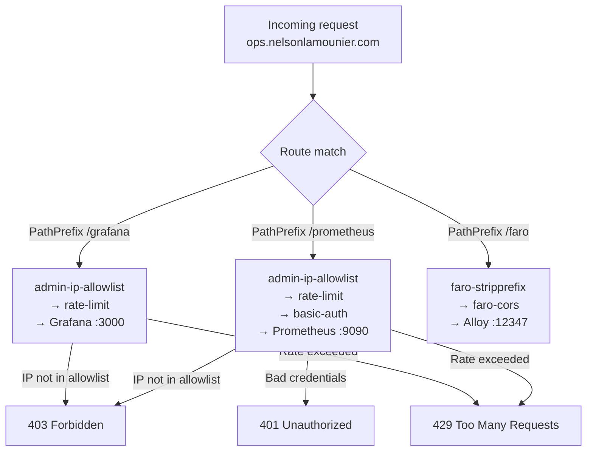

# Monitoring Access Control

How the observability endpoints at `ops.nelsonlamounier.com` are protected — three Traefik Middlewares applied selectively per endpoint, basic-auth credentials seeded from SSM at bootstrap time, IP allowlist CIDRs injected by a PostSync Job after each ArgoCD sync, and why the `/faro` Alloy endpoint deliberately bypasses all access control.

## Endpoint-to-middleware mapping

Three IngressRoutes serve the monitoring stack, all via `websecure` (TLS) entrypoint. Middleware application differs per endpoint:

| Endpoint | Path | `admin-ip-allowlist` | `basic-auth` | `rate-limit` |
|----------|------|----------------------|-------------|-------------|
| Prometheus | `PathPrefix('/prometheus')` | ✓ | ✓ | ✓ |
| Grafana | `PathPrefix('/grafana')` | ✓ | — | ✓ |
| Alloy (Faro) | `PathPrefix('/faro')` | — | — | — |

Grafana omits `basic-auth` because Grafana has its own authentication layer (Grafana login page). Adding HTTP Basic Auth on top would cause double-authentication prompts in the browser and break Grafana's own session management.

The Alloy `/faro` endpoint omits all three access-control middlewares. The Faro SDK runs in end-users' browsers — not operator machines — and must accept unauthenticated POSTs from any IP. It applies two different middlewares instead: `faro-stripprefix` (strips the `/faro` prefix before forwarding to Alloy) and `faro-cors` (handles browser preflight OPTIONS requests).

All three middlewares are gated by `{{- if .Values.adminAccess.enabled }}`. In environments where `adminAccess.enabled: false`, no IngressRoutes or Middlewares for Prometheus, Grafana, or Alloy auth are created.

## The three access-control middlewares

### admin-ip-allowlist

```yaml
# charts/monitoring/chart/templates/traefik/ip-allowlist-middleware.yaml
apiVersion: traefik.io/v1alpha1
kind: Middleware
metadata:
  name: admin-ip-allowlist
spec:
  ipAllowList:
    sourceRange: []   # populated at runtime by PostSync Job
```

The Helm chart renders `sourceRange: []` — an empty allowlist. The actual operator IP CIDRs are injected after each ArgoCD sync by the `allowlist-patcher` PostSync hook Job, which reads the `admin-ip-allowlist` Secret (populated by ESO from SSM parameters `/k8s/development/monitoring/allow-ipv4` and `/allow-ipv6`).

The lifecycle: operator updates SSM → ESO refreshes the Secret within 5m → operator triggers manual ArgoCD sync → PostSync Job fires → patches `sourceRange` on the live Middleware resource. ArgoCD's `ignoreDifferences` + `RespectIgnoreDifferences=true` prevent `selfHeal` from reverting the patch. See [PostSync patcher pattern](../decisions/postsync-patcher-pattern.md) for the full analysis.

### basic-auth

```yaml
# charts/monitoring/chart/templates/traefik/basicauth-middleware.yaml
apiVersion: traefik.io/v1alpha1
kind: Middleware
metadata:
  name: basic-auth
spec:
  basicAuth:
    secret: prometheus-basic-auth-secret
    removeHeader: true
```

`removeHeader: true` strips the `Authorization` header after authentication — prevents the Basic Auth credentials from being forwarded to the Prometheus backend, where they would appear in access logs.

The `prometheus-basic-auth-secret` Secret is not managed by ESO or ArgoCD. It is created imperatively during bootstrap.

### rate-limit

```yaml
# charts/monitoring/chart/templates/traefik/rate-limit-middleware.yaml
apiVersion: traefik.io/v1alpha1
kind: Middleware
metadata:
  name: rate-limit
spec:
  rateLimit:
    average: 100   # requests per second
    burst: 50
```

Applied to both Prometheus and Grafana. Limits the impact of misconfigured monitoring agents or automated scrapers hitting the admin endpoints. The 50-burst allowance handles dashboard page loads (which trigger multiple datasource queries simultaneously) without triggering the rate limit during normal use.

## Basic-auth seeding at bootstrap

`prometheus-basic-auth-secret` is seeded by `seedPrometheusBasicAuth()` in [`sm-a/argocd/steps/apps.ts`](../../sm-a/argocd/steps/apps.ts) (line 110), called as step `seed_prometheus_basic_auth` in `bootstrap_argocd.ts` (line 78).

**Flow:**

1. Bootstrap reads the htpasswd-formatted credential from SSM at `{ssmPrefix}/monitoring/prometheus-basic-auth`
2. Validates the value contains `:` (htpasswd format: `user:$apr1$...`)
3. Applies the Secret inline via `kubectl apply`:

```yaml
apiVersion: v1
kind: Secret
metadata:
  name: prometheus-basic-auth-secret
  namespace: monitoring
  labels:
    app.kubernetes.io/managed-by: bootstrap
type: Opaque
stringData:
  users: |
    <htpasswd line from SSM>
```

If the SSM parameter is absent or malformed, the bootstrap logs a warning with the exact `aws ssm put-parameter` command to fix it, and continues. The Prometheus IngressRoute will then reject all requests (Traefik's BasicAuth middleware with an empty `users` field blocks all traffic).

**To rotate the basic-auth password:**
```bash
# Generate new htpasswd entry
htpasswd -nB username   # bcrypt hash

# Store in SSM
aws ssm put-parameter \
  --name "/k8s/development/monitoring/prometheus-basic-auth" \
  --value "username:$2y$..." \
  --type SecureString \
  --overwrite

# Re-run bootstrap step or manually apply:
kubectl create secret generic prometheus-basic-auth-secret \
  --from-literal=users="username:$2y$..." \
  -n monitoring \
  --dry-run=client -o yaml | kubectl apply -f -
```

## Alloy /faro endpoint: CORS instead of auth

The Alloy IngressRoute ([`templates/alloy/ingressroute.yaml`](../../charts/monitoring/chart/templates/alloy/ingressroute.yaml)) applies two non-auth middlewares:

```yaml
middlewares:
  - name: faro-stripprefix
  - name: faro-cors
```

**`faro-stripprefix`** — strips `/faro` from the path before forwarding to Alloy. The Alloy Faro receiver listens at `/` (port 12347), not at `/faro`. Without this, requests would arrive at Alloy as `/faro/collect` instead of `/collect`.

**`faro-cors`** — handles browser CORS preflight:

```yaml
spec:
  headers:
    accessControlAllowOriginList:
      - "https://nelsonlamounier.com"
      - "https://www.nelsonlamounier.com"
      - "http://localhost:3000"
    accessControlAllowMethods: ["GET", "POST", "OPTIONS"]
    accessControlAllowHeaders: ["Content-Type", "X-Faro-Session-Id"]
    accessControlMaxAge: 3600
```

This Traefik middleware handles browser preflight `OPTIONS` requests before they reach Alloy. Alloy also has `cors_allowed_origins` configured with the same list — the Traefik layer is required because browsers send the preflight to the Traefik edge and expect a CORS response there, before sending the actual Faro payload. Both layers must allow the same origins.

The Alloy route has `priority: 110` vs `priority: 100` on the Prometheus and Grafana routes. Higher priority matches first — ensures `/faro` is routed to Alloy without risk of a lower-priority rule matching the path prefix.

## Full middleware flow per request



## Related

- [PostSync patcher pattern](../decisions/postsync-patcher-pattern.md) — `ignoreDifferences` + `RespectIgnoreDifferences` mechanism that keeps the IP allowlist from being reverted by selfHeal
- [ESO secret management](eso-secret-management.md) — how `admin-ip-allowlist` Secret is populated from SSM
- [RUM pipeline](rum-pipeline.md) — how the `/faro` endpoint fits into the Faro SDK → Alloy → Loki/Tempo path
- [Observability stack](../projects/observability-stack.md) — full component inventory

<!--
Evidence trail (auto-generated):
- Source: charts/monitoring/chart/templates/traefik/ip-allowlist-middleware.yaml (read 2026-04-28 — adminAccess.enabled gate, empty sourceRange default)
- Source: charts/monitoring/chart/templates/traefik/basicauth-middleware.yaml (read 2026-04-28 — prometheus-basic-auth-secret, removeHeader: true)
- Source: charts/monitoring/chart/templates/traefik/rate-limit-middleware.yaml (read 2026-04-28 — average 100, burst 50)
- Source: charts/monitoring/chart/templates/prometheus/ingressroute.yaml (read 2026-04-28 — all 3 middlewares applied, PathPrefix /prometheus)
- Source: charts/monitoring/chart/templates/grafana/ingressroute.yaml (read 2026-04-28 — admin-ip-allowlist + rate-limit only, no basic-auth, priority 100)
- Source: charts/monitoring/chart/templates/alloy/ingressroute.yaml (read 2026-04-28 — faro-stripprefix + faro-cors, no auth middlewares, priority 110, CORS headers)
- Source: sm-a/argocd/steps/apps.ts (read 2026-04-28, lines 108-148 — seedPrometheusBasicAuth, SSM path {ssmPrefix}/monitoring/prometheus-basic-auth, htpasswd validation, kubectl apply inline, warning message)
- Generated: 2026-04-28
-->
