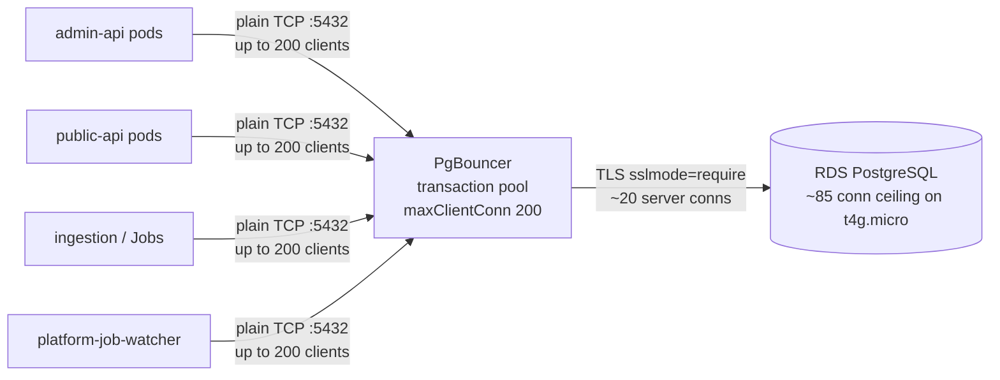

## Overview

Every pod in the cluster that needs Postgres connects to a single in-cluster
**PgBouncer** Deployment, not to RDS directly. PgBouncer multiplexes many
short-lived client connections onto a small, stable set of server connections to
RDS, so a fleet of stateless HTTP handlers and Jobs never exhausts the database's
connection limit. It is the "front door" of the
[Platform RDS data tier](../projects/platform-rds-data-tier.md): one endpoint,
`pgbouncer.platform.svc.cluster.local:5432`, that owns connection lifecycle,
TLS to RDS, and pool sizing on behalf of every consumer
([pgbouncer-deployment.yaml](../../charts/platform-rds/chart/templates/pgbouncer-deployment.yaml)).

## How it works

PgBouncer runs in **transaction pool mode**: a server connection is assigned to a
client only for the duration of a transaction, then returned to the pool. This is
the correct mode for stateless HTTP handlers, which do not depend on
session-scoped state surviving across transactions. The pool is sized so the
many client connections collapse onto far fewer server connections —
`defaultPoolSize: 20` and `maxClientConn: 200` in the chart default — keeping the
open server count well under the ~85-connection ceiling of the RDS `t4g.micro`
([values.yaml](../../charts/platform-rds/chart/values.yaml), pool sizing comments;
[pgbouncer-deployment.yaml](../../charts/platform-rds/chart/templates/pgbouncer-deployment.yaml#L103-L108)).

Two hops with different trust assumptions meet at PgBouncer:

- **client to PgBouncer** — intra-cluster, plain TCP. The cluster network is the
  trust boundary, so no TLS is required on this hop.
- **PgBouncer to RDS** — leaves the cluster. RDS enforces `rds.force_ssl=1`, so
  PgBouncer connects with `PGBOUNCER_SERVER_TLS_SSLMODE=require`; plain TCP would
  be rejected with "no pg_hba.conf entry ... no encryption"
  ([pgbouncer-deployment.yaml](../../charts/platform-rds/chart/templates/pgbouncer-deployment.yaml#L109-L116)).

## Implementation in this codebase

The pooler is a plain Deployment plus ClusterIP Service in the `platform`
namespace, configured entirely through the Bitnami image's environment variables,
which are populated from the
[ExternalSecrets the data tier publishes](../projects/platform-rds-data-tier.md)
(`platform-rds-config` for host/database, `platform-rds-credentials` for
user/password). Consumers reference the same `platform-rds-credentials` secret;
its `PG_HOST` key is deliberately set to the PgBouncer Service DNS name, not the
RDS endpoint, so applications reach RDS only through the pooler
([rds-credentials.yaml](../../charts/platform-rds/external-secrets/rds-credentials.yaml#L1191-L1197)).

Two implementation choices are worth knowing before debugging it:

- **Non-default listen port 5432.** PgBouncer's documented default is 6432; this
  chart binds 5432 via `PGBOUNCER_PORT` so consumers use the canonical Postgres
  port with no translation. The Service carries a
  `nelsonlamounier.com/upstream-port-override` annotation that surfaces the
  deviation in `kubectl describe svc`
  ([pgbouncer-service.yaml](../../charts/platform-rds/chart/templates/pgbouncer-service.yaml#L209-L214)).
- **Probes issue a real query.** Liveness and readiness exec `psql ... SELECT 1`
  through the loopback listener rather than a bare TCP check, because a TCP probe
  only proves PgBouncer is listening — it once masked a broken upstream for four
  hours
  ([pgbouncer-deployment.yaml](../../charts/platform-rds/chart/templates/pgbouncer-deployment.yaml#L124-L151)).

### Authentication: clients are matched against PgBouncer, not Postgres

PgBouncer authenticates incoming clients itself rather than passing the
credential straight through to Postgres. A Postgres role that PgBouncer has not
been told about cannot connect through it — even if that role exists in the
database. This is exactly why the read-only `grafana_ro` role could not be used
for the Grafana datasource: routed through PgBouncer it failed SASL auth, because
PgBouncer did not know the role. Re-enabling least-privilege there requires
configuring PgBouncer auth for `grafana_ro` (a `userlist` entry or an
`auth_query`) first — the chart does not configure either today
([decision: Grafana datasource bypasses PgBouncer](../decisions/grafana-datasource-bypasses-pgbouncer.md),
grounded in commit `c44a6e4`).

## Tradeoffs

- **In-cluster PgBouncer vs RDS Proxy** — PgBouncer is a self-managed pod, which
  means owning its image (currently pinned to `bitnamilegacy/pgbouncer:1.23.1`
  after Bitnami purged docker.io tags in 2025) and its auth configuration, but it
  costs nothing extra and gives full control over pool mode and sizing. RDS Proxy
  would remove the operational burden but adds per-hour cost and IAM-auth
  plumbing. The chart comments flag the legacy image as debt to revisit at the
  next major upgrade
  ([values.yaml](../../charts/platform-rds/chart/values.yaml)).
- **Single shared pooler vs per-app poolers** — one pooler is simpler and gives a
  single connection budget against RDS, but makes the pooler a shared dependency
  and chokepoint. Production mitigates the chokepoint by running **2 replicas**,
  so a node drain does not tear down all database connectivity at once
  ([values-production.yaml](../../charts/platform-rds/chart/values-production.yaml)).
- **Transaction mode vs session mode** — transaction mode maximises server-connection
  reuse but forbids session-level features (prepared statements pinned to a
  session, `SET` that must persist, `LISTEN/NOTIFY`). Acceptable here because
  consumers are stateless request handlers.

## Deeper detail

- [Platform RDS data tier](../projects/platform-rds-data-tier.md) — the full
  chart: pooler, bootstrap, DDL migrations, and ExternalSecrets.
- [Grafana datasource bypasses PgBouncer](../decisions/grafana-datasource-bypasses-pgbouncer.md)
  — the auth limitation in practice.
- [Platform RDS bootstrap and DDL migrations](../runbooks/platform-rds-bootstrap-and-migrations.md)
  — operating the schema Jobs that run behind the pooler.

## Related concepts

- [External Secrets AWS integration](./external-secrets-aws-integration.md) —
  how the pooler's credentials are delivered.

<!--
Evidence trail (auto-generated):
- Source: charts/platform-rds/chart/templates/pgbouncer-deployment.yaml (read on 2026-06-16)
- Source: charts/platform-rds/chart/templates/pgbouncer-service.yaml (read on 2026-06-16)
- Source: charts/platform-rds/chart/values.yaml (read on 2026-06-16)
- Source: charts/platform-rds/chart/values-production.yaml (read on 2026-06-16)
- Source: charts/platform-rds/external-secrets/rds-credentials.yaml (read on 2026-06-16)
- Commit: c44a6e4 (#128) grafana_ro fails via pgbouncer — requires userlist/auth_query
-->
