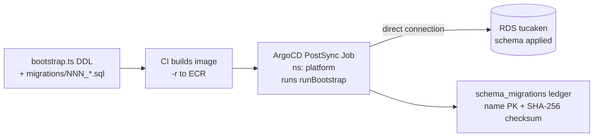
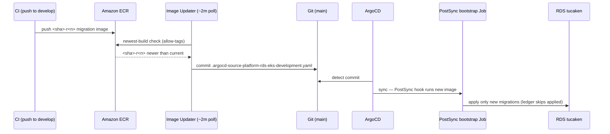

# Platform RDS Schema Management

How the `tucaken` database schema is **created and evolved** — distinct from how the RDS
*instance* is provisioned. The schema is plain SQL shipped in a container and applied by an
in-cluster ArgoCD-driven Job with a checksummed, run-exactly-once ledger. This document records
the design review of that system, why the obvious "connect with `pg` and run SQL" script is not
enough, the schema-authoring options considered (Drizzle ORM vs declarative SQL), and the
ArgoCD Image Updater wiring that removes the last manual step.

## Two layers — do not conflate them

| Layer | Built by | Produces | Lives in |
|---|---|---|---|
| **Infrastructure** | CDK / Terraform | the RDS instance `k8s-dev-platform-rds`, endpoint, security group, master password | infra repo |
| **Schema** | `platform-rds-bootstrap` | tables, indexes, roles, extensions, trigger functions inside `tucaken` | `ai-applications/applications/platform-rds-bootstrap` |

"How is RDS created?" has two answers. The instance is infrastructure. The **tables** — `users`,
`repositories`, `pipeline_runs`, the 100+ domain tables — are *schema*, and they are owned by the
bootstrap service, not by infra code. This review is about the schema layer.

## How tables get created (the canonical path)

1. **Base DDL** — `src/bootstrap.ts` exports a `DDL` string: `CREATE EXTENSION vector` +
   `CREATE EXTENSION "uuid-ossp"`, the base tables (`users`, `oauth_connections`,
   `repositories`, `pipeline_runs`, …) as `CREATE TABLE IF NOT EXISTS`, a guarded
   `CREATE ROLE tucaken_app`, and the `set_updated_at` trigger function.
2. **Numbered migrations** — `migrations/NNN_*.sql` (currently **103 files**, `003`–`103`),
   one concern per file (`030_projects.sql`, `046_project_ontology.sql`,
   `021_rls_pipeline_tables.sql`, …), applied in lexical order.
3. **Build** — CI builds these into a container image, tags it `<git-sha>-r<run_attempt>`,
   pushes to ECR `771826808455.dkr.ecr.eu-west-1.amazonaws.com/platform-rds-bootstrap`, and
   publishes the URI to SSM.
4. **Apply** — the chart's `bootstrap-job.yaml` runs as an ArgoCD **PostSync hook** Job in
   namespace `platform`. Its entrypoint `dist/index.js → runBootstrap(pool)` connects
   **directly to RDS** (not via PgBouncer — PgBouncer may not be up on first deploy), applies
   the base DDL, then each migration.



## Connection model — direct to RDS, not PgBouncer

The runner connects to the **raw RDS endpoint**, deliberately bypassing the PgBouncer pooler that
application pods use. This is a role split, not an oversight.

| Caller | Connects to | Why |
|---|---|---|
| Application pods (runtime traffic) | `pgbouncer.platform.svc.cluster.local:5432` | connection reuse, fewer RDS backends |
| **Bootstrap Job** (one-shot schema apply) | `PGHOST` = RDS instance endpoint | runs once at deploy; must not depend on PgBouncer being up |

**Where the connection params come from.** The Job (`charts/platform-rds/chart/templates/bootstrap-job.yaml`)
injects env from two ESO-synced secrets:

- `platform-rds-credentials` → `PGUSER`, `PGPASSWORD` (master creds; password auto-generated)
- `platform-rds-config` → `PGHOST`, `PGPORT`, `PGDATABASE`

`PGHOST` resolves from SSM `/k8s/<env>/platform-rds/host` (the RDS endpoint), via
`charts/platform-rds/external-secrets/rds-config.yaml`. That ExternalSecret spells out the split
explicitly:

> `Note: Application pods use pgbouncer.platform.svc.cluster.local:5432, NOT PGHOST directly.`

**Why bypass the pooler.** The bootstrap is an ArgoCD **PostSync hook** in the same chart that
deploys PgBouncer. On a fresh cluster the PgBouncer Deployment may still be starting when the hook
fires. A migration runner that needed the pooler up would be a chicken-and-egg dependency — so it
talks to RDS directly and removes the ordering constraint. The Job header
(`bootstrap-job.yaml`) states the reason: *"PgBouncer may not be ready on first deploy."*

**The pool itself** (`src/bootstrap.ts` `createPool`):

```ts
new Pool({
  host: process.env.PGHOST, port: parseInt(process.env.PGPORT ?? '5432', 10),
  database: process.env.PGDATABASE, user: process.env.PGUSER, password: process.env.PGPASSWORD,
  ssl: process.env.PGSSL === 'disable' ? false : { rejectUnauthorized: false },
  max: 1,                          // single connection — runner is serial, no interleaved DDL
  connectionTimeoutMillis: 10_000, // fail fast if RDS not yet reachable
});
```

- **`max: 1`** — the runner is single-threaded and applies migrations serially over one
  connection. More connections would only risk interleaving DDL; there is nothing to parallelise.
- **`connectionTimeoutMillis: 10_000` + Job `backoffLimit: 3` + `restartPolicy: OnFailure`** —
  this is the real "wait for the database" mechanism. If RDS is not yet reachable the pod fails
  fast and Kubernetes retries the Job, rather than the process blocking on a sleep loop.
- **`ssl: { rejectUnauthorized: false }`** — TLS is on but the RDS CA chain is not pinned; the
  connection stays inside the VPC. (`PGSSL=disable` is only for the local Postgres E2E test.)

## The migration ledger — what "migration design" means here

A migration runner is not "run the SQL files." The design point is **run each migration exactly
once, and detect tampering**. The whole apply path is `applyMigrations` in `src/bootstrap.ts`; it
is deliberately split from IO so the decision logic is pure and unit-tested without a database.

### The ledger table

```sql
-- SCHEMA_MIGRATIONS_DDL — idempotent, ensured on every run
CREATE TABLE IF NOT EXISTS schema_migrations (
    name        TEXT        PRIMARY KEY,   -- the migration filename, e.g. 030_projects.sql
    checksum    TEXT        NOT NULL,       -- SHA-256 hex of the file's full SQL text
    applied_at  TIMESTAMPTZ NOT NULL DEFAULT now()
);
```

The **identity** of a migration is `sha256(sql).hex` over the entire file's bytes (`checksum()`).
Change one byte and the identity changes — that is what makes history tamper-evident.

### The per-migration decision (pure function)

`decideMigration(currentChecksum, recordedChecksum)` returns one of three verdicts:

| Ledger state for this `name` | Verdict | Action |
|---|---|---|
| no row (never applied) | `apply` | run the SQL, then `INSERT (name, checksum)` |
| row, checksum **matches** | `skip` | `continue` — never touches the DB |
| row, checksum **differs** | `reject` | `throw` → Job exits non-zero → ArgoCD sync fails |

The reject message is explicit:

> `Migration <name> was edited after it was applied (checksum mismatch). Historical migrations are immutable — add a NEW migration instead of changing this one.`

Recording uses an upsert (`INSERT … ON CONFLICT (name) DO UPDATE SET checksum = EXCLUDED.checksum,
applied_at = now()`), so an `apply` is safe to repeat within a run.

> **Why `decideMigration` is a standalone pure function:** it has no DB or IO, so the
> apply/skip/reject/baseline matrix is unit-tested with a mock client and an injected migration
> list (`src/bootstrap-ledger.test.ts`) — which is why `yarn test` needs no Postgres. IO is
> isolated behind a small `QueryClient` interface (`loadLedger`, `recordMigration`, `tableExists`).

### Execution order inside `applyMigrations`

The sequence matters, especially the two probes that run **before** any DDL:

```text
1. tableExists('schema_migrations')  → ledgerExisted    ┐ probe BEFORE step 3 —
2. tableExists('users')              → dbPreExisting     ┘ the base DDL creates `users`
3. client.query(DDL)                 → extensions, base tables, tucaken_app role, set_updated_at()
4. client.query(SCHEMA_MIGRATIONS_DDL) → ensure the ledger table exists
5. load ledger into Map<name, checksum>  (one SELECT for the whole run)
6. for each migrations/*.sql in sorted order → decideMigration → apply | skip | reject
```

If the probes ran *after* the base DDL, step 3 would have already created `users` and you could no
longer distinguish a pre-existing database from a fresh one. The ledger is also loaded once into an
in-memory `Map` (step 5) — the per-file loop is then pure comparison, not a query per migration.

### Three entry states (the full matrix)

| `schema_migrations` exists | `users` exists | Branch taken | Behaviour |
|---|---|---|---|
| no | no | normal loop | **fresh DB** — apply every migration, record each |
| no | yes | **baseline / adoption** | **run** every migration **and** record each |
| yes | — | normal loop | apply only new, skip applied, reject edited |

After the first ledgered run a database is permanently in the bottom row.

### The baseline edge case (the subtle part)

`if (!ledgerExisted && dbPreExisting)` means: no ledger table yet, but `users` already exists — a
database the **old pre-ledger runner** populated (that runner re-ran every file on every boot,
relying on each migration being idempotent — ADR 0009). In this branch the runner **runs then
records** every migration:

```ts
for (const { name, sql } of migrations) {
    await client.query(sql);                              // RUN it
    await recordMigration(client, name, checksum(sql));   // then record it
}
```

**Why run, not merely record-as-applied?** A migration shipped in the *same deploy* that first
introduces the ledger was **never executed** by the old runner. If baselining only recorded it
(without running), its DDL would never execute, yet its checksum would then match — so it would be
`skip`ped forever: silent missing schema. Running everything is safe precisely because pre-ledger
migrations were idempotent by contract.

### Why this matters operationally

- **Historical migrations are immutable.** Editing an already-applied `NNN_*.sql` flips its
  checksum → `reject` → the next bootstrap fails. To change behaviour, add a *new* `NNN_*.sql`.
  Writing each file idempotently (`CREATE … IF NOT EXISTS`) is **defence in depth**, not the
  primary guard — the ledger is.
- **Expand/contract is mandatory.** Because any prior image can be re-synced and re-run, every
  migration must be expand/contract-safe. The `084 → 085 → 086` sequence (add nullable column →
  cutover → drop legacy unique) is the canonical example in the tree.
- **A failed migration halts the deploy loudly.** A `reject`, or any SQL error, exits the Job
  non-zero; ArgoCD shows the sync failed rather than silently continuing on a half-applied schema.

See ADR 0009 (idempotent re-apply bootstrap) and ADR 0010 (checksummed migration ledger) in the
ai-applications repo for the decision history.

## Why NOT the naïve `pg` + `aws-sdk` script

A first instinct is `npm install pg aws-sdk` and a script that connects and runs SQL. That is a
**connectivity smoke test**, not schema management. The concrete gaps:

| Concern | Naïve script | platform-rds-bootstrap |
|---|---|---|
| Idempotency | none — re-run errors or re-creates | ledger runs each migration once |
| Ordering / history | none | numbered files + recorded ledger |
| Tamper detection | none | SHA-256 checksum rejects edited migrations |
| Secrets | password hardcoded in source | `PGPASSWORD` from ESO-synced `platform-rds-credentials` |
| Where it runs | a laptop, outside the VPC | in-cluster Job, reproducible via GitOps |
| TLS | `rejectUnauthorized: false` (disabled) | RDS connection inside the VPC |
| `aws-sdk` | imported, only sets region, never called | not needed — only `pg` is a dependency |

The naïve script only ever did `SELECT version()` — it *reads*. It creates zero tables. The
bootstrap service *evolves the schema safely*. They are different jobs.

## Schema authoring: Drizzle ORM vs declarative SQL

Two ways to author the schema were weighed.

**Option A — Drizzle ORM (TypeScript schema as source of truth).** Define the whole schema in
`schema.ts`; `drizzle-kit` diffs the schema and generates SQL migrations; the Job applies them.
- *Pros:* one TS source; typed row/query types the frontend/app layer can import (aligns with the
  TS / TanStack stack); less hand-written `ALTER`.
- *Cost:* adds `drizzle-orm` + `drizzle-kit`; generated SQL is less readable than hand DDL; weaker
  ergonomics for raw pgvector, RLS, GIN, and custom trigger DDL — you drop to raw-SQL escapes often.

**Option B — Declarative SQL, applied idempotently (the implemented choice).** A directory of
plain `CREATE TABLE …` DDL, one file per domain, applied idempotently on a fresh DB; evolution =
add additive `NNN_*.sql` files.
- *Pros:* zero ORM dependencies (`package.json` is just `pg`); maximum transparency; full control
  of pgvector / RLS / GIN / triggers; recruiter-readable pure SQL.
- *Cost:* no diff engine, so altering populated tables later is hand-written (expand/contract).

### Verdict: stay on B

Reasons specific to this repo:

- **103 migrations already exist in B.** Switching to A means rewriting the source of truth and
  risking a re-baseline against a live DB.
- **Heavy pgvector / RLS / GIN / ontology DDL** (`021_rls_pipeline_tables`, `080_*_gin`, vector
  indexes, the ontology migrations). Drizzle's diff engine fights this; you would live in raw-SQL
  escapes anyway, losing A's main benefit.
- **A's one real win — shared TS types to the frontend — is available cheaply** without adopting
  Drizzle: hand-write or generate types in `shared/src/rds/types.ts` (which already exists).

Only switch to A if "typed queries everywhere" becomes the dominant pain. Today the dominant pain
was the **manual image-tag bump**, addressed below — not schema authoring.

## The deploy gotcha that this review fixed

Building the migration image does **not** apply the migrations. The PostSync Job only ever runs
the tag **pinned** in `charts/platform-rds/chart/values-<env>.yaml`. Historically that tag was
bumped by hand, so a merged migration could sit in ECR while the cluster kept re-running an old
image — the DB silently lags. This is exactly what happened to migrations 025–043: the dev tag
was stuck at the migration-024-era image (`c0e075f0…`).

### Fix — ArgoCD Image Updater on the dev Application

The dev Application `platform-rds-eks-development` now carries Image Updater annotations
(mirroring `public-api` / `nextjs`):

```yaml
argocd-image-updater.argoproj.io/image-list: rds-bootstrap=771826808455.dkr.ecr.eu-west-1.amazonaws.com/platform-rds-bootstrap
argocd-image-updater.argoproj.io/rds-bootstrap.allow-tags: regexp:^[0-9a-f]{7,40}(-r[0-9]+)?$
argocd-image-updater.argoproj.io/rds-bootstrap.update-strategy: newest-build
argocd-image-updater.argoproj.io/rds-bootstrap.helm.image-name: bootstrap.image.repository
argocd-image-updater.argoproj.io/rds-bootstrap.helm.image-tag: bootstrap.image.tag
argocd-image-updater.argoproj.io/write-back-method: git:secret:argocd/argocd-image-updater-writeback-key
argocd-image-updater.argoproj.io/git-branch: main
argocd-image-updater.argoproj.io/git-repository: git@github.com:Nelson-Lamounier/kubernetes-bootstrap.git
```

The only difference from a normal service: the Helm params are nested — `bootstrap.image.repository`
and `bootstrap.image.tag` — not top-level `image.*`, because the bootstrap image lives under the
`bootstrap.image` key in `values-development.yaml`.

**Flow once merged:**



Image Updater writes a parameter override to
`charts/platform-rds/chart/.argocd-source-platform-rds-eks-development.yaml`; ArgoCD merges it
over `values-development.yaml`, so the tag in the values file becomes a fallback default while the
override file is authoritative. The required infra — the Image Updater controller (wave 4), the
`ecr-credentials` Secret refreshed by the `ecr-token-refresh` CronJob, and the write-enabled
`argocd-image-updater-writeback-key` — already exists and serves the other four apps.

### Production stays manual — by design

`values-production.yaml` explicitly pins the bootstrap tag to a tested value
(`CHANGEME-pin-to-tested-tag`) with the comment "do NOT auto-track dev's bleeding edge."
Auto-applying unreviewed schema migrations to production is a deliberate non-goal: prod is bumped
manually after the dev migration is verified. Image Updater is therefore wired on **dev only**.

### Why auto-apply is safe on dev

Because the migration runner is idempotent and ledgered, an ArgoCD sync that re-runs a tag is
harmless, and a sync that runs a newer tag applies only the genuinely new migrations. Auto-bumping
the tag cannot corrupt the schema — at worst it applies pending migrations, which is the point.

## Verification after merge

```bash
# Image Updater picked up the new annotations and is polling the repo
kubectl logs -n argocd -l app.kubernetes.io/name=argocd-image-updater --tail=100 | grep platform-rds

# The write-back override file appears after the first newer image
cat charts/platform-rds/chart/.argocd-source-platform-rds-eks-development.yaml

# The Application is registered and synced
kubectl get applications -n argocd | grep platform-rds

# The bootstrap Job ran and completed
kubectl get jobs -n platform | grep platform-rds-bootstrap
```

## Related

- [ArgoCD Image Updater](argocd-image-updater.md) — controller install, ECR credential chain,
  write-back key incident, and the annotation reference this wiring mirrors
- [PgBouncer connection pooling](pgbouncer-connection-pooling.md) — the pooler the same chart
  deploys in front of this RDS instance
- [Idempotent step runner](../patterns/idempotent-step-runner.md) — the broader run-once pattern
  the migration ledger is an instance of

<!--
Evidence trail:
- argocd-apps/eks/development/platform-rds.yaml (read 2026-06-26 — Application name platform-rds-eks-development, wave 7, targetRevision main, path charts/platform-rds/chart, values-development.yaml; Image Updater annotations added this change)
- charts/platform-rds/chart/values-development.yaml (read 2026-06-26 — bootstrap.image.repository/tag, tag c0e075f08ce…-r1; comment updated to Image Updater this change)
- charts/platform-rds/chart/values-production.yaml (read 2026-06-26 — bootstrap tag "CHANGEME-pin-to-tested-tag", comment "do NOT auto-track dev's bleeding edge")
- ai-applications/applications/platform-rds-bootstrap/README.md (read 2026-06-26 — ledger apply/skip/reject/baseline, immutable history, PostSync hook, direct-to-RDS, deploy gotcha, migrations 025–043 stuck at c0e075f0)
- ai-applications/applications/platform-rds-bootstrap/src/bootstrap.ts + index.ts (read 2026-06-26 — DDL string, runBootstrap, env from ESO secrets)
- ai-applications/applications/platform-rds-bootstrap/migrations/ (read 2026-06-26 — 103 NNN_*.sql files, 003–103; 021_rls_pipeline_tables, 080_*_gin, 084→085→086 expand/contract)
- docs/concepts/argocd-image-updater.md (read 2026-06-26 — controller wave 4, ecr-credentials, writeback key, annotation pattern)
- Generated: 2026-06-26
-->
