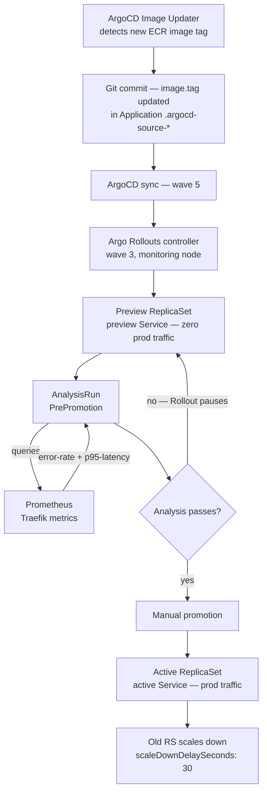

# Progressive Delivery with Argo Rollouts

How Argo Rollouts replaces Kubernetes Deployments for user-facing workloads — using Blue/Green strategy with Prometheus-driven pre-promotion analysis to gate image promotions on live error rate and latency data from Traefik.

## Architecture overview



Three workloads use Argo Rollouts Blue/Green in this cluster: `admin-api`, `nextjs`, and `start-admin`. All other workloads use standard Kubernetes Deployments.

## Argo Rollouts installation

[`argocd-apps/argo-rollouts.yaml`](../../argocd-apps/argo-rollouts.yaml) installs chart `argo-rollouts` version `2.40.6` from `https://argoproj.github.io/argo-helm` at wave 3 — before the wave 5 business apps that use Rollout resources.

Key installation choices:

```yaml
installCRDs: true    # Required — registers Rollout, AnalysisTemplate, AnalysisRun, Experiment CRDs
controller:
  replicas: 1
  nodeSelector:
    node-pool: monitoring
  resources:
    requests: { cpu: 25m, memory: 64Mi }
    limits:   { cpu: 100m, memory: 128Mi }
dashboard:
  enabled: true      # Web UI for promote / abort actions
  nodeSelector:
    node-pool: monitoring
  resources:
    requests: { cpu: 10m, memory: 32Mi }
    limits:   { cpu: 50m, memory: 64Mi }
```

**Why Helm chart over raw manifests:** The comment in the Application explains the reason: applying raw CRD manifests via Server-Side Apply produces a `metadata.managedFields must be nil` error. The Helm chart avoids this.

**Wave placement:** Wave 3 ensures the Rollout CRDs exist before wave 5 Rollout resources are applied. ArgoCD would otherwise fail to apply Rollout manifests because the CRD is not yet registered.

## Blue/Green strategy

All three Rollout workloads use `strategy: blueGreen`. No canary strategy is in use in this cluster.

Blue/Green runs **two full ReplicaSets simultaneously** during a rollout:

| ReplicaSet | Service | Traffic |
|-----------|---------|---------|
| **active** | production Service (e.g. `admin-api`) | 100% production traffic |
| **preview** | preview Service (e.g. `admin-api-preview`) | 0% — analysis only, no user traffic |

Example from [`charts/admin-api/chart/templates/rollout.yaml`](../../charts/admin-api/chart/templates/rollout.yaml):

```yaml
strategy:
  blueGreen:
    activeService: admin-api
    previewService: admin-api-preview
    autoPromotionEnabled: false          # manual promotion required
    autoPromotionSeconds: 0              # IMPORTANT: see quirk note below
    scaleDownDelaySeconds: 30            # old RS waits 30s before scale-down
    prePromotionAnalysis:
      templates:
        - templateName: admin-api-bluegreen-analysis
      args:
        - name: service-name
          value: "admin-api"
```

**`autoPromotionEnabled: false`** — promotion never happens automatically regardless of analysis outcome. The operator must run `kubectl argo rollouts promote <name> -n <namespace>` or use the Argo Rollouts dashboard.

**`autoPromotionSeconds: 0` quirk:** The values.yaml comment explains this is intentional. Any non-zero value causes Argo Rollouts to auto-promote after N seconds even when `autoPromotionEnabled: false` — this is an Argo Rollouts behavior that overrides the enabled flag. Setting it to `0` disables the timer entirely.

**`scaleDownDelaySeconds: 30`** — after promotion, the previously-active ReplicaSet remains running for 30 seconds before scaling down. This provides an instant rollback window: if issues are detected in the first 30 seconds post-promotion, the old RS is still available.

**`revisionHistoryLimit: 3`** — Argo Rollouts retains the last 3 ReplicaSets for rollback.

## Workload inventory

| Workload | Namespace | Active Service | Preview Service | Latency threshold |
|---------|-----------|---------------|-----------------|-----------------|
| `admin-api` | `admin-api` | `admin-api` | `admin-api-preview` | 1500ms |
| `nextjs` | `nextjs-app` | `nextjs` | `nextjs-preview` | 2000ms |
| `start-admin` | `start-admin` | `start-admin` | `start-admin-preview` | 2000ms |

`admin-api` has a tighter P95 threshold (1500ms vs 2000ms) because its routes are pure PostgreSQL and Kubernetes API calls — there is no page rendering, so higher latency indicates a genuine problem rather than expected rendering time
([`charts/admin-api/chart/values.yaml`](../../charts/admin-api/chart/values.yaml) comment: "admin-api routes are pure PG / K8s-API calls — tighter than nextjs (which renders pages)").

**Workloads NOT using Rollout:** `public-api`, PgBouncer, and all monitoring stack components (Grafana, Loki, Tempo, Alloy, kube-state-metrics, etc.) use standard Kubernetes Deployments. These workloads either serve internal traffic only, are stateful enough that Blue/Green overhead is not justified, or don't receive image updates that require quality gates.

## Pre-promotion analysis

Before the controller promotes the preview to active, it runs a `prePromotionAnalysis` phase using the workload's AnalysisTemplate.

### AnalysisTemplate structure

Each workload defines its own AnalysisTemplate (e.g. [`charts/admin-api/chart/templates/analysis-template.yaml`](../../charts/admin-api/chart/templates/analysis-template.yaml)). All three follow the same structure: two metrics, both sourced from Prometheus, both parameterised via Helm values.

```yaml
spec:
  args:
    - name: service-name    # passed in from prePromotionAnalysis.args
  metrics:
    - name: error-rate
      interval: 60s
      count: 3
      failureLimit: 1
      consecutiveErrorLimit: 5
      provider:
        prometheus:
          address: http://prometheus.monitoring.svc.cluster.local:9090/prometheus
          query: |
            scalar(
              sum(rate(traefik_service_requests_total{service=~"...",code=~"5.."}[5m])) /
              sum(rate(traefik_service_requests_total{service=~"..."}[5m]))
            )
      successCondition: "isNaN(result) || result < 0.05"

    - name: p95-latency
      interval: 60s
      count: 3
      failureLimit: 1
      consecutiveErrorLimit: 5
      provider:
        prometheus:
          address: http://prometheus.monitoring.svc.cluster.local:9090/prometheus
          query: |
            scalar(
              histogram_quantile(0.95,
                sum(rate(traefik_service_request_duration_seconds_bucket{service=~"..."}[5m]))
                by (le)
              ) * 1000
            )
      successCondition: "isNaN(result) || result < 1500"
```

Analysis runs 3 measurements (`count: 3`) at 60-second intervals — total analysis window of 3 minutes. The rollout fails if any single measurement exceeds the threshold (`failureLimit: 1`). If Prometheus itself is unavailable (query errors), the analysis fails after 5 consecutive errors (`consecutiveErrorLimit: 5`).

### Prometheus address

All templates query `http://prometheus.monitoring.svc.cluster.local:9090/prometheus` — in-cluster DNS, no authentication, path prefix `/prometheus` matching the Traefik IngressRoute path stripping for Prometheus. The Argo Rollouts controller reaches Prometheus directly via the Kubernetes service network without going through the Traefik ingress.

### Traefik service label format

Traefik emits metrics with a `service` label in the format `<namespace>-<service-name>-<port>@kubernetes`. The PromQL queries use regex matching to capture all ports:

| Workload | PromQL service selector |
|---------|------------------------|
| `admin-api` | `service=~"admin-api-admin-api-.*@kubernetes"` |
| `nextjs` | `service=~"nextjs-nextjs-app-.*@kubernetes"` |
| `start-admin` | `service=~"start-admin-start-admin-.*@kubernetes"` |

These match the **active** service's traffic. The preview ReplicaSet receives no production traffic, so its metrics are always zero/NaN during analysis.

### The `scalar()` fix

The nextjs analysis template comment documents a bug fix from 2026-03-18:

```
# FIX (2026-03-18): Wrapped PromQL with scalar() to convert
# vector results into scalars, preventing []float64 type errors.
```

Without `scalar()`, Prometheus returns a vector (multiple time series), but Argo Rollouts' metric evaluation expects a single scalar value. The `[]float64` type error caused the AnalysisRun to fail regardless of the actual metric values. Both templates (admin-api and start-admin) follow the same pattern.

### The `isNaN(result)` success condition

The success condition `"isNaN(result) || result < threshold"` handles the zero-traffic case. During pre-promotion analysis, the preview ReplicaSet receives no production traffic (only internal health checks). The rate query over a window of zero requests returns `NaN`:

```
# zero requests → sum(rate(...)) = 0
# 0 / 0 = NaN in PromQL
```

Without `isNaN(result)`, `NaN < 0.05` evaluates to false and the analysis fails — blocking every promotion of a new image that hasn't yet received production traffic. With the guard, zero-traffic state is treated as success.

### Analysis thresholds

| Workload | Error rate threshold | P95 latency threshold |
|---------|---------------------|----------------------|
| `admin-api` | 5% (`0.05`) | 1500ms |
| `nextjs` | 5% (`0.05`) | 2000ms |
| `start-admin` | 5% (`0.05`) | 2000ms |

All workloads share the same error-rate threshold (5%) but differ on latency. Thresholds are Helm values, allowing per-environment overrides.

## Image Updater integration

Rollouts are triggered when ArgoCD Image Updater detects a new ECR image tag and commits an updated `image.tag` to Git. ArgoCD syncs the application, which causes the Argo Rollouts controller to detect the PodSpec change and start a new Rollout.

Image Updater configuration from [`argocd-apps/admin-api.yaml`](../../argocd-apps/admin-api.yaml):

```yaml
annotations:
  argocd-image-updater.argoproj.io/image-list: "admin-api=<ecr-account>.dkr.ecr.<region>.amazonaws.com/admin-api"
  argocd-image-updater.argoproj.io/admin-api.update-strategy: newest-build
  argocd-image-updater.argoproj.io/admin-api.allow-tags: "regexp:^[0-9a-f]{7,40}(-r[0-9]+)?$"
  argocd-image-updater.argoproj.io/admin-api.helm.image-name: image.repository
  argocd-image-updater.argoproj.io/admin-api.helm.image-tag: image.tag
  argocd-image-updater.argoproj.io/write-back-method: "git:secret:argocd/argocd-image-updater-writeback-key"
```

The `newest-build` strategy picks the most recently pushed image matching the SHA tag regex. Image Updater writes back to Git (not directly patching the live Application), ensuring the rollout is fully GitOps-auditable — the promotion decision is traceable through a Git commit.

## Rollout vs Deployment: when each is used

| Criterion | Rollout | Deployment |
|-----------|---------|-----------|
| User-facing traffic | Yes | No (internal/infrastructure) |
| Image Updater managed | Yes | No |
| Pre-promotion analysis needed | Yes | No |
| Reloader integration | Yes | No |
| Examples | `admin-api`, `nextjs`, `start-admin` | `public-api`, `pgbouncer`, all monitoring |

The choice is not about workload complexity — `public-api` is equally complex as `admin-api` but uses a Deployment because it serves internal traffic that doesn't require the Blue/Green gate. The Rollout overhead (two ReplicaSets, analysis window, manual promotion step) is justified only for workloads where a bad image would directly affect end users.

## ArgoCD ignoreDifferences for Rollouts

Argo Rollouts and Stakater Reloader both modify live Rollout metadata that ArgoCD does not control. Two `ignoreDifferences` paths are configured for the Rollout workloads in their ArgoCD Applications:

```yaml
# argocd-apps/admin-api.yaml
ignoreDifferences:
  - group: argoproj.io
    kind: Rollout
    jsonPointers:
      - /spec/template/metadata/annotations   # Reloader last-reload-from-X stamps

syncOptions:
  - RespectIgnoreDifferences=true             # ignore applies to sync, not just diff display
```

`nextjs` adds a second entry for the IngressRoute `matchRule` field (patched by the ingressroute-patcher PostSync Job with the CloudFront origin secret). Both fields would be reverted by ArgoCD's `selfHeal: true` on every reconcile without `ignoreDifferences` + `RespectIgnoreDifferences=true`.

## Promotion flow

Manual promotion step-by-step once analysis passes:

```bash
# Via kubectl plugin
kubectl argo rollouts promote admin-api -n admin-api

# Via dashboard (Argo Rollouts UI)
# Navigate to the Rollout → click Promote

# Verify transition
kubectl argo rollouts status admin-api -n admin-api
kubectl argo rollouts get rollout admin-api -n admin-api --watch
```

After promotion, the controller:
1. Swings the active Service selector to the preview ReplicaSet pods
2. Swings the preview Service selector away from those pods (next rollout cycle)
3. Waits `scaleDownDelaySeconds: 30` then scales down the old (formerly-active) ReplicaSet

## Related

- [ArgoCD Image Updater](argocd-image-updater.md) — ECR tag detection, `newest-build` strategy, SHA regex, git write-back to `.argocd-source-*.yaml`, ECR credential chain; the upstream trigger for every Blue/Green Rollout
- [Argo Rollouts analysis failing](../troubleshooting/argo-rollouts-analysis-failing.md) — diagnosing AnalysisRun failures: Prometheus unreachable, `scalar()` errors, NaN edge cases, `failureLimit` vs `consecutiveErrorLimit`, abort/retry commands
- [Reloader integration](reloader-integration.md) — how Stakater Reloader triggers rolling restarts when watched Secrets change; the `ignoreDifferences` annotation path overlap with Argo Rollouts
- [ArgoCD GitOps architecture](argocd-gitops-architecture.md) — wave ordering (wave 3 Rollouts controller before wave 5 Rollout workloads), Image Updater write-back
- [Traefik tool doc](../tools/traefik.md) — source of `traefik_service_requests_total` and `traefik_service_request_duration_seconds_bucket` metrics used in AnalysisTemplates

<!--
Evidence trail (auto-generated):
- Source: argocd-apps/argo-rollouts.yaml (read 2026-04-28 — chart 2.40.6, wave 3, installCRDs: true, controller 25m/64Mi req 100m/128Mi lim, monitoring node pool, dashboard enabled 10m/32Mi req, comment about managedFields SSA error)
- Source: charts/admin-api/chart/templates/rollout.yaml (read 2026-04-28 — blueGreen strategy, activeService: admin-api, previewService: admin-api-preview, autoPromotionEnabled from values, scaleDownDelaySeconds: 30, prePromotionAnalysis admin-api-bluegreen-analysis, Reloader annotation 4 secrets, ESO secrets comment, out-of-band Job images pattern, revisionHistoryLimit: 3)
- Source: charts/admin-api/chart/templates/analysis-template.yaml (read 2026-04-28 — error-rate metric, p95-latency metric, scalar() wrap, prometheus address, service=~"admin-api-admin-api-.*@kubernetes", isNaN condition, interval/count/failureLimit/consecutiveErrorLimit from values)
- Source: charts/admin-api/chart/values.yaml (read 2026-04-28 — autoPromotionEnabled: false, autoPromotionSeconds: 0, scaleDownDelaySeconds: 30, interval: 60s, count: 3, failureLimit: 1, consecutiveErrorLimit: 5, errorRateThreshold: 0.05, latencyThresholdMs: 1500, comment "pure PG / K8s-API calls — tighter than nextjs")
- Source: charts/nextjs/chart/templates/rollout.yaml (read 2026-04-28 — blueGreen, activeService: nextjs, previewService: nextjs-preview, AUTH_TRUST_HOST, OTEL env vars, topology spread constraints placeholder, revisionHistoryLimit: 3)
- Source: charts/nextjs/chart/templates/analysis-template.yaml (read 2026-04-28 — FIX 2026-03-18 comment about scalar() []float64 fix, service=~"nextjs-nextjs-app-.*@kubernetes", same structure as admin-api)
- Source: charts/nextjs/chart/templates/preview-service.yaml (read 2026-04-28 — preview Service name: nextjs-preview, comment explaining preview receives traffic during analysis)
- Source: charts/nextjs/chart/values.yaml (read 2026-04-28 — latencyThresholdMs: 2000, autoPromotionEnabled: false, autoPromotionSeconds: 0 quirk comment)
- Source: charts/start-admin/chart/templates/rollout.yaml (read 2026-04-28 — blueGreen, activeService: start-admin, previewService: start-admin-preview, start-admin-config optional: true)
- Source: charts/start-admin/chart/templates/analysis-template.yaml (read 2026-04-28 — service=~"start-admin-start-admin-.*@kubernetes", same scalar() and isNaN pattern)
- Source: charts/start-admin/chart/values.yaml (read 2026-04-28 — latencyThresholdMs: 2000, same thresholds)
- Source: argocd-apps/admin-api.yaml (read 2026-04-28 — wave 5, Image Updater annotations, newest-build strategy, SHA tag regex, git write-back, ignoreDifferences argoproj.io/Rollout /spec/template/metadata/annotations, RespectIgnoreDifferences=true)
- Source: argocd-apps/nextjs.yaml (read 2026-04-28 — wave 5, Image Updater, ignoreDifferences on Rollout annotations + IngressRoute matchRule, RespectIgnoreDifferences=true)
- Source: argocd-apps/start-admin.yaml (read 2026-04-28 — wave 5, Image Updater, same pattern)
- Source: grep survey of charts/*/templates for kind: Deployment (read 2026-04-28 — public-api, pgbouncer, monitoring components use Deployment; confirmed only 3 workloads use Rollout)
- Generated: 2026-04-28
-->
