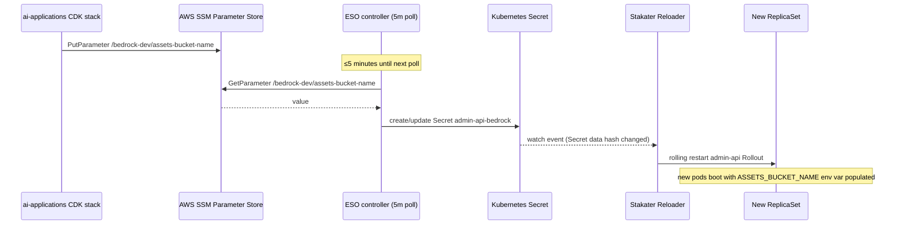

# Reloader Integration

How Stakater Reloader bridges ESO's Secret refresh cycle with workload restarts — detecting when a watched Secret's content changes and triggering a rolling restart on the owning Deployment or Rollout, without any ArgoCD sync or manual intervention.

## Why Reloader is necessary

ESO refreshes Kubernetes Secret content from SSM every `refreshInterval`. But pod environment variables are read once — at process start — and frozen for the lifetime of the pod. A Secret update does not update running pods.

Without Reloader, two scenarios break silently:

1. **Credential rotation:** An RDS password rotated in Secrets Manager is picked up by ESO within 15 minutes. The old password remains in all running pods until the next deploy or manual restart.
2. **Cross-stack dependency arrival:** `admin-api-bedrock` starts absent (the SSM key doesn't exist when `admin-api` first deploys). When the AI applications stack later publishes the key, ESO creates the Secret. Without Reloader, the running `admin-api` pods never see the new env var — the asset routes remain 503 indefinitely.

Reloader closes this gap: ESO syncs → Secret changes → Reloader detects the change → rolling restart → new pods boot with the updated values.

## Installation

[`argocd-apps/reloader.yaml`](../../argocd-apps/reloader.yaml) installs Reloader from `https://stakater.github.io/stakater-charts` at version `1.0.16`, wave 4 (after CRDs, CSI, CNI, and ESO at waves 0–3).

Key Helm values:

```yaml
reloader:
  watchGlobally: true        # single controller watches all namespaces

  reloadStrategy: env-vars   # triggers rolling restart (not annotation mutation)

  deployment:
    replicas: 1              # pinned — two replicas would double-roll workloads
    resources:
      requests:
        cpu: 10m
        memory: 64Mi
      limits:
        cpu: 100m
        memory: 128Mi
    nodeSelector:
      node-pool: general

  isOpenshift: false
```

**`watchGlobally: true`** — one Reloader controller handles all namespaces. The alternative (namespace-scoped mode) would require a Reloader pod per namespace.

**`reloadStrategy: env-vars`** — Reloader triggers a standard rolling restart of the pod. The comment in `reloader.yaml` explains the alternative: `annotations` strategy mutates the PodSpec in place, which produces noisier diffs in ArgoCD since ArgoCD would see the PodSpec diverge from Git on every restart. `env-vars` strategy avoids this because the mutation is a new ReplicaSet, not a patch to the existing PodSpec.

**`replicas: 1`** — two replicas would both react to the same Secret change event independently and trigger two back-to-back rolling restarts of the same workload. Single replica is intentional.

## Annotation pattern

A workload opts in to Reloader by adding a pod template annotation listing the Secret (or ConfigMap) names to watch:

```yaml
# Secret watch — comma-separated list, no spaces
secret.reloader.stakater.com/reload: "secret-name-1,secret-name-2"

# ConfigMap watch
configmap.reloader.stakater.com/reload: "configmap-name-1"
```

Reloader watches these specific resource names (not all Secrets in the namespace). When the `data` hash of any watched resource changes, Reloader triggers a rolling restart of the annotated workload.

## Workloads using Reloader

Two workloads carry Reloader annotations in this cluster:

### admin-api Rollout

[`charts/admin-api/chart/templates/rollout.yaml`](../../charts/admin-api/chart/templates/rollout.yaml):

```yaml
metadata:
  annotations:
    # Reloader rolls the pod when any of these Secrets' content changes
    # — Bedrock CDK stacks publishing new SSM keys, ESO refreshing
    # platform-rds-credentials on RDS password rotation, or Cognito
    # value rotation.
    secret.reloader.stakater.com/reload: "admin-api-secrets,admin-api-bedrock,admin-api-job-images,platform-rds-credentials"
```

Four Secrets watched:

| Secret | Source | Why watched |
|--------|--------|-------------|
| `admin-api-secrets` | SSM (`aws-ssm`) | Cognito pool IDs, DynamoDB table name — fail-fast at startup if missing |
| `admin-api-bedrock` | SSM (`aws-ssm`) | Optional Bedrock assets bucket — absent until AI stack deploys |
| `admin-api-job-images` | SSM (`aws-ssm`) | ECR image URIs for Job creation — file-mounted, but Reloader watch ensures timely restarts if other secrets also change |
| `platform-rds-credentials` | Secrets Manager (`aws-secretsmanager`) | RDS password — rotates on CDK password rotation cycle |

### public-api Deployment

[`charts/public-api/chart/templates/deployment.yaml`](../../charts/public-api/chart/templates/deployment.yaml):

```yaml
secret.reloader.stakater.com/reload: "public-api-core,public-api-bedrock,public-api-strategist"
```

Three Secrets watched — all sourced from SSM, covering the public-facing API's runtime config and optional Bedrock/strategist dependencies.

## The last-reload-from stamp and ignoreDifferences

When Reloader triggers a rolling restart, it stamps a timestamp annotation onto the pod template:

```
last-reload-from-admin-api-bedrock: "2026-04-28T14:23:00Z"
```

This annotation is not in the Helm chart template — it is added live by the Reloader controller. ArgoCD's selfHeal would detect this as drift from the Git-rendered manifest and revert it on the next sync cycle, which would undo Reloader's restart by restoring the pre-Reloader PodSpec.

Two ArgoCD configuration keys prevent this:

```yaml
# argocd-apps/admin-api.yaml
ignoreDifferences:
  - group: argoproj.io
    kind: Rollout
    jsonPointers:
      - /spec/template/metadata/annotations

syncOptions:
  - RespectIgnoreDifferences=true
```

**`ignoreDifferences`** tells ArgoCD not to treat the annotation path as Out-of-Sync. **`RespectIgnoreDifferences=true`** extends this rule to sync operations — without it, ArgoCD ignores the difference in the diff view but still overwrites the path during a sync. Both are required together.

The same pattern applies to `public-api` (`apps/Deployment`) and `nextjs` (`argoproj.io/Rollout`) — both carry `ignoreDifferences` covering `/spec/template/metadata/annotations`.

## ESO + Reloader event chain

The full chain from a cross-stack SSM key appearing to new pods running with that value:



Total lag from SSM write to running pods: ≤5 minutes (ESO poll) + rolling restart time (~30–60s for admin-api).

### The required/optional split

`admin-api-secrets.yaml` explains the design rationale for splitting admin-api secrets into two ExternalSecrets:

```yaml
# From charts/admin-api/external-secrets/admin-api-secrets.yaml comment:
# Optional Bedrock pipeline values (assets bucket + 4 Lambda ARNs +
# strategist table) are split into admin-api-bedrock so a partially-
# deployed Bedrock stack doesn't block the entire Secret. Once those SSM
# keys land, ESO refreshes admin-api-bedrock and Reloader rolls the pod —
# no manual sync required.
```

If the optional values were in `admin-api-secrets` alongside the required Cognito/DynamoDB values, ESO would fail to create the entire Secret until every SSM key exists. Splitting them lets `admin-api` boot with the required keys immediately, then self-heal once the optional keys arrive.

## Reloader vs Argo Rollouts Blue/Green

Reloader's rolling restart and Argo Rollouts Blue/Green are distinct mechanisms:

| | Reloader restart | Blue/Green Rollout |
|---|---|---|
| **Trigger** | Secret/ConfigMap data hash change | Image tag change (Image Updater) or manual |
| **Strategy** | Rolling (gradual pod replacement) | Two ReplicaSets, traffic switch at promotion |
| **Pre-promotion analysis** | None | AnalysisRun (error rate, P95 latency) |
| **Rollback** | Not automatic | Abort Rollout, revert to active ReplicaSet |
| **Use case** | Secret rotation, config drift correction | Container image update with canary validation |

Reloader restarts use the `rolling` strategy of the underlying Rollout (not the BlueGreen strategy). This means a Reloader-triggered restart on an Argo Rollout does a standard rolling replacement — it does not go through pre-promotion analysis and does not create a preview ReplicaSet.

## Related

- [External Secrets AWS integration](external-secrets-aws-integration.md) — the ESO side of the chain: `admin-api-bedrock` cross-stack pattern, volumeMount vs envFrom, refresh intervals
- [ESO secret management](eso-secret-management.md) — ExternalSecret schema, `-secrets` Application ordering, deletion policies
- [ArgoCD GitOps architecture](argocd-gitops-architecture.md) — sync waves, `ignoreDifferences`, `RespectIgnoreDifferences` pattern

<!--
Evidence trail (auto-generated):
- Source: argocd-apps/reloader.yaml (read 2026-04-28 — chart 1.0.16, wave 4, watchGlobally: true, reloadStrategy: env-vars, replicas: 1 with double-roll comment, 10m/64Mi requests, 100m/128Mi limits, general node pool, isOpenshift: false, full comment block explaining why Reloader exists)
- Source: charts/admin-api/chart/templates/rollout.yaml (read 2026-04-28 — secret.reloader.stakater.com/reload annotation listing 4 secrets, comment explaining Bedrock SSM keys and RDS password rotation)
- Source: charts/public-api/chart/templates/deployment.yaml (read 2026-04-28 — secret.reloader.stakater.com/reload annotation listing 3 secrets)
- Source: argocd-apps/admin-api.yaml (read 2026-04-28 — ignoreDifferences on /spec/template/metadata/annotations, RespectIgnoreDifferences=true, comment about last-reload-from-X stamp)
- Source: argocd-apps/public-api.yaml (read 2026-04-28 — ignoreDifferences on apps/Deployment /spec/template/metadata/annotations)
- Source: argocd-apps/nextjs.yaml (read 2026-04-28 — ignoreDifferences on argoproj.io/Rollout /spec/template/metadata/annotations, RespectIgnoreDifferences=true)
- Source: charts/admin-api/external-secrets/admin-api-bedrock.yaml (read 2026-04-28 — full event-driven chain comment, UNSET_BUCKET_SENTINEL pattern, 5m refresh)
- Source: charts/admin-api/external-secrets/admin-api-secrets.yaml (read 2026-04-28 — required/optional split rationale comment, Reloader reference in comment)
- Generated: 2026-04-28
-->
