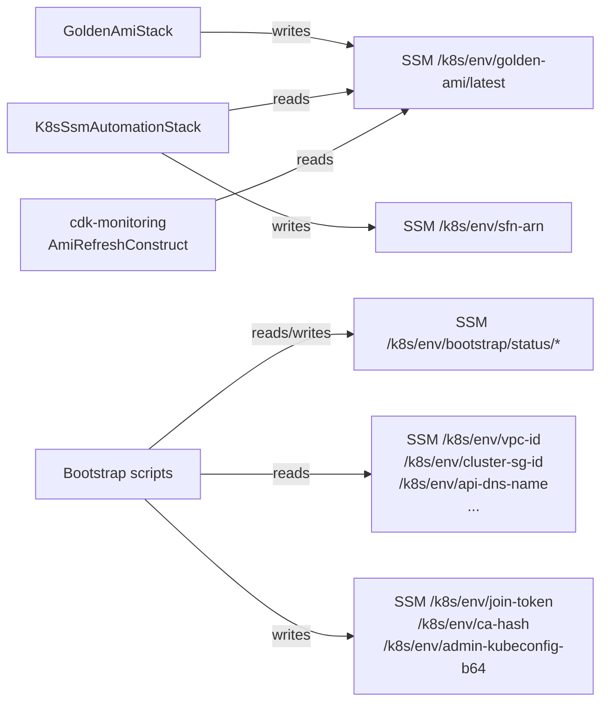
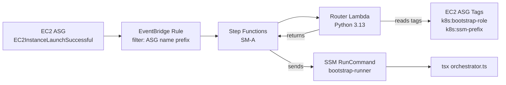

# SSM Automation Bootstrap Integration

How AWS SSM Parameter Store acts as the cross-stack service registry and live status bus for the Kubernetes bootstrap pipeline — covering parameter path conventions, RunCommand document lifecycle, and S3 hot-fix override.

## SSM as cross-stack service registry

All inter-stack references go through SSM parameters rather than CloudFormation exports. This keeps each CDK stack independently deployable without hard CloudFormation dependency chains.



Path conventions are defined in [`infra/lib/config/ssm-paths.ts`](../../infra/lib/config/ssm-paths.ts). All paths are prefixed with `/k8s/{environment}/` (e.g., `/k8s/development/`, `/k8s/production/`).

## Parameter path layout

```
/k8s/{env}/
  ├── golden-ami/
  │   └── latest                    — AMI ID written by Image Builder pipeline
  ├── vpc-id                        — VPC ID (read by CDK synth via context)
  ├── cluster-sg-id                 — EC2 security group for cluster nodes
  ├── api-dns-name                  — Control plane API server DNS (Route 53)
  ├── hosted-zone-id                — Route 53 hosted zone for the cluster
  ├── s3-bucket                     — S3 bucket for bootstrap scripts + etcd backups
  ├── nlb-http-target-group-arn     — NLB target group ARN (read by verify-cluster.sh)
  ├── sfn-arn                       — Step Functions state machine ARN
  │
  ├── join-token                    — SecureString, kubeadm bootstrap token (12h rotation)
  ├── ca-hash                       — SHA256 of cluster CA certificate
  ├── admin-kubeconfig-b64          — SecureString, base64-encoded admin.conf
  │
  └── bootstrap/
      └── status/
          ├── boot/
          │   ├── mount-data-volume — { status, startedAt, finishedAt, error? }
          │   ├── init-kubeadm      — { status, ... }
          │   ├── install-calico    — { status, ... }
          │   └── ...               — one parameter per step
          └── argocd/
              ├── create_namespace  — { status, startedAt, finishedAt, error? }
              ├── install_argocd    — { status, ... }
              └── ...               — one parameter per step
```

The `join-token` and `admin-kubeconfig-b64` parameters use SSM `SecureString` type (KMS-encrypted at rest). All others use `String`.

## RunCommand document — bootstrap-runner

The `K8sSsmAutomationStack` defines an SSM RunCommand document that:

1. **S3-syncs** the full `sm-a/` source tree over the AMI-baked copy at `/opt/k8s-bootstrap/sm-a/`
2. **Invokes** `tsx orchestrator.ts --mode {role}` where `{role}` is passed as a document parameter

```yaml
# SSM document (simplified)
schemaVersion: "2.2"
parameters:
  mode:
    type: String
    allowedValues: [control-plane, worker]
mainSteps:
  - action: aws:runShellScript
    timeoutSeconds: 3600
    inputs:
      runCommand:
        - aws s3 sync s3://{{s3Bucket}}/sm-a/ /opt/k8s-bootstrap/sm-a/
        - cd /opt/k8s-bootstrap && tsx sm-a/boot/steps/orchestrator.ts --mode {{mode}}
```

### Why 3600 seconds

The timeout is set to 1 hour. The previous default (600 s) caused a production incident: a slow EBS attach during a Calico DaemonSet wait loop ran past the timeout, killing the execution mid-bootstrap. The instance was left in a partially bootstrapped state requiring manual SSM intervention. The comment in `ssm-automation-stack.ts` preserves this history to prevent the value being reduced in code review.

## S3 hot-fix override

Bootstrap scripts are baked into the AMI at `/opt/k8s-bootstrap/` at image-build time. The S3 sync at runtime overlays the baked copy:

```
AMI (version-locked):  /opt/k8s-bootstrap/sm-a/boot/steps/worker.ts (v1.2.3)
S3 at runtime:         s3://bucket/sm-a/boot/steps/worker.ts          (v1.2.4 hot-fix)
                       ↓ aws s3 sync
Effective:             /opt/k8s-bootstrap/sm-a/boot/steps/worker.ts   (v1.2.4)
```

This allows urgent fixes to be deployed without a full AMI re-bake and re-rollout. The S3 bucket receives the `sm-a/` tree on every `deploy-ssm-automation.yml` workflow run, which is lighter-weight than triggering `deploy-golden-ami.yml`.

The tradeoff: the S3 sync adds a few seconds to every bootstrap execution and creates a divergence between the AMI content and the runtime content. For debugging, the S3 version always wins.

## Event-driven dispatch — EventBridge → Step Functions

The `BootstrapOrchestratorConstruct` wires the full dispatch chain ([`infra/lib/constructs/ssm/bootstrap-orchestrator.ts`](../../infra/lib/constructs/ssm/bootstrap-orchestrator.ts)):



The Router Lambda (inline Python 3.13) reads two ASG tags:
- `k8s:bootstrap-role` — `control-plane` or `worker` (determines the `--mode` flag)
- `k8s:ssm-prefix` — the SSM path prefix for this cluster (e.g., `/k8s/development`)

This tag-driven dispatch means a single Step Functions state machine serves multiple cluster environments without any code changes.

## Live status monitoring

Every step in both `control_plane.ts` and `worker.ts` writes its status to SSM via `makeRunStep` (see [Idempotent step runner pattern](../patterns/idempotent-step-runner.md)). Every step in `bootstrap_argocd.ts` writes via `BootstrapLogger`. This provides live bootstrap observability:

```bash
# Watch all control plane boot step statuses
aws ssm get-parameters-by-path \
  --path "/k8s/development/bootstrap/status/boot" \
  --recursive \
  --query 'Parameters[*].{Step:Name,Status:Value}' \
  --output table

# Watch ArgoCD bootstrap steps
aws ssm get-parameters-by-path \
  --path "/k8s/development/bootstrap/status/argocd" \
  --recursive \
  --query 'Parameters[*].{Step:Name,Status:Value}' \
  --output table
```

Status values: `running`, `success`, `failed`, `degraded`.

## SSM client pattern in common.ts

`common.ts` uses a lazy singleton for the SSM client to avoid re-initialising the AWS SDK on every `ssmGet`/`ssmPut` call:

```typescript
// common.ts — SSM lazy singleton
let _ssm: SSMClient | undefined;
const ssm = () => (_ssm ??= new SSMClient({ region: process.env.AWS_REGION }));
```

`ssmGet(path)` and `ssmPut(path, value, secure?)` are the two primitives used throughout the bootstrap codebase. `secure=true` writes a `SecureString` parameter (KMS-encrypted); the default is `String`.

## Related

- [Kubernetes Bootstrap Orchestrator](../projects/kubernetes-bootstrap-orchestrator.md) — the full pipeline that this infrastructure serves
- [Control plane vs worker join sequence](cp-worker-join-sequence.md) — the SSM parameters used for join coordination (`join-token`, `ca-hash`, `admin-kubeconfig-b64`)
- [Idempotent step runner pattern](../patterns/idempotent-step-runner.md) — how steps write to the `bootstrap/status/boot/*` namespace
- [ArgoCD bootstrap pattern](argocd-bootstrap-pattern.md) — how `BootstrapLogger` writes to `bootstrap/status/argocd/*`

<!--
Evidence trail (auto-generated):
- Source: infra/lib/constructs/ssm/bootstrap-orchestrator.ts (read in prior session — Router Lambda Python 3.13 inline, k8s:bootstrap-role + k8s:ssm-prefix tag reads, Step Functions dispatch chain)
- Source: infra/lib/stacks/ssm-automation-stack.ts (read in prior session — bootstrap-runner RunCommand document, timeoutSeconds=3600, S3 sync command, production incident comment)
- Source: infra/lib/config/ssm-paths.ts (referenced in README evidence trail — cross-stack service registry pattern)
- Source: sm-a/boot/steps/common.ts (read 2026-04-28 — SSM lazy singleton, ssmGet/ssmPut, SecureString usage)
- Generated: 2026-04-28
-->
