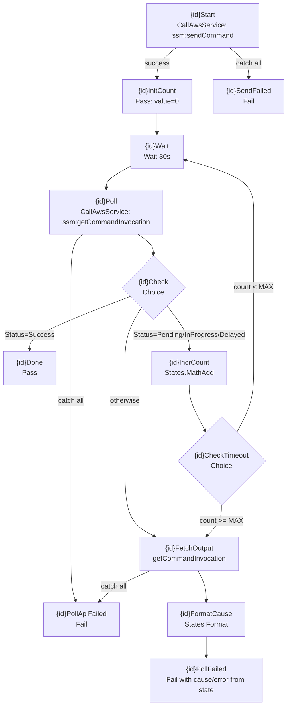

# Step Functions SSM Poll Loop Pattern

The `buildRunCommandChain` private method in `BootstrapOrchestratorConstruct` — a reusable CDK pattern that wraps any SSM RunCommand execution in a Send → Wait → Poll → Check → Timeout loop, enriches failures with ready-to-paste diagnostic commands, and uses `States.MathAdd` and `States.Format` intrinsic functions to keep the implementation entirely within Step Functions without a single Lambda or wait function.

## The problem

SSM RunCommand is asynchronous. `SendCommand` returns a `CommandId` immediately; the actual script may run for 30 minutes. Step Functions needs a poll loop to detect completion without paying for Lambda invocations or burning idle time in an Activity.

The naive implementation — a single `Wait(N seconds)` followed by `GetCommandInvocation` — fails for scripts with variable runtimes and doesn't produce actionable failures.

## buildRunCommandChain — per-step state chain

`buildRunCommandChain(step, runnerDocName, logGroupName, instanceIdPath, ssmPrefixPath, s3BucketPath, regionPath)` generates 10–12 Step Functions states for a single SSM step ([`infra/lib/constructs/ssm/bootstrap-orchestrator.ts`](../../infra/lib/constructs/ssm/bootstrap-orchestrator.ts), line ~422):



`buildRunCommandChain` returns `{ start, end }` — the caller chains `.end.next(nextStep.start)` to compose sequential steps. The `chainSteps()` helper in the construct wires them into a linear chain automatically.

## States.MathAdd — counter without Lambda

The poll counter is maintained entirely in the Step Functions execution context using the `States.MathAdd` intrinsic function via a `CustomState` (raw JSON escape hatch):

```typescript
// infra/lib/constructs/ssm/bootstrap-orchestrator.ts
const incrPollCount = new sfn.CustomState(this, `${id}IncrCount`, {
  stateJson: {
    Type: "Pass",
    Parameters: {
      "value.$": `States.MathAdd(${pollCountPath}.value, 1)`,
    },
    ResultPath: pollCountPath,
  },
});
```

`States.MathAdd` is a Step Functions intrinsic function available since 2021. The CDK high-level constructs don't expose it directly — `CustomState` with raw `stateJson` is the only way to use it in CDK v2.

`pollCountPath` is `$.${safeId}PollCount` — a unique key per step, preventing collision when multiple steps are chained into the same execution context.

### Why safeId

Step Functions state IDs that contain hyphens are invalid in dot-notation JSONPath (the syntax used by intrinsic functions). `buildRunCommandChain` strips hyphens:

```typescript
const safeId = id.replace(/-/g, "");  // "BootstrapControlPlane" → stays as-is; "my-step" → "mystep"
```

This matters because `$.my-stepPollCount.value` is a JSONPath syntax error — the dash is interpreted as a subtraction operator. `$.mystepPollCount.value` is valid.

## Dynamic MAX_POLL_ITERATIONS

Each step gets a timeout derived from its own `timeoutSeconds`:

```typescript
const MAX_POLL_ITERATIONS = Math.ceil(step.timeoutSeconds / 30);
// BootstrapControlPlane: Math.ceil(1800 / 30) = 60 iterations = 30 min
// BootstrapWorker:       Math.ceil(900 / 30)  = 30 iterations = 15 min
```

The `CheckTimeout` Choice compares `${pollCountPath}.value >= MAX_POLL_ITERATIONS`. If the script has not completed within the per-step budget, the chain moves to the failure enrichment path — not a generic timeout state.

## States.Format — failure enrichment

When a step fails or times out, `buildRunCommandChain` runs a two-state enrichment path before the terminal `Fail` state:

**State 1: `{id}FetchOutput`** — calls `ssm:getCommandInvocation` to retrieve `StatusDetails`, `StandardOutputContent`, and `StandardErrorContent`.

**State 2: `{id}FormatCause`** — a `CustomState` using `States.Format` to produce a rich, operator-ready failure string:

```typescript
const formatFailureCause = new sfn.CustomState(this, `${id}FormatCause`, {
  stateJson: {
    Type: "Pass",
    Parameters: {
      error: "CommandFailed",
      "cause.$": `States.Format(
        '⚠ Bootstrap step ${id} FAILED.\nSSM status: {}.\nCommandId: {}\nInstanceId: {}\n\n' +
        'Tail full logs:\n  aws logs tail ${logGroupName} --log-stream-name-prefix {} ...\n\n' +
        'Or fetch invocation directly:\n  aws ssm get-command-invocation ...\n\n' +
        'Query step status in SSM:\n  aws ssm get-parameter ...\n\n' +
        '─── stderr (full) ───\n{}',
        $.${safeId}FailureOutput.StatusDetails,
        $.${id}Result.CommandId,
        ${instanceIdPath},
        $.${id}Result.CommandId,
        ...
        $.${safeId}FailureOutput.StandardErrorContent
      )`,
    },
    ResultPath: `$.${safeId}FailCause`,
  },
});
```

`States.Format` is a Step Functions intrinsic function that performs string interpolation using `{}` placeholders. The resulting formatted string is stored in the execution context, then picked up by the terminal `Fail` state via `causePath` and `errorPath`:

```typescript
const pollFailed = new sfn.Fail(this, `${id}PollFailed`, {
  causePath: `$.${safeId}FailCause.cause`,
  errorPath: `$.${safeId}FailCause.error`,
});
```

### Why stderr only, not stdout

The failure cause omits `StandardOutputContent` and only includes `StandardErrorContent`. Step Functions truncates the `Cause` field on display, and SSM stdout is already capped at ~24 KB upstream. Including both means the most useful diagnostic content (the ready-to-paste `aws logs tail` command) gets pushed past the truncation point. Operators tail CloudWatch for full output.

## SendCommand retry policy

`startExec.addRetry()` handles transient SSM availability issues:

```typescript
startExec.addRetry({
  errors: ["Ssm.InvalidInstanceIdException", "Ssm.SsmException"],
  interval: cdk.Duration.seconds(30),
  maxAttempts: 5,
  backoffRate: 1.5,
});
```

`InvalidInstanceIdException` occurs when SSM agent hasn't registered yet — common in the first ~15 seconds after EC2 launch. The 5-attempt retry with 1.5× backoff covers this registration window without failing the execution.

## Chaining multiple steps

`chainSteps()` wires `buildRunCommandChain` outputs into a linear chain:

```typescript
const chainSteps = (steps, runnerDocName, logGroupName) => {
  const builtSteps = steps.map(step => buildRunCommandChain(step, ...));
  for (let i = 0; i < builtSteps.length - 1; i++) {
    builtSteps[i].end.next(builtSteps[i + 1].start);
  }
  return { start: builtSteps[0].start, end: builtSteps[builtSteps.length - 1].end };
};
```

Currently each role has exactly one step (`CONTROL_PLANE_STEPS` and `WORKER_STEPS` each have one `BootstrapStep`). The chain infrastructure supports adding more steps without any structural changes — add an entry to the array and the states wire automatically.

## CA-token poll loop — reuse of the same pattern

The `CheckCaParam` join-token gate that follows `cpChain` uses the same `States.MathAdd` pattern, implemented manually (not via `buildRunCommandChain`) because it polls an SSM *parameter* rather than an SSM *command invocation*:

```typescript
const incrCaPollCount = new sfn.CustomState(this, "IncrCaPollCount", {
  stateJson: {
    Type: "Pass",
    Parameters: {
      "value.$": "States.MathAdd($.CaPollCount.value, 1)",
    },
    ResultPath: "$.CaPollCount",
  },
});
```

The same mechanics — `CustomState` for `States.MathAdd`, `Choice` for threshold check, `Wait` for interval — demonstrate that the pattern is composable beyond the RunCommand use case.

## Related

- [SM-A Bootstrap Orchestrator](../projects/sm-a-bootstrap-orchestrator.md) — where this pattern is instantiated
- [SSM Automation bootstrap integration](ssm-automation-bootstrap.md) — the SSM parameter layout that the poll loop queries

<!--
Evidence trail (auto-generated):
- Source: infra/lib/constructs/ssm/bootstrap-orchestrator.ts (read 2026-04-28, 606 lines — buildRunCommandChain lines ~422-602, CustomState for States.MathAdd, formatFailureCause States.Format, safeId hyphen stripping, addRetry policy, CA poll loop States.MathAdd reuse, CONTROL_PLANE_STEPS/WORKER_STEPS definitions)
- Generated: 2026-04-28
-->
