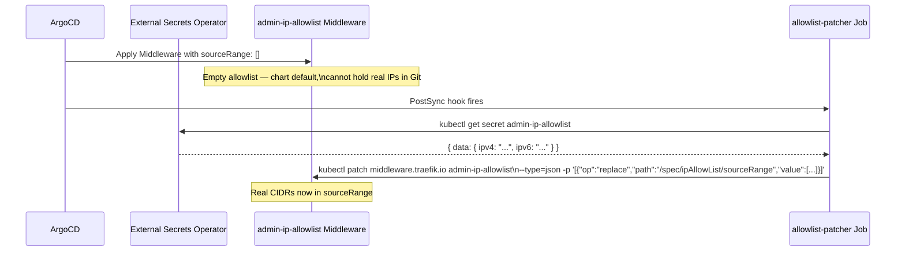

# PostSync Patcher Pattern — ignoreDifferences + RespectIgnoreDifferences

Why the monitoring Application uses a PostSync hook Job to patch the Traefik IP allowlist Middleware, and how the `ignoreDifferences` + `RespectIgnoreDifferences` combination prevents ArgoCD selfHeal from immediately reverting the patch — and why omitting either half creates a silent production regression.

## The problem: runtime-only values that cannot live in Git

The Traefik `admin-ip-allowlist` Middleware requires an IP CIDR list for `/spec/ipAllowList/sourceRange`. The actual CIDRs (operator IP addresses) cannot be committed to a public Git repository. They live in AWS SSM Parameter Store and are synced into the cluster by External Secrets Operator (ESO) as a Kubernetes Secret.

The difficulty: `ipAllowList.sourceRange` is a field on the Traefik `Middleware` CRD — a Traefik-specific custom resource. ESO populates Kubernetes `Secret` objects only. It cannot write directly into a CRD field on a different resource type.

Helm `lookup` would be the conventional alternative (look up the Secret in the chart, render the CIDR list), but `helm lookup` is a no-op under `helm template` (ArgoCD's rendering mode). It always returns nil.

## The solution: PostSync hook Job

The monitoring Helm chart includes a PostSync hook Job ([`charts/monitoring/chart/templates/traefik/allowlist-patcher.yaml`](../../charts/monitoring/chart/templates/traefik/allowlist-patcher.yaml)) that runs after every ArgoCD sync:



The Job reads `.data.ipv4` and `.data.ipv6` from the ESO-managed Secret (comma-separated CIDR lists, base64-decoded), builds a JSON array, and patches `/spec/ipAllowList/sourceRange`.

## The production footgun: selfHeal without ignoreDifferences

Without `ignoreDifferences`, ArgoCD immediately detects drift between the Git state (empty `sourceRange: []`) and the live state (patched CIDRs). With `selfHeal: true`, it reverts the patch within seconds of the Job completing.

The result: the IP allowlist is never actually enforced. The patcher fires after sync, ArgoCD reverts it, and the Middleware stays with an empty sourceRange — silently allowing all traffic to admin-protected endpoints.

## The two-part fix in argocd-apps/monitoring.yaml

Both halves are required. Each half alone is insufficient.

### Part 1: ignoreDifferences

```yaml
# argocd-apps/monitoring.yaml
ignoreDifferences:
  - group: traefik.io
    kind: Middleware
    name: admin-ip-allowlist
    jsonPointers:
      - /spec/ipAllowList/sourceRange
```

This tells ArgoCD's **diff** engine to ignore this field when computing whether the Application is `OutOfSync`. ArgoCD will no longer show the patched sourceRange as drift.

### Part 2: RespectIgnoreDifferences

```yaml
syncPolicy:
  syncOptions:
    - RespectIgnoreDifferences=true
```

This extends the `ignoreDifferences` rule from the **diff** phase to the **sync** phase. Without it, when ArgoCD syncs (either automatically via selfHeal or manually), it still applies the Helm-rendered value (`sourceRange: []`) to the live cluster — ignoring only whether the difference is _shown_ as drift, not whether it's _written_.

`RespectIgnoreDifferences=true` is what prevents the sync operation from reverting the patched field. It is a relatively new ArgoCD sync option (added in ArgoCD ~2.4) and is not part of the default sync behaviour.

### Why omitting either half is a silent failure

| Configuration | Effect |
|--------------|--------|
| `ignoreDifferences` only | App shows Synced, but next sync reverts the patch. Middleware stays empty. |
| `RespectIgnoreDifferences=true` only | Sync won't revert, but App shows perpetually OutOfSync due to the diff. selfHeal triggers repeatedly. |
| Both | App shows Synced, sync doesn't revert, patcher's changes survive. Correct behaviour. |

The failure mode without `RespectIgnoreDifferences` is particularly subtle: the Application shows Synced and Healthy in the ArgoCD UI (because diff is suppressed), but the allowlist isn't enforced. There's no alert, no error — just open admin access.

## allowlist-patcher Job implementation details

The Job ([`charts/monitoring/chart/templates/traefik/allowlist-patcher.yaml`](../../charts/monitoring/chart/templates/traefik/allowlist-patcher.yaml)) is gated by `{{- if .Values.adminAccess.enabled }}` — disabled in environments where admin access controls aren't required.

**Hook annotations:**
```yaml
argocd.argoproj.io/hook: PostSync
argocd.argoproj.io/hook-delete-policy: BeforeHookCreation
```

`BeforeHookCreation` deletes the previous Job run before creating the new one — prevents accumulation of completed Jobs that would block the next sync.

**Container image: `alpine/k8s:1.31.4`** — not the upstream `registry.k8s.io/kubectl` image. The kubectl image is distroless (no `/bin/sh`), which prevents running the multi-command shell script that decodes the Secret and constructs the CIDR JSON array.

**Security context:**
```yaml
securityContext:
  runAsNonRoot: true
  runAsUser: 1001
  allowPrivilegeEscalation: false
  readOnlyRootFilesystem: true
  capabilities:
    drop: ["ALL"]
```

**ESO wait loop:** The Job polls for the `admin-ip-allowlist` Secret up to 30 times with 5-second intervals (150 s total) before failing. This handles the race between the PostSync hook firing and ESO completing its Secret refresh cycle.

**CIDR construction:**
```sh
# Merges ipv4 + ipv6, drops empties, builds JSON array
CIDRS_JSON=$(printf '%s,%s' "$IPV4" "$IPV6" | tr ',' '\n' | awk 'NF' \
  | sed 's/^[[:space:]]*//;s/[[:space:]]*$//' \
  | awk 'BEGIN{printf "["} {if (NR>1) printf ","; printf "\"%s\"", $0} END{printf "]"}')
```

## RBAC scope

A `Role` and `RoleBinding` in the `monitoring` namespace grant the Job's `ServiceAccount` exactly:
- `secrets/get` on `admin-ip-allowlist` only
- `middlewares/get,patch` on `admin-ip-allowlist` only (Traefik CRD, `traefik.io` group)

No cluster-wide permissions, no wildcard resources.

## Rotation procedure

To update the allowed IP CIDRs:
1. Update SSM parameters: `/k8s/{env}/monitoring/allow-ipv4` and `/allow-ipv6`
2. ESO refreshes the `admin-ip-allowlist` Secret within 5 minutes (its refresh interval)
3. Trigger a manual ArgoCD sync of the `monitoring` Application
4. The PostSync hook fires, the Job reads the updated Secret, patches the Middleware

**selfHeal does NOT auto-trigger on Secret content changes** — only on Application manifest drift. The manual sync is the required trigger. This is by design: automatic CIDRs rotation on every ESO refresh would create unnecessary sync churn.

## Where this pattern applies elsewhere

The same `ignoreDifferences` + `RespectIgnoreDifferences` combination is used for any resource field that:
- Cannot be expressed in a Helm chart value
- Is owned by a runtime process (ESO, a controller, a hook Job)
- Must survive ArgoCD reconciliation

Other candidates in this repo that use the same principle (check argocd-apps/ for other ignoreDifferences blocks): CloudFront origin secret injection into IngressRoute headers.

## Related

- [ArgoCD bootstrap pattern](../concepts/argocd-bootstrap-pattern.md) — `provision_crossplane_credentials` and secret seeding before first sync
- [Kubernetes Bootstrap Orchestrator](../projects/kubernetes-bootstrap-orchestrator.md) — `inject_monitoring_helm_params` step that seeds runtime values as Helm parameters

<!--
Evidence trail (auto-generated):
- Source: charts/monitoring/chart/templates/traefik/allowlist-patcher.yaml (read 2026-04-28 — PostSync hook, BeforeHookCreation, alpine/k8s rationale comment, CIDR construction script, RBAC Role/RoleBinding, ESO wait loop 30×5s, security context)
- Source: argocd-apps/monitoring.yaml (read 2026-04-28 — ignoreDifferences block on /spec/ipAllowList/sourceRange, RespectIgnoreDifferences=true in syncOptions, comment block explaining the selfHeal revert problem)
- Generated: 2026-04-28
-->
