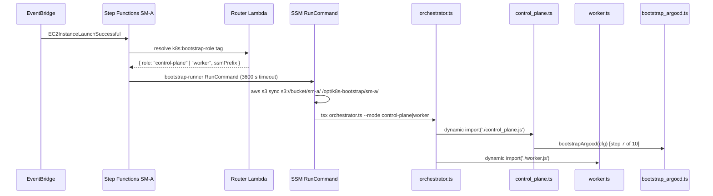
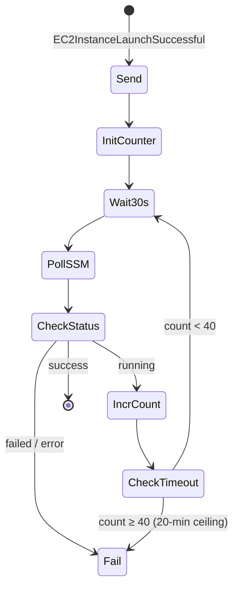

# Kubernetes Bootstrap Orchestrator

End-to-end event-driven orchestration that takes a bare EC2 instance from ASG launch to a fully-reconciled ArgoCD-managed Kubernetes cluster — with zero manual steps and a total of 47 idempotent TypeScript steps across both node types.

## System overview

When an EC2 instance joins an Auto Scaling Group, an EventBridge rule fires on `EC2InstanceLaunchSuccessful` and hands control to an AWS Step Functions state machine. A Python Lambda router reads the ASG's `k8s:bootstrap-role` tag and dispatches the correct SSM RunCommand script. The script S3-syncs the full `sm-a/` source tree over the AMI-baked copy, then invokes `tsx orchestrator.ts` as the single entry point for both node types.



The Step Functions state machine polls SSM for the control-plane join token before dispatching workers (40 iterations × 30 s = 20-minute ceiling).
See [`infra/lib/constructs/ssm/bootstrap-orchestrator.ts`](../../infra/lib/constructs/ssm/bootstrap-orchestrator.ts) and the higher-level architecture doc at [`docs/sm-a-bootstrap-orchestrator.md`](../sm-a-bootstrap-orchestrator.md).

## Entry point — orchestrator.ts

[`sm-a/boot/steps/orchestrator.ts`](../../sm-a/boot/steps/orchestrator.ts) is an 87-line thin dispatcher. It parses `--mode` (default: `control-plane`) and `--dry-run` CLI flags, then uses dynamic `await import()` to load the correct module at runtime:

```typescript
if (mode === 'worker') {
  const { main } = await import('./worker.js');
  await main(config);
} else {
  const { main } = await import('./control_plane.js');
  await main(config);
}
```

The dynamic import keeps the SSM RunCommand document identical for both node types — only the `--mode` flag differs.

## Control plane bootstrap — 10 sequential steps

[`sm-a/boot/steps/control_plane.ts`](../../sm-a/boot/steps/control_plane.ts) runs 10 idempotent steps in sequence (lines 1549–1564):

| # | Step name | Marker file | Notes |
|---|-----------|------------|-------|
| 1 | `mount-data-volume` | `DATA_MOUNT_MARKER` | Attaches + mounts EBS data volume at `/data` |
| 2 | `dr-restore` | `DR_RESTORE_MARKER` | Restores etcd snapshot from S3 if present |
| 3 | `init-kubeadm` | _(none — idempotent internally)_ | `kubeadm init` or second-run maintenance path |
| 4 | `install-calico` | `CALICO_MARKER` | Tigera operator + Installation CR, 6-min DaemonSet wait |
| 5 | `install-ccm` | `CCM_MARKER` | AWS Cloud Controller Manager via Helm |
| 6 | `configure-kubectl` | _(none)_ | Writes `/etc/bashrc`, copies admin.conf |
| 7 | `bootstrap-argocd` | _(none)_ | Calls `bootstrap_argocd.ts` — hands off to GitOps |
| 8 | `verify-cluster` | _(none)_ | Runs `verify-cluster.sh` |
| 9 | `install-etcd-backup` | `/etc/systemd/system/etcd-backup.timer` | systemd timer, backup to S3 |
| 10 | `install-token-rotator` | `TOKEN_ROTATOR_MARKER` | systemd timer, `OnBootSec=10min`, `OnUnitActiveSec=12h` |

Steps without marker files are either idempotent by design (`configure-kubectl`, `bootstrap-argocd`) or re-verify live state on every run (`verify-cluster`). Steps 1–2, 4–5, 9–10 use filesystem markers and are skipped on any subsequent SSM invocation that lands on the same instance.

### Second-run (maintenance) path

`initOrReconstruct()` branches on `existsSync(ADMIN_CONF)`. On a fresh instance it runs `kubeadm init`; on a subsequent SSM execution it handles:

- Certificate SAN regeneration for DNS changes
- Bootstrap token restore from SSM SecureString
- RBAC repair
- Stale node cleanup via `kubectl delete node`

This makes `init-kubeadm` safe to re-run across restarts without risking a double-init.

### Calico configuration

Calico is installed with VXLAN encapsulation and BGP disabled, pod CIDR `192.168.0.0/16`. The step polls up to 6 minutes for the `calico-node` DaemonSet to reach Ready before proceeding (with stale state detection to prevent a misread Ready on a partially updated DaemonSet).

### Bootstrap configuration interface

All runtime parameters come through the `BootConfig` interface — values are read from SSM parameters published by CDK stacks at deploy time, so zero infrastructure state is hardcoded in the AMI:

```typescript
// control_plane.ts — BootConfig
ssmPrefix: string;   // e.g. /k8s/development
k8sVersion: string;  // "1.35.1"
podCidr: string;     // "192.168.0.0/16"
serviceCidr: string; // "10.96.0.0/12"
calicoVersion: string; // "v3.29.3"
apiDnsName: string;
hostedZoneId: string;
s3Bucket: string;
environment: string;
// ...plus: awsRegion, dataDir, mountPoint, logGroupName
```

## Worker bootstrap — 6 sequential steps

[`sm-a/boot/steps/worker.ts`](../../sm-a/boot/steps/worker.ts) runs 6 steps (lines 1207–1212):

| # | Step name | Marker | Notes |
|---|-----------|--------|-------|
| 1 | `validate-ami` | _(none)_ | Checks required binaries, kernel modules, sysctl values |
| 2 | `join-cluster` | _(none)_ | `kubeadm join` with retry loop (5 attempts, 30 s interval) |
| 3 | `register-instance` | _(none)_ | Applies node labels, removes uninitialized taint |
| 4 | `install-cloudwatch-agent` | `CW_AGENT_MARKER` | CloudWatch agent install + start |
| 5 | `clean-stale-pvs` | `STALE_PV_CLEANUP_MARKER` | Removes orphaned PVs (monitoring workers only) |
| 6 | `verify-cluster-membership` | _(none)_ | Self-healing re-join if node not in `kubectl get nodes` |

### AMI validation (step 1)

Before joining, the worker validates the node is actually ready to be a Kubernetes member:

- **Binaries**: `containerd`, `kubeadm`, `kubelet`, `kubectl`, `helm`
- **Kernel modules**: `overlay`, `br_netfilter`
- **Sysctl**: `net.bridge.bridge-nf-call-iptables=1`, `net.bridge.bridge-nf-call-ip6tables=1`, `net.ipv4.ip_forward=1`

If any check fails the step throws, blocking the join and surfacing a classified failure to SSM before the Step Functions timeout fires.

### Join sequence and CA mismatch handling

`joinCluster()` detects CA mismatch by comparing the local certificate hash against SSM `/ca-hash`. On mismatch it runs `kubeadm reset -f` before retrying — this handles the case where a recycled instance has stale certificates from a previous cluster lifetime.

The join token is re-fetched from SSM **per attempt** (aware of the 12-hour rotator); the CA hash is fetched **once** (stable for the cluster lifetime). Up to 5 attempts with 30 s interval.

API server reachability is probed via `node:net` (`tcpProbe(host, 6443)`, 5 s timeout) — avoids the subprocess overhead of shelling out to `nc` or `curl`.

### Worker kubeconfig

Workers use `kubelet.conf` for `kubectl` operations (not `admin.conf`). The admin kubeconfig is fetched from SSM `/admin-kubeconfig-b64` (base64-encoded) for operations that require cluster-admin rights.

## Shared step infrastructure — common.ts

[`sm-a/boot/steps/common.ts`](../../sm-a/boot/steps/common.ts) (724 lines) provides four layers used by both control_plane.ts and worker.ts.

### Structured logging

JSON to stdout: `{ timestamp, level, message, ...extra }`. Every step writes start/end to both stdout and SSM, providing live observability without a management cluster.

### Subprocess runner

`run(cmd: string[], opts?)` uses `spawnSync` with the **array form** — never shell string interpolation. This prevents command injection from any SSM-sourced parameter value reaching the shell.

### makeRunStep — the idempotency factory

`makeRunStep(scriptName)` returns a `runStep(name, fn, cfg, marker?)` closure. The flow for every step invocation:

```
runStep(name, fn, cfg, marker?) flow:
  1. If marker file exists on filesystem → skip (log, return early)
  2. Write SSM: {ssmPrefix}/bootstrap/status/boot/{name} = { status: "running", startedAt }
  3. Execute fn()
  4a. Success  → touch marker (if provided), write SSM "success", append run_summary.json
  4b. StepDegraded → write SSM "degraded", do NOT touch marker, do NOT rethrow
  4c. Error    → write SSM "failed", rethrow → blocks entire pipeline
```

The `StepDegraded` class (extends `Error`) lets a step signal "I have a non-critical issue" without halting the bootstrap. The pipeline continues; the marker is not written so the step re-runs on the next invocation; the degraded status appears in SSM for operator inspection.

Run summaries accumulate at `/var/lib/k8s-bootstrap/run_summary.json`.

### Failure classification

`classifyFailure()` maps error message keywords to typed failure codes:

| Code | Trigger keywords |
|------|-----------------|
| `AMI_MISMATCH` | "ami mismatch" / "ami version" |
| `S3_FORBIDDEN` | "s3" + "access denied" / "forbidden" |
| `KUBEADM_FAIL` | "kubeadm" |
| `CALICO_TIMEOUT` | "calico" + "timeout" |
| `ARGOCD_SYNC_FAIL` | "argocd" + "sync" |
| `CW_AGENT_FAIL` | "cloudwatch agent" |
| `UNKNOWN` | fallback |

The Step Functions execution failure cause embeds the classified code alongside a ready-to-paste `aws logs tail` command (constructed via `States.Format`).

### Polling primitives

`poll<T>(fn, opts)` supports fixed-interval or exponential-backoff polling with `throwOnTimeout`. `waitUntil(check, opts)` wraps it for boolean predicates. Used throughout both scripts for DaemonSet readiness, CCM taint removal, and join token availability.

### IMDSv2 and ECR credential provider

`imds(path)` implements the two-step IMDSv2 protocol (PUT token + GET metadata). `ensureEcrCredentialProvider()` installs ECR credential provider v1.31.0 with config at `/etc/kubernetes/image-credential-provider-config.yaml`, enabling kubelet to pull from ECR without static credentials.

## ArgoCD bootstrap — 31 sequential steps

[`sm-a/argocd/bootstrap_argocd.ts`](../../sm-a/argocd/bootstrap_argocd.ts) is invoked as step 7 of the control plane sequence (lines 62–138). It runs 31 sequential steps via `BootstrapLogger`, which writes each step's status to SSM at `{ssmPrefix}/bootstrap/status/argocd/{step}`.

**Namespace and credentials (steps 1–5):**

| Step | Function |
|------|---------|
| `create_namespace` | Creates the `argocd` namespace |
| `resolve_deploy_key` | Fetches the SSH deploy key from SSM |
| `create_repo_secret` | Creates the ArgoCD repository Secret |
| `provision_image_updater_writeback` | Provisions a write-enabled deploy key for ArgoCD Image Updater (`.argocd-source-*.yaml` writeback) |
| `preserve_argocd_secret` | Reads existing OIDC signing key if re-bootstrapping — preserves active sessions |

**Installation (steps 6–10):**

| Step | Function |
|------|---------|
| `install_argocd` | `kubectl apply` of the ArgoCD manifest |
| `restore_argocd_secret` | Restores the signing key so existing browser sessions survive re-installs |
| `create_default_project` | Creates the `default` AppProject |
| `configure_argocd_server` | Patches server ConfigMap (insecure mode, resource limits) |
| `configure_health_checks` | Patches resource health check config for Argo Rollouts |

**App-of-apps seeding (steps 11–12):**

| Step | Function |
|------|---------|
| `provision_arc_crds` | Pre-installs ARC (Actions Runner Controller) CRDs **before** `apply_root_app` |
| `apply_root_app` | Applies `platform-root-app.yaml`; ArgoCD discovers all 38 child Applications |

The ARC CRD pre-install at step 11 is an ordering constraint: `arc-controller` appears at sync-wave 2 in the app-of-apps and immediately tries to use `actions.github.com/v1alpha1` types. If the CRDs aren't installed when ArgoCD first reconciles, the controller pod crash-loops. The comment at line 72 of `bootstrap_argocd.ts` records this explicitly.

**Secret seeding (steps 13–18):**

| Step | Function |
|------|---------|
| `inject_monitoring_helm_params` | Injects runtime Helm parameters (IP CIDRs, endpoints) that cannot live in Git |
| `seed_prometheus_basic_auth` | Seeds Prometheus basic auth credentials |
| `seed_ecr_credentials` | Seeds ECR pull credentials |
| `provision_crossplane_credentials` | Seeds AWS credentials for Crossplane managed resources |
| `provision_arc_github_secret` | Seeds GitHub App credentials for ARC |
| `restore_tls_cert` | Restores TLS certificate from SSM backup |

**Networking (steps 19–23, some non-fatal):**

| Step | Fatal? | Function |
|------|--------|---------|
| `apply_cert_manager_issuer` | Non-fatal | cert-manager CRD may not be ready; ArgoCD reconciles |
| `wait_for_argocd` | Fatal | Polls until ArgoCD server is healthy |
| `apply_ingress` | Non-fatal | Traefik CRDs may not be ready yet |
| `create_argocd_ip_allowlist` | Non-fatal | Same Traefik timing issue |
| `configure_webhook_secret` | Fatal | Seeds the GitHub webhook HMAC secret |

**Auth and CI (steps 24–31):**

| Step | Fatal? | Function |
|------|--------|---------|
| `provision_argocd_notifications_secret` | Non-fatal | GitHub App creds may not exist on first bootstrap |
| `install_argocd_cli` | Fatal | Downloads ArgoCD CLI to the control plane |
| `create_ci_bot` | Non-fatal (conditional) | Creates the CI service account |
| `generate_ci_token` | Non-fatal (conditional) | Generates a CI token written to SSM |
| `set_admin_password` | Fatal | Sets the ArgoCD admin password from SSM |
| `backup_tls_cert` | Fatal | Backs up the TLS certificate to SSM |
| `backup_argocd_secret_key` | Fatal | Backs up the signing key to SSM |
| `print_summary` | Fatal | Emits the bootstrap summary |

Non-fatal steps are wrapped in `try/catch`; failures are logged but do not halt the pipeline. ArgoCD's reconciliation loop handles the eventual-consistency cases (Traefik CRDs, cert-manager CRDs) without requiring a manual retry of the entire bootstrap.

## Post-bootstrap verification — verify-cluster.sh

[`sm-a/boot/verify-cluster.sh`](../../sm-a/boot/verify-cluster.sh) runs as step 8 of the control plane sequence (1,443 lines). It performs 18 check sections with PASS/FAIL/WARN/SKIP counters:

| Section | What it checks |
|---------|---------------|
| 0 | Pre-flight: kubectl access, auto-detects KUBECONFIG if unset |
| 1 | Node count (expects 1 CP + 2 workers) and Ready status |
| 2 | Node labels (`node-pool=general`, `node-pool=monitoring`) and control-plane NoSchedule taint |
| 2b | _(migration mode only)_ NLB target health gate before nodeSelector update |
| 3 | System pods: kube-apiserver, etcd, controller-manager, scheduler, coredns, kube-proxy |
| 4 | Namespaces: nextjs-app, monitoring, argocd, calico-system, tigera-operator |
| 5 | Calico CNI: all DaemonSet pods Running |
| 6 | Traefik DaemonSet + IngressRoute count |
| 7 | ArgoCD pods + `platform-root` Application sync/health status |
| 8 | Monitoring stack: Prometheus, Grafana, Loki, Tempo, kube-state-metrics |
| 9 | Next.js pods with per-status diagnostics (Pending / ImagePullBackOff / CrashLoopBackOff) |
| 10 | Services across all namespaces |
| 11 | PVs/PVCs + EBS mount at `/data` |
| 12 | Resource usage via `kubectl top` (Metrics Server availability) |
| 13 | NetworkPolicies |
| 14 | DNS resolution via ephemeral busybox pod (`nslookup kubernetes.default`) |
| 15 | Pod scheduling placement (application pods must not run on control plane) |
| 16 | End-to-end connectivity: `curl localhost`, public IP reachability, cert expiry |
| 16b | _(migration mode only)_ Per-instance NLB health check before drain approval |
| 17 | Problem pods (non-Running, non-Completed) |
| 18 | Recent Warning events |

**Flags:**

- `--skip-connectivity` — skips curl/cert tests (useful in automated SSM context where there is no public IP yet)
- `--json` — emits `{ passed, failed, warnings, skipped, healthy }` for CI automation
- `--migrate` — activates NLB health gates (sections 2b and 16b) for zero-downtime node replacement; prevents nodeSelector updates and `kubectl drain` until new-pool nodes are confirmed healthy NLB targets

The script exits with `$FAIL` as its exit code — non-zero propagates failure back up to the Step Functions execution and surfaces in the execution failure cause.

## Step Functions poll loop



On timeout the failure state uses `States.Format` to embed a ready-to-paste `aws logs tail` command in the execution failure cause. On control-plane bootstrap a second identical poll loop gates worker dispatch behind SSM `/join-token` — workers cannot start until the control plane writes the token after `kubeadm init`.

## SSM RunCommand timeout — 3600 seconds

The bootstrap-runner document uses `timeoutSeconds=3600` (1 hour). The previous default of 600 s caused a production incident: a slow EBS attach during a Calico wait loop exceeded the timeout and the execution was killed mid-bootstrap. The comment in `ssm-automation-stack.ts` records this to prevent the value being reverted during code review.

## S3 override for hot-fixes

Bootstrap scripts are baked into the AMI at `/opt/k8s-bootstrap/` at image-build time (content-hash-driven invalidation via SHA-256 of all `sm-a/` source files). At runtime, the SSM RunCommand document syncs `s3://bucket/sm-a/` over the baked copy. This enables hot-fixes without a full AMI re-bake — only a new S3 upload is required.

## Deeper detail

- [TypeScript idempotent step runner pattern](../patterns/idempotent-step-runner.md) — `makeRunStep`, filesystem markers, SSM status, `StepDegraded`
- [kubeadm init OS-level flow](../concepts/kubeadm-init-flow.md) — kernel modules, sysctl, containerd CRI socket config, static pod manifests, certificate generation
- [ArgoCD bootstrap pattern](../concepts/argocd-bootstrap-pattern.md) — signing key preservation, app-of-apps seeding, sync-wave ordering constraints, non-fatal step design
- [SSM Automation bootstrap integration](../concepts/ssm-automation-bootstrap.md) — cross-stack service registry, SSM parameter paths, RunCommand document lifecycle
- [Control plane vs worker join sequence](../concepts/cp-worker-join-sequence.md) — join token lifecycle, CA hash verification, 12-hour rotation, retry handling

<!--
Evidence trail (auto-generated):
- Source: sm-a/boot/steps/orchestrator.ts (read 2026-04-28, 87 lines — dynamic import dispatch)
- Source: sm-a/boot/steps/control_plane.ts (read 2026-04-28, 1573 lines — main() at lines 1549-1564, initOrReconstruct() on ADMIN_CONF, Calico VXLAN config, BootConfig interface, token rotator timer config)
- Source: sm-a/boot/steps/worker.ts (read 2026-04-28, 1220 lines — main() at lines 1207-1212, CA mismatch kubeadm reset, join retry 5×30s, tcpProbe node:net, kubelet.conf vs admin.conf)
- Source: sm-a/boot/steps/common.ts (read 2026-04-28, 724 lines — makeRunStep factory, StepDegraded class, poll/waitUntil, classifyFailure codes, imds IMDSv2 protocol, ensureEcrCredentialProvider v1.31.0)
- Source: sm-a/boot/verify-cluster.sh (read 2026-04-28, 1443 lines — 18 check sections, --migrate NLB gates 2b+16b, --json flag, $FAIL exit code)
- Source: sm-a/argocd/bootstrap_argocd.ts (read 2026-04-28, 144 lines — 31 sequential steps via BootstrapLogger, ARC CRDs ordering constraint comment at line 72, non-fatal try/catch pattern)
- Source: infra/lib/constructs/ssm/bootstrap-orchestrator.ts (read in prior session — poll loop 40×30s, States.Format failure message, CA-token gate for workers)
- Source: infra/lib/stacks/ssm-automation-stack.ts (read in prior session — timeoutSeconds=3600, S3 sync override, production incident comment)
- Generated: 2026-04-28
-->
