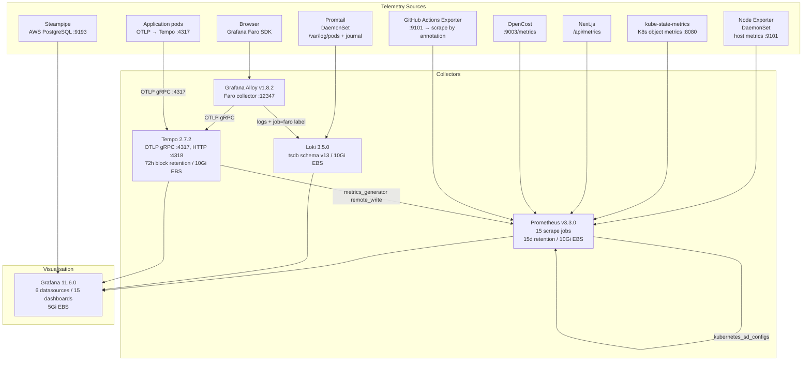
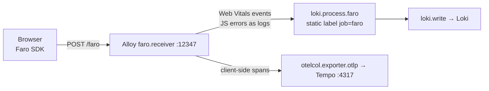

# Observability Stack

A self-hosted, full-signal observability platform deployed as a single Helm chart into the `monitoring` namespace — metrics (Prometheus + Node Exporter + kube-state-metrics), logs (Loki + Promtail), traces (Tempo + Alloy), Real User Monitoring (Faro SDK → Alloy → Loki/Tempo), visualisation (Grafana with 15 dashboards), AWS inventory (Steampipe), and GitHub Actions metrics — all behind a three-layer Traefik access control stack.

## Architecture



All stateful components (Prometheus, Grafana, Loki, Tempo) use `Recreate` deployment strategy — no rolling update to avoid two instances writing to the same EBS PVC simultaneously. PodDisruptionBudgets (`minAvailable: 1`) prevent the Cluster Autoscaler from evicting the sole replica of each stateful component during scale-down events.

## Component inventory

| Component | Image | Role | Kind |
|-----------|-------|------|------|
| Prometheus | `prom/prometheus:v3.3.0` | Metrics TSDB, 15 scrape jobs | Deployment |
| Grafana | `grafana/grafana:11.6.0` | Dashboards, 6 datasources, alerting | Deployment |
| Loki | `grafana/loki:3.5.0` | Log aggregation, tsdb schema v13 | Deployment |
| Tempo | `grafana/tempo:2.7.2` | Distributed tracing, OTLP, span metrics | Deployment |
| Promtail | `grafana/promtail:3.5.0` | Log shipper (pod logs + systemd journal) | DaemonSet |
| Node Exporter | `prom/node-exporter:v1.9.1` | Host metrics (CPU, memory, disk, net) | DaemonSet |
| kube-state-metrics | `registry.k8s.io/kube-state-metrics/kube-state-metrics:v2.15.0` | Kubernetes object metrics | Deployment |
| Grafana Alloy | `grafana/alloy:v1.8.2` | Faro RUM collector, OTLP exporter | Deployment |
| GitHub Actions Exporter | `ghcr.io/cpanato/github_actions_exporter:v0.8.0` | CI/CD workflow metrics | Deployment |
| Steampipe | ECR `steampipe-aws:latest` | AWS inventory SQL over PostgreSQL wire protocol | Deployment |

## Node placement

All Deployments are pinned to the `monitoring` dedicated node pool via `nodeSelector: node-pool: monitoring` and a toleration for `dedicated=monitoring:NoSchedule` ([`values.yaml`](../../charts/monitoring/chart/values.yaml), lines 19–31). The monitoring pool is tainted at bootstrap time; only monitoring workloads tolerate it.

DaemonSets (Promtail, Node Exporter) must run on every node to collect host metrics and logs. They inherit Kubernetes' default behaviour of tolerating all taints, so they schedule across all node pools regardless.

## Metrics — Prometheus

Prometheus is configured with 15 scrape jobs ([`templates/prometheus/configmap.yaml`](../../charts/monitoring/chart/templates/prometheus/configmap.yaml)):

| Job | Discovery | Notes |
|-----|-----------|-------|
| `prometheus` | static `localhost:9090` | Self-scrape via `/prometheus/metrics` |
| `kubernetes-nodes` | `kubernetes_sd role: node` | HTTPS with SA token, node-level metrics |
| `kubernetes-cadvisor` | `kubernetes_sd role: node` | Container CPU/memory via `/metrics/cadvisor` |
| `kubernetes-service-endpoints` | `kubernetes_sd role: endpoints` | Opt-in via `prometheus.io/scrape: "true"` annotation |
| `node-exporter` | `kubernetes_sd role: endpoints` | Filtered by Service name `node-exporter` |
| `kube-state-metrics` | static | K8s object state metrics |
| `grafana` | static | Self-monitoring via `/grafana/metrics` |
| `loki` | static | Loki internals |
| `tempo` | static | Tempo internals |
| `github-actions-exporter` | static | CI/CD workflow metrics |
| `traefik` | `kubernetes_sd role: pod` (kube-system) | Pod IP discovery via label `app.kubernetes.io/name=traefik` |
| `nextjs-app` | static | Application metrics via `/api/metrics` |
| `nextjs-app-preview` | static | Blue/Green preview Service — active only during rollouts |
| `alloy` | static | Alloy self-monitoring |
| `opencost` | static | Cost allocation metrics |

The `nextjs-app-preview` job scrapes the preview Service used during Blue/Green rollouts. This gives the `bluegreen-rollout.json` dashboard simultaneous metrics from both the active and candidate versions during promotion — no special rollout tooling needed for metric comparison.

**Key flags** ([`templates/prometheus/deployment.yaml`](../../charts/monitoring/chart/templates/prometheus/deployment.yaml), lines 46–52):

```
--web.external-url=/prometheus          # path-prefix for Traefik routing
--web.enable-remote-write-receiver      # accepts Tempo metrics_generator writes
--enable-feature=exemplar-storage,native-histograms
--storage.tsdb.retention.time=15d       # 7d in development (values-development.yaml)
```

Prometheus uses `Recreate` strategy with `topologySpreadConstraints (ScheduleAnyway)` — spreading replicas across nodes without hard-blocking on a 2-node cluster where `maxSkew` may already be violated.

**RBAC:** `ClusterRole` grants `get/list/watch` on `nodes, services, endpoints, pods, ingresses` and non-resource URLs `/metrics` and `/metrics/cadvisor` ([`templates/prometheus/rbac.yaml`](../../charts/monitoring/chart/templates/prometheus/rbac.yaml)).

## Logs — Loki + Promtail

**Loki** ([`templates/loki/configmap.yaml`](../../charts/monitoring/chart/templates/loki/configmap.yaml)) uses `tsdb` store with schema `v13` on local filesystem. Key configuration:

- `auth_enabled: false` — single-tenant mode (no per-tenant auth overhead)
- `replication_factor: 1` — single instance, no HA
- `reject_old_samples_max_age: 168h` — rejects logs older than 7 days at ingest time
- `ingestion_rate_mb: 10`, burst `20`
- `max_streams_per_user: 10000`
- Compactor runs every 10 minutes with `retention_enabled: true` and 2-hour delete delay

**Promtail** ([`templates/promtail/configmap.yaml`](../../charts/monitoring/chart/templates/promtail/configmap.yaml)) runs as a DaemonSet on every node, collecting:

1. **Pod logs** — `/var/log/pods/*<uid>/<container>/*.log` via `kubernetes_sd role: pod` with CRI parser. Labels attached: `namespace`, `pod`, `container`, `app`
2. **Systemd journal** — `/var/log/journal` (max_age: 12h), labelled `job=systemd-journal`, filtered by `__journal__systemd_unit`

**Loki ↔ Tempo correlation** is configured at the Grafana datasource level — a `derivedField` on the Loki datasource matches `"traceID":"(\w+)"` in log lines and creates a clickable link to the Tempo trace ([`templates/grafana/configmap.yaml`](../../charts/monitoring/chart/templates/grafana/configmap.yaml), lines 25–29). One click in a log line opens the full distributed trace in Grafana Explore.

## Traces — Tempo + OTLP

**Tempo** ([`templates/tempo/configmap.yaml`](../../charts/monitoring/chart/templates/tempo/configmap.yaml)) accepts OTLP on:
- gRPC `:4317`
- HTTP `:4318`

**Block retention:** 72 hours. Storage is local filesystem on a 10Gi EBS PVC.

**Metrics generator** — Tempo derives two metric streams from ingested traces and remote-writes them to Prometheus:

| Processor | What it generates |
|-----------|------------------|
| `service-graphs` | Request rate, error rate, duration histograms between services — powers the service dependency graph |
| `span-metrics` | `traces_spanmetrics_calls_total` and `traces_spanmetrics_duration_seconds` by `service.name`, `http.method`, `http.status_code` — used by DynamoDB/tracing alerts and the `tracing.json` dashboard |

The `remote_write` target is `http://prometheus.monitoring.svc.cluster.local:9090/prometheus/api/v1/write` — the Prometheus remote-write receiver enabled by `--web.enable-remote-write-receiver`. Span-derived metrics flow into Prometheus's TSDB and become queryable alongside all other metrics.

`max_bytes_per_trace: 5000000` caps individual trace size at 5 MB to prevent single large traces from spiking Tempo's memory.

## Real User Monitoring — Alloy + Faro SDK

**Grafana Alloy** ([`templates/alloy/configmap.yaml`](../../charts/monitoring/chart/templates/alloy/configmap.yaml)) bridges the browser to the backend observability pipeline. The Next.js frontend instruments with the Grafana Faro SDK, which POSTs telemetry to `https://ops.nelsonlamounier.com/faro`.



The `job=faro` static label injected by `loki.process` is what the `rum.json` dashboard queries filter on — it separates RUM logs from server-side pod logs in Loki. CORS is configured to allow origins `nelsonlamounier.com`, `www.nelsonlamounier.com`, and `localhost:3000`.

The `/faro` IngressRoute does **not** apply the `admin-ip-allowlist` middleware — the endpoint must be reachable from end-user browsers, not just operator IPs.

## AWS inventory — Steampipe

**Steampipe** ([`templates/steampipe/deployment.yaml`](../../charts/monitoring/chart/templates/steampipe/deployment.yaml)) runs the AWS provider configured for `eu-west-1` and `us-east-1` ([`templates/steampipe/configmap.yaml`](../../charts/monitoring/chart/templates/steampipe/configmap.yaml)). It exposes a PostgreSQL wire-protocol endpoint on port 9193, allowing Grafana to query AWS resource state using SQL:

```sql
-- Example: unencrypted EBS volumes (cloud-inventory.json)
select volume_id, state, encrypted from aws_ebs_volume where not encrypted
```

Steampipe uses a custom ECR image (`steampipe-aws:latest`) — the upstream Steampipe image is extended with the AWS plugin pre-installed. Authentication uses the EC2 instance profile of the monitoring node (same ambient credential pattern as ESO).

Grafana registers Steampipe as a `postgres` datasource ([`templates/grafana/configmap.yaml`](../../charts/monitoring/chart/templates/grafana/configmap.yaml), lines 62–75). The `cloud-inventory.json` dashboard uses SQL queries against Steampipe for EBS volume audit, unencrypted volumes, and security groups with open internet access.

## GitHub Actions metrics

**GitHub Actions Exporter** ([`templates/github-actions-exporter/deployment.yaml`](../../charts/monitoring/chart/templates/github-actions-exporter/deployment.yaml)) reads GITHUB_API_TOKEN, GITHUB_WEBHOOK_TOKEN, and GITHUB_ORG from the `github-actions-exporter-credentials` Secret (ESO-managed, `optional: true` so the pod starts even if the Secret is absent).

Its Service carries `prometheus.io/scrape: "true"` annotation, making it discoverable by the `kubernetes-service-endpoints` Prometheus scrape job without any static configuration. The `cicd.json` dashboard uses its metrics for CI minutes tracking and workflow distribution.

## Access control

Three Traefik Middlewares defined in [`templates/traefik/`](../../charts/monitoring/chart/templates/traefik/), all gated by `{{- if .Values.adminAccess.enabled }}`:

| Middleware | Kind | Policy |
|-----------|------|--------|
| `admin-ip-allowlist` | `IPAllowList` | Allowlist sourced from ESO-managed Secret; patched by PostSync Job after each sync |
| `basic-auth` | `BasicAuth` | Credentials from `prometheus-basic-auth-secret`, `removeHeader: true` |
| `rate-limit` | `RateLimit` | 100 req/s average, 50 burst |

IngressRoutes for Grafana (`PathPrefix('/grafana')`) and Prometheus (`PathPrefix('/prometheus')`) apply `admin-ip-allowlist` + `rate-limit`. Grafana does not apply `basic-auth` — Grafana has its own authentication layer. Prometheus applies both `admin-ip-allowlist` and `basic-auth` in addition to rate limiting.

The Alloy IngressRoute (`PathPrefix('/faro')`) applies no access-control middleware — it must accept unauthenticated RUM payloads from end-user browsers.

All three IngressRoutes serve via the `websecure` entrypoint (TLS) at `ops.nelsonlamounier.com`.

The `admin-ip-allowlist` Middleware's `sourceRange` is deliberately left empty in the Helm chart (`allowedIps: []`). The actual CIDRs are injected by a PostSync hook Job after each ArgoCD sync — see [PostSync patcher pattern](../decisions/postsync-patcher-pattern.md) for the full `ignoreDifferences` + `RespectIgnoreDifferences` mechanism that prevents selfHeal from reverting the patch.

## Grafana datasources

Six datasources configured in [`templates/grafana/configmap.yaml`](../../charts/monitoring/chart/templates/grafana/configmap.yaml):

| Datasource | UID | Backend | Notes |
|-----------|-----|---------|-------|
| Prometheus | `prometheus` | `http://prometheus.monitoring:9090/prometheus` | Default |
| Loki | `loki` | `http://loki.monitoring:3100` | Derived field: TraceID → Tempo |
| Tempo | `tempo` | `http://tempo.monitoring:3200` | tracesToLogs, serviceMap, nodeGraph |
| CloudWatch | `cloudwatch` | AWS SDK | `eu-west-1`, ambient EC2 auth |
| CloudWatch Edge | `cloudwatch-edge` | AWS SDK | `us-east-1` for Lambda@Edge / CloudFront logs |
| Steampipe | `steampipe` | PostgreSQL `:9193` | AWS inventory SQL |

The Tempo datasource enables three correlation features: `tracesToLogs` (open a trace → jump to filtered Loki view), `serviceMap` (service dependency graph from Tempo's `service-graphs` processor), and `nodeGraph` (interactive topology view).

## Dashboard catalog (15 dashboards)

Dashboards are version-controlled as JSON files in [`charts/monitoring/chart/dashboards/`](../../charts/monitoring/chart/dashboards/) and loaded via a ConfigMap mounted at `/var/lib/grafana/dashboards`. The provider checks for updates every 60 seconds.

| File | Title | Primary datasource | Focus |
|------|-------|--------------------|-------|
| `auto-bootstrap.json` | Auto-Bootstrap Trace | CloudWatch + Prometheus | Step Functions execution metrics/duration, Router Lambda invocations, bootstrap logs |
| `bedrock.json` | Bedrock Content Pipeline | Prometheus | Articles published/failed, token usage, estimated cost, processing time, QA confidence |
| `bluegreen-rollout.json` | Blue/Green Rollout Comparison | Prometheus | Active vs preview request rate, error rate, p95 latency side-by-side |
| `cicd.json` | CI/CD Pipeline | Prometheus | GitHub Actions workflow distribution, runner status, CI minutes (7d / 30d) |
| `cloud-inventory.json` | Cloud Inventory & Compliance | Steampipe (SQL) | EBS volumes (total, unencrypted, orphaned), security groups open to internet |
| `cloudwatch-edge.json` | AWS Logs — Edge (us-east-1) | CloudWatch Edge | Lambda@Edge logs, CloudFront cert/DNS provider Lambdas |
| `cloudwatch.json` | AWS Logs | CloudWatch | Lambda logs, SSM bootstrap/deploy logs, EC2 instance logs |
| `cluster.json` | Cluster & Nodes | Prometheus | Nodes, pods, pod phases, CPU/memory utilisation, container restarts |
| `finops.json` | FinOps — Cost Visibility | Prometheus (OpenCost) | Monthly/hourly cost estimate, cost per node, cluster CPU efficiency |
| `frontend.json` | Frontend Performance | Prometheus | Traefik request rate, error rate, latency p50/p95/p99, open connections |
| `monitoring-health.json` | Monitoring Stack Health | Prometheus | Scrape target availability, active series, TSDB storage, ingestion rate |
| `nextjs.json` | Next.js Application | Prometheus | Replica health, CPU/memory, container restart count |
| `rum.json` | Real User Monitoring (RUM) | Loki (Faro logs) | Core Web Vitals (LCP, INP, CLS, TTFB, FCP), JavaScript errors |
| `self-healing.json` | Self-Healing Pipeline | CloudWatch + Prometheus | AI agent Lambda logs, tool execution (EBS detach, diagnose), token usage |
| `tracing.json` | DynamoDB & Tracing | Prometheus (span metrics) | DynamoDB RED metrics, latency heatmap, service graph from Tempo span metrics |

The `rum.json` dashboard is unique in querying Loki (not Prometheus) as its primary datasource — all panels filter on `{job="faro"}` to isolate browser telemetry from server-side logs. This label is injected by the Alloy `loki.process.faro` pipeline stage.

The `tracing.json` dashboard uses `traces_spanmetrics_*` metrics generated by Tempo's `span-metrics` processor and written to Prometheus — not querying Tempo directly. This makes DynamoDB latency and error metrics available in Prometheus alert rules without requiring trace-level queries.

## Alerting

Seven alert rules across three groups, defined in [`templates/grafana/alerting-configmap.yaml`](../../charts/monitoring/chart/templates/grafana/alerting-configmap.yaml), evaluated every 1 minute:

**Cluster Health:**
- `Node Down` — `up{job="node-exporter"} < 1` for 2m → critical
- `High Node CPU Usage` — CPU idle rate < 15% (>85% used) for 5m → warning
- `High Node Memory Usage` — available memory < 15% for 5m → warning
- `Pod CrashLooping` — `increase(kube_pod_container_status_restarts_total[15m]) > 3` → critical (fires immediately)
- `Pod Not Ready` — `kube_pod_status_ready{condition="true"} == 0` for 5m → warning

**Application Health:**
- `High Application Error Rate` — 5xx rate > 5% of total requests for 5m → critical
- `High Application Latency (P95)` — p95 `http_request_duration_seconds` > 2s for 5m → warning

**Storage Health:**
- `Disk Space Low` — filesystem used > 80% for 5m → warning
- `Disk Space Critical` — filesystem used > 90% for 2m → critical
- `DynamoDB Error Rate High` — DynamoDB span error rate > 5% for 5m → critical (uses `traces_spanmetrics_*`)
- `DynamoDB P95 Latency High` — DynamoDB p95 span duration > 1s for 5m → warning
- `Span Ingestion Stopped` — `rate(traces_spanmetrics_calls_total[5m]) < 0.001` for 10m → critical

**Contact point:** SNS topic (`grafana.alerting.snsTopicArn` value). When unset (development), the contact point list is empty and alerts fire silently in the Grafana UI only. Routing: both `severity=critical` and `severity=warning` route to SNS, group interval 5m, repeat every 4h.

## Storage sizing

| Component | Development PVC | Production PVC | StorageClass |
|-----------|----------------|---------------|-------------|
| Prometheus | 5Gi | 10Gi | `ebs-sc` |
| Grafana | 2Gi | 5Gi | `ebs-sc` |
| Loki | 5Gi | 10Gi | `ebs-sc` |
| Tempo | 5Gi | 10Gi | `ebs-sc` |

Development retention: 7d (Prometheus), 168h reject threshold (Loki), 72h (Tempo). Production retention: 15d (Prometheus). Loki and Tempo retention in production is controlled by compactor config, not separate values.

## Resource footprint (development, observed values)

Resource requests are calibrated to observed `kubectl top` values × 1.5 (documented as "120% rule" in `values-development.yaml`):

| Component | CPU request | Memory request | Observed p50 |
|-----------|------------|---------------|-------------|
| Prometheus | 50m | 384Mi | ~16m / ~265Mi |
| Grafana | 15m | 128Mi | ~6m / ~103Mi |
| Loki | 25m | 256Mi | ~10m / ~173Mi |
| Tempo | 20m | 320Mi | ~4m / ~236Mi |
| Steampipe | 250m | 512Mi | — |

Steampipe is the most resource-heavy component at 250m/512Mi request — it runs a PostgreSQL-compatible service with AWS SDK calls per query.

Namespace ResourceQuota (development): `requests.cpu: 1000m`, `requests.memory: 3Gi`, `limits.cpu: 3`, `limits.memory: 5Gi`, `persistentvolumeclaims: 6`.

## Deeper detail

- [Prometheus scrape configuration](../tools/prometheus-scrape-config.md) — scrape job details, kubernetes_sd relabeling, exemplar storage, remote-write receiver
- [Grafana datasources](../tools/grafana-datasources.md) — datasource configuration, Loki→Tempo correlation, Tempo tracesToLogs, CloudWatch and Steampipe setup
- [Loki + Tempo pipeline](../tools/loki-tempo-pipeline.md) — Loki schema v13, compaction, Tempo span-metrics processor, metrics_generator remote-write to Prometheus
- [RUM pipeline](../concepts/rum-pipeline.md) — Faro SDK integration, Alloy Faro receiver, `job=faro` labeling, Core Web Vitals in the RUM dashboard
- [Monitoring access control](../concepts/monitoring-access-control.md) — three-middleware Traefik stack, PostSync patcher for IP allowlist, `/faro` exception, basic-auth seeding
- [Observability vs CloudWatch](../concepts/observability-vs-cloudwatch.md) — cost and operational tradeoffs of self-hosted vs CloudWatch (two CloudWatch datasources remain for Lambda@Edge and SSM logs outside the cluster)
- [Dashboard architecture](../concepts/dashboard-architecture.md) — full panel-level coverage of all 15 dashboards, datasource per panel, span-metrics vs raw trace queries

<!--
Evidence trail (auto-generated):
- Source: charts/monitoring/chart/Chart.yaml (read 2026-04-28 — chart name monitoring-stack, component list in description)
- Source: charts/monitoring/chart/values.yaml (read 2026-04-28, 255 lines — all component images, resource requests/limits, PVC sizes, retention, scrapeInterval, port assignments, resource quota, nodeSelector/tolerations, adminAccess, alloy CORS origins)
- Source: charts/monitoring/chart/values-development.yaml (read 2026-04-28 — dev retention 7d, dev PVC sizes, observed p50 comments, port 9101 for Node Exporter conflict note)
- Source: charts/monitoring/chart/templates/prometheus/configmap.yaml (read 2026-04-28, 144 lines — all 15 scrape jobs, kubernetes_sd configs, nextjs-app-preview comment, relabel rules)
- Source: charts/monitoring/chart/templates/prometheus/deployment.yaml (read 2026-04-28 — Recreate strategy, --web.enable-remote-write-receiver, --enable-feature=exemplar-storage,native-histograms, topologySpreadConstraints ScheduleAnyway)
- Source: charts/monitoring/chart/templates/prometheus/rbac.yaml (read 2026-04-28 — ClusterRole resource list and non-resource URLs)
- Source: charts/monitoring/chart/templates/grafana/configmap.yaml (read 2026-04-28 — 6 datasources, Loki derivedFields TraceID regex, Tempo tracesToLogs/serviceMap/nodeGraph, CloudWatch dual-region, Steampipe postgres)
- Source: charts/monitoring/chart/templates/grafana/alerting-configmap.yaml (read 2026-04-28, 505 lines — 7 alert rules across 3 groups, SNS contact point, routing policies, DynamoDB alerts using traces_spanmetrics_*)
- Source: charts/monitoring/chart/templates/grafana/dashboard-provider.yaml (read 2026-04-28 — path /var/lib/grafana/dashboards, updateIntervalSeconds: 60)
- Source: charts/monitoring/chart/templates/grafana/ingressroute.yaml (read 2026-04-28 — admin-ip-allowlist + rate-limit, no basic-auth on Grafana)
- Source: charts/monitoring/chart/templates/loki/configmap.yaml (read 2026-04-28 — tsdb schema v13, replication_factor 1, reject_old_samples_max_age 168h, compactor 10m, retention_delete_delay 2h)
- Source: charts/monitoring/chart/templates/tempo/configmap.yaml (read 2026-04-28 — OTLP gRPC/HTTP ports, block_retention 72h, metrics_generator service-graphs + span-metrics, remote_write to prometheus, max_bytes_per_trace 5MB)
- Source: charts/monitoring/chart/templates/alloy/configmap.yaml (read 2026-04-28 — faro.receiver port 12347, CORS origins, loki.process job=faro label, loki.write endpoint, otelcol.exporter.otlp to tempo :4317)
- Source: charts/monitoring/chart/templates/promtail/configmap.yaml (read 2026-04-28 — kubernetes_sd role pod, CRI parser, /var/log/pods path, journal job systemd-journal)
- Source: charts/monitoring/chart/templates/steampipe/deployment.yaml (read 2026-04-28 — command args, Recreate strategy, config mount at /home/steampipe/.steampipe/config/aws.spc)
- Source: charts/monitoring/chart/templates/steampipe/configmap.yaml (read 2026-04-28 — aws plugin, regions eu-west-1 and us-east-1)
- Source: charts/monitoring/chart/templates/github-actions-exporter/deployment.yaml (read 2026-04-28 — optional: true for credentials, prometheus.io/scrape annotation on Service, env vars GITHUB_API_TOKEN/WEBHOOK_TOKEN/ORG)
- Source: charts/monitoring/chart/templates/traefik/ip-allowlist-middleware.yaml (read 2026-04-28 — adminAccess.enabled gate, sourceRange from values)
- Source: charts/monitoring/chart/templates/traefik/basicauth-middleware.yaml (read 2026-04-28 — prometheus-basic-auth-secret, removeHeader: true)
- Source: charts/monitoring/chart/templates/traefik/rate-limit-middleware.yaml (read 2026-04-28 — average 100, burst 50)
- Source: charts/monitoring/chart/dashboards/ (15 JSON files — titles and first 8 panel names extracted via python3 on 2026-04-28)
- Generated: 2026-04-28
-->
