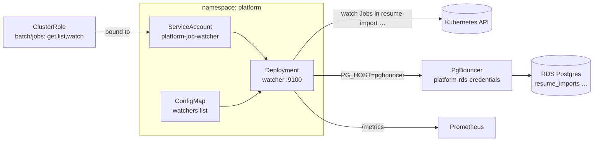

## What it does

`platform-job-watcher` is a single-replica controller that watches Kubernetes
batch Jobs across the cluster and reconciles their terminal state back into
Postgres, so an application database row is never left believing a job is still
running after its Job has failed or vanished. It exists to catch the gap between
"a Kubernetes Job died" and "the row that dispatched it still says
`status=running`": each configured watcher maps a namespace to a database table
and a staleness threshold, and the watcher flips stale/failed rows accordingly
([Chart.yaml](../../charts/platform-job-watcher/chart/Chart.yaml) — "Watches K8s
batch Jobs and writes failure status to the DB").

The Node controller binary itself (`dist/run-watcher.js`) is built and published
as the `platform-job-watcher` ECR image from a sibling application repository;
**this repository owns its deployment surface only** — the Helm chart, RBAC,
config, and ArgoCD wiring.

## Architecture



The watcher reads its config from a mounted ConfigMap, opens a cluster-wide
watch on `batch/jobs` using a `ServiceAccount` bound to a `ClusterRole`, and
writes status updates to RDS **through the shared PgBouncer pooler** using the
`platform-rds-credentials` secret. It is purely a Kubernetes-API client plus a
database writer — its only HTTP surface is `/metrics`, `/readyz`, and `/livez`
on port 9100.

## Least-privilege RBAC

The controller's entire cluster grant is read-only watch access to Jobs and
nothing else
([clusterrole.yaml](../../charts/platform-job-watcher/chart/templates/clusterrole.yaml)):

```yaml
rules:
  - apiGroups: ["batch"]
    resources: ["jobs"]
    verbs: ["get", "list", "watch"]
```

A `ClusterRole` (not a namespaced `Role`) is required because the watcher
observes Jobs in other namespaces — `resume-import` today — from its own
`platform` namespace. It holds no create/update/delete verbs and no access to
pods, secrets, or any other resource: the only state it mutates lives in
Postgres, not the Kubernetes API
([serviceaccount.yaml](../../charts/platform-job-watcher/chart/templates/serviceaccount.yaml)).

## Watcher configuration

Watchers are declared in `values` and rendered into a ConfigMap mounted at
`/etc/watcher/config.yaml`
([configmap.yaml](../../charts/platform-job-watcher/chart/templates/configmap.yaml)).
Each entry binds a namespace to the table it reconciles and how long a job may
run before it is considered stale
([values.yaml](../../charts/platform-job-watcher/chart/values.yaml)):

```yaml
config:
  watchers:
    - namespace: resume-import
      dbTable: resume_imports
      staleAfterMinutes: 15
```

Adding coverage for another pipeline is a values-only change: append a
`{namespace, dbTable, staleAfterMinutes}` entry. The `resume_imports` table it
writes to is provisioned by the
[Platform RDS data tier](./platform-rds-data-tier.md) migration Jobs.

## Runtime contract

| Concern | Value |
| --- | --- |
| Image | `…/platform-job-watcher` (ECR), tag written by ArgoCD Image Updater |
| Entrypoint | `node dist/run-watcher.js` |
| Config | `WATCHER_CONFIG_PATH=/etc/watcher/config.yaml` (mounted ConfigMap) |
| DB credentials | `platform-rds-credentials` via `envFrom` (`PG_HOST` → PgBouncer) |
| HTTP port | 9100 — `/metrics`, `/readyz`, `/livez` |
| Telemetry | OTLP to `alloy.monitoring:4318`, profiles to `pyroscope.monitoring:4040` |

The database credentials come from the same `platform-rds-credentials`
ExternalSecret the data tier publishes, whose `PG_HOST` already points at
`pgbouncer.platform.svc.cluster.local` — so the watcher reaches RDS only through
the pooler, never the endpoint directly
([deployment.yaml](../../charts/platform-job-watcher/chart/templates/deployment.yaml#L60-L63)).
A `Service` exists solely so Prometheus can scrape `/metrics`; it carries no
external traffic
([service.yaml](../../charts/platform-job-watcher/chart/templates/service.yaml)).

## Repository layout

```text
charts/platform-job-watcher/
├── platform-job-watcher-values.yaml   # dev overrides (ECR repo, env)
├── platform-job-watcher-values-production.yaml
└── chart/
    ├── Chart.yaml
    ├── values.yaml                     # default watchers list, resources
    ├── .argocd-source-platform-job-watcher.yaml  # Image Updater write-back target
    └── templates/
        ├── deployment.yaml             # watcher container + probes + OTEL
        ├── clusterrole.yaml            # batch/jobs get,list,watch
        ├── serviceaccount.yaml
        ├── service.yaml                # ClusterIP for Prometheus scrape
        └── configmap.yaml              # rendered watchers config
```

## How to run locally

Render the chart to inspect the manifests:

```bash
helm template platform-job-watcher charts/platform-job-watcher/chart \
  -f charts/platform-job-watcher/platform-job-watcher-values.yaml
```

## Deploy

Deployed by the ArgoCD `Application`
[argocd-apps/eks/development/platform-job-watcher.yaml](../../argocd-apps/eks/development/platform-job-watcher.yaml)
(project `platform`, path `charts/platform-job-watcher/chart`) into the
`platform` namespace with `prune`, `selfHeal`, and `CreateNamespace=true`.
The kubeadm-era root-level `ApplicationSet` variant was removed in the
2026-07 legacy purge (#206); the synced tree is `argocd-apps/eks/development/`
only. **ArgoCD Image Updater** watches the ECR repository with
the `newest-build` strategy (tags matching `^[0-9a-f]{7,40}(-r[0-9]+)?$`) and
git-writes the new tag into
`chart/.argocd-source-platform-job-watcher.yaml`, so a CI image push
auto-promotes without a manual values bump.

## Related projects

- [Platform RDS data tier](./platform-rds-data-tier.md) — owns the
  `platform-rds-credentials` secret and the `resume_imports` table this watcher
  reconciles, and the PgBouncer pooler it writes through.
- [observability-stack](./observability-stack.md) — scrapes the watcher's
  `/metrics` endpoint and receives its OTLP traces and Pyroscope profiles.

## Deeper detail

- (planned) docs/concepts/job-watcher-reconcile-loop.md — the watch→staleness→DB
  reconcile algorithm, which lives in the controller's source in the application
  repository (not in this deployment repo).

<!--
Evidence trail (auto-generated):
- Source: charts/platform-job-watcher/chart/Chart.yaml (read on 2026-06-16)
- Source: charts/platform-job-watcher/chart/values.yaml (read on 2026-06-16)
- Source: charts/platform-job-watcher/chart/templates/deployment.yaml (read on 2026-06-16)
- Source: charts/platform-job-watcher/chart/templates/clusterrole.yaml (read on 2026-06-16)
- Source: charts/platform-job-watcher/chart/templates/serviceaccount.yaml (read on 2026-06-16)
- Source: charts/platform-job-watcher/chart/templates/service.yaml (read on 2026-06-16)
- Source: charts/platform-job-watcher/chart/templates/configmap.yaml (read on 2026-06-16)
- Source: charts/platform-job-watcher/platform-job-watcher-values.yaml (read on 2026-06-16)
- Source: argocd-apps/eks/development/platform-job-watcher.yaml (updated ref 2026-07; original read 2026-06-16)
- Source: charts/platform-job-watcher/chart/.argocd-source-platform-job-watcher.yaml (read on 2026-06-16)
-->
