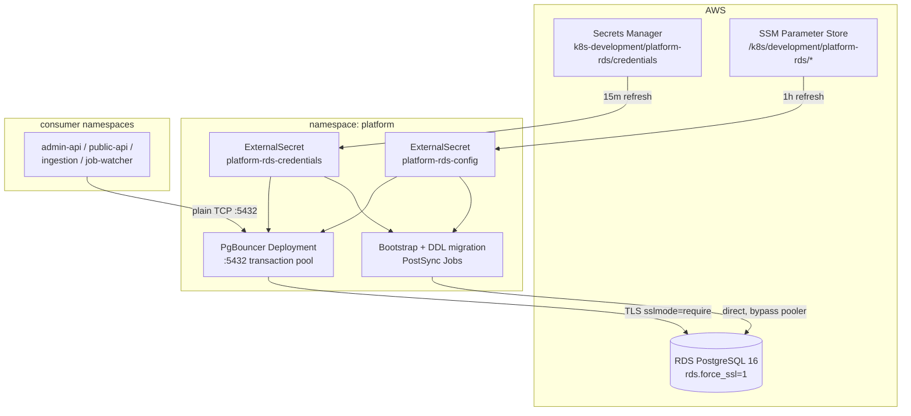

## What it does

The `platform-rds` Helm chart is the cluster's **shared database access layer**.
It does not run Postgres — Postgres lives in AWS RDS, provisioned by CDK — but
it owns everything the cluster needs to reach it: a **PgBouncer connection
pooler** that every pod connects to instead of RDS directly, an idempotent
**DDL bootstrap + migration Job pipeline** that keeps the schema current on
every ArgoCD sync, and the **ExternalSecrets** that pull credentials from
Secrets Manager and connection config from SSM
([Chart.yaml](../../charts/platform-rds/chart/Chart.yaml), appVersion `16.6`).
It runs in the `platform` namespace and serves consumers across the cluster —
admin-api, public-api, ingestion, resume-import, and the platform-job-watcher.

## Architecture



Application pods open plain intra-cluster TCP to
`pgbouncer.platform.svc.cluster.local:5432`; PgBouncer multiplexes them onto a
small pool of TLS connections to RDS. Credentials arrive entirely through
ExternalSecrets — no init container, no `kubectl` — and `optional: false` on
every `secretKeyRef` holds a pod `Pending` until ESO has synced, rather than
crash-looping
([pgbouncer-deployment.yaml](../../charts/platform-rds/chart/templates/pgbouncer-deployment.yaml#L59-L96)).

## PgBouncer connection pooler

PgBouncer runs in `transaction` pool mode with `default_pool_size: 20` and
`max_client_conn: 200` — it multiplexes up to 200 cluster-side clients onto at
most ~20 server connections, keeping well under the ~85-connection ceiling of
the RDS `t4g.micro`
([values.yaml](../../charts/platform-rds/chart/values.yaml), pool sizing comments).
Transaction mode is the correct choice because consumers are stateless HTTP
handlers that do not rely on session-scoped state across transactions.

Two deliberate, documented deviations matter when operating it:

- **Listen port 5432, not 6432.** PgBouncer's documented default is 6432; this
  chart binds 5432 via `PGBOUNCER_PORT` so consumers, ExternalSecrets, and
  Grafana datasources use the canonical "Postgres port" with no translation
  step. The departure is surfaced on the Service via the
  `nelsonlamounier.com/upstream-port-override` annotation so
  `kubectl describe svc pgbouncer -n platform` shows it at a glance
  ([pgbouncer-service.yaml](../../charts/platform-rds/chart/templates/pgbouncer-service.yaml#L209-L214)).
- **TLS forced on the egress hop only.** RDS is configured with
  `rds.force_ssl=1`, so `PGBOUNCER_SERVER_TLS_SSLMODE=require` encrypts the
  pooler→RDS hop. The intra-cluster app→pooler hop stays plain TCP, matching
  the cluster trust model
  ([pgbouncer-deployment.yaml](../../charts/platform-rds/chart/templates/pgbouncer-deployment.yaml#L109-L116)).

The frontend database name is pinned with `PGBOUNCER_DATABASE` equal to the
upstream `POSTGRESQL_DATABASE`; without it the Bitnami image defaults the
frontend name to `postgres` and rejects clients requesting `tucaken` with
"no such database"
([pgbouncer-deployment.yaml](../../charts/platform-rds/chart/templates/pgbouncer-deployment.yaml#L74-L84)).

### Health probes issue a real query

Both liveness and readiness probes exec `psql ... -tAc "SELECT 1"` through the
loopback PgBouncer listener rather than a bare TCP check. A TCP probe only
confirms PgBouncer is *listening* and once masked a broken upstream for four
hours (`pgbouncer-7fc6b8c79-whj69` sat `Ready=False` on 2026-05-11). The exec
probe catches credential drift, RDS unavailability, and network partitions
immediately, bounded to 3s by `PGCONNECT_TIMEOUT`
([pgbouncer-deployment.yaml](../../charts/platform-rds/chart/templates/pgbouncer-deployment.yaml#L124-L151)).

## Schema bootstrap and DDL migrations

Schema management is split into two Job families, both rendered as ArgoCD
`PostSync` hooks with `hook-delete-policy: BeforeHookCreation` so each sync
deletes the prior completed Job before recreating it:

- **Bootstrap Job** — runs the baseline DDL from the `platform-rds-bootstrap`
  ECR image. Gated by `bootstrap.enabled` so the chart still renders PgBouncer
  and RBAC before that image exists
  ([bootstrap-job.yaml](../../charts/platform-rds/chart/templates/bootstrap-job.yaml#L242-L267)).
- **Incremental DDL migrations** — `migration-NN-<desc>` Jobs in
  [ddl-migrations.yaml](../../charts/platform-rds/chart/templates/ddl-migrations.yaml),
  each a standalone `postgres:17-alpine` pod running idempotent SQL
  (`CREATE ... IF NOT EXISTS`, `ON CONFLICT DO NOTHING`, guarded
  `DO` blocks for triggers and policies). Eight migrations are committed,
  covering `repository_profiles` + pgvector HNSW embeddings, `prompt_invocations`
  cost columns, `user_token_budgets`, `resume_import_corrections`, `tavily_cache`,
  and partial-index widening.

Critically, **bootstrap and migration Jobs connect directly to RDS, bypassing
PgBouncer**, because the pooler may not be Ready on first deploy
([bootstrap-job.yaml](../../charts/platform-rds/chart/templates/bootstrap-job.yaml#L249-L252)).
Migrations are idempotent by design because PostSync hooks within a sync-wave
run in non-deterministic order, so each must be self-contained
([ddl-migrations.yaml](../../charts/platform-rds/chart/templates/ddl-migrations.yaml#L388-L402)).
Several migrations enable row-level security and grant table privileges to the
`tucaken_app` role, keeping least-privilege grants co-located with the schema.

A separate, default-disabled `dynamo-to-pg-migration` Job performs a one-shot
DynamoDB→Postgres data backfill, triggered manually via
`helm upgrade --set migration.enabled=true`
([migration-job.yaml](../../charts/platform-rds/chart/templates/migration-job.yaml#L318-L329)).

## Runtime contract

| Secret | Source store | Keys consumed |
| --- | --- | --- |
| `platform-rds-credentials` | Secrets Manager (`aws-secretsmanager`), 15m refresh | `PGUSER`, `PGPASSWORD` (libpq); `PG_HOST`…`PG_PASSWORD` (Node apps) |
| `platform-rds-config` | SSM Parameter Store (`aws-ssm`), 1h refresh | `PGHOST`, `PGPORT`, `PGDATABASE`, `PGUSER` |

The credentials ExternalSecret templates two credential shapes from one
upstream secret: **libpq-native** (`PGUSER`/`PGPASSWORD`) for PgBouncer and the
bootstrap Job, and **`PG_*`** for Node.js consumers — where `PG_HOST` is
deliberately set to `pgbouncer.platform.svc.cluster.local`, not the RDS
endpoint, so apps reach RDS only through the pooler
([rds-credentials.yaml](../../charts/platform-rds/external-secrets/rds-credentials.yaml#L1184-L1197)).
The bootstrap ServiceAccount holds **no cluster RBAC** — secrets are delivered
via `envFrom`, not the API
([bootstrap-rbac.yaml](../../charts/platform-rds/chart/templates/bootstrap-rbac.yaml)).

## Repository layout

```text
charts/platform-rds/
├── chart/
│   ├── Chart.yaml                 # name, appVersion 16.6
│   ├── values.yaml                # neutral defaults (pool sizes, port, image)
│   ├── values-development.yaml    # bootstrap image + metrics exporter on
│   ├── values-production.yaml
│   └── templates/
│       ├── namespace.yaml
│       ├── pgbouncer-deployment.yaml   # pooler + optional metrics sidecar
│       ├── pgbouncer-service.yaml      # ClusterIP :5432
│       ├── bootstrap-job.yaml          # baseline DDL (image-gated)
│       ├── ddl-migrations.yaml         # migration-001..008 PostSync Jobs
│       ├── migration-job.yaml          # one-shot dynamo→pg backfill
│       └── bootstrap-rbac.yaml         # bootstrap ServiceAccount
└── external-secrets/
    ├── rds-credentials.yaml            # Secrets Manager → libpq + PG_*
    └── rds-config.yaml                 # SSM → PGHOST/PGPORT/PGDATABASE
```

## How to run locally

Render the chart to inspect the manifests without a cluster:

```bash
helm template platform-rds charts/platform-rds/chart \
  -f charts/platform-rds/chart/values-development.yaml
```

Trigger the one-shot DynamoDB→Postgres migration against a live cluster:

```bash
helm upgrade platform-rds charts/platform-rds/chart -n platform \
  --set migration.enabled=true \
  --set migration.articlesTable=<table> --set migration.strategistTable=<table>
kubectl wait --for=condition=complete job/dynamo-to-pg-migration -n platform --timeout=600s
helm upgrade platform-rds charts/platform-rds/chart -n platform --set migration.enabled=false
```

## Deploy

Deployed by ArgoCD from the app-of-apps tree
([argocd-apps/eks/development/platform-rds.yaml](../../argocd-apps/eks/development/platform-rds.yaml)),
referencing `values-development.yaml`. DDL changes ship as new `migration-NN`
Jobs that re-run on the next sync. The `platform-rds-bootstrap` ECR image URI is
published to SSM by the `deploy-platform-rds-bootstrap` workflow; its tag is
currently kept in sync manually in the dev values file until ArgoCD Image
Updater is wired to this chart
([values-development.yaml](../../charts/platform-rds/chart/values-development.yaml)).

## Related projects

- [platform-job-watcher](./platform-job-watcher.md) — a `platform`-namespace
  consumer that connects through this pooler via the `PG_*` secret keys.
- [observability-stack](./observability-stack.md) — scrapes the optional
  `pgbouncer-exporter` sidecar and renders the PgBouncer dashboard panels.

## Deeper detail

- [Grafana datasource bypasses PgBouncer](../decisions/grafana-datasource-bypasses-pgbouncer.md)
  — why the Grafana RDS datasource connects to Postgres directly, not through
  this pooler.
- [PgBouncer connection pooling](../concepts/pgbouncer-connection-pooling.md) —
  pool modes, `auth_query` vs explicit userlist, in-cluster pooler vs RDS Proxy
  tradeoff.
- [Platform RDS bootstrap and DDL migrations](../runbooks/platform-rds-bootstrap-and-migrations.md)
  — adding a new `migration-NN` Job, verifying PostSync hook completion, rollback.

<!--
Evidence trail (auto-generated):
- Source: charts/platform-rds/chart/Chart.yaml (read on 2026-06-16)
- Source: charts/platform-rds/chart/values.yaml (read on 2026-06-16)
- Source: charts/platform-rds/chart/values-development.yaml (read on 2026-06-16)
- Source: charts/platform-rds/chart/templates/pgbouncer-deployment.yaml (read on 2026-06-16)
- Source: charts/platform-rds/chart/templates/pgbouncer-service.yaml (read on 2026-06-16)
- Source: charts/platform-rds/chart/templates/bootstrap-job.yaml (read on 2026-06-16)
- Source: charts/platform-rds/chart/templates/migration-job.yaml (read on 2026-06-16)
- Source: charts/platform-rds/chart/templates/ddl-migrations.yaml (read on 2026-06-16)
- Source: charts/platform-rds/chart/templates/bootstrap-rbac.yaml (read on 2026-06-16)
- Source: charts/platform-rds/external-secrets/rds-credentials.yaml (read on 2026-06-16)
- Source: charts/platform-rds/external-secrets/rds-config.yaml (read on 2026-06-16)
-->
