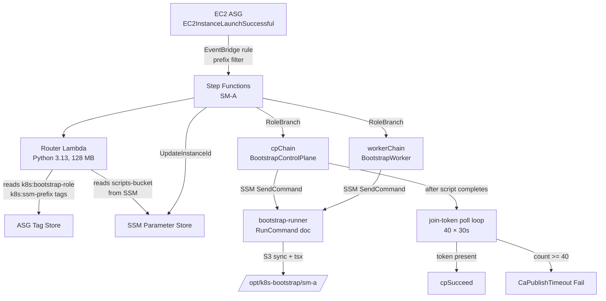
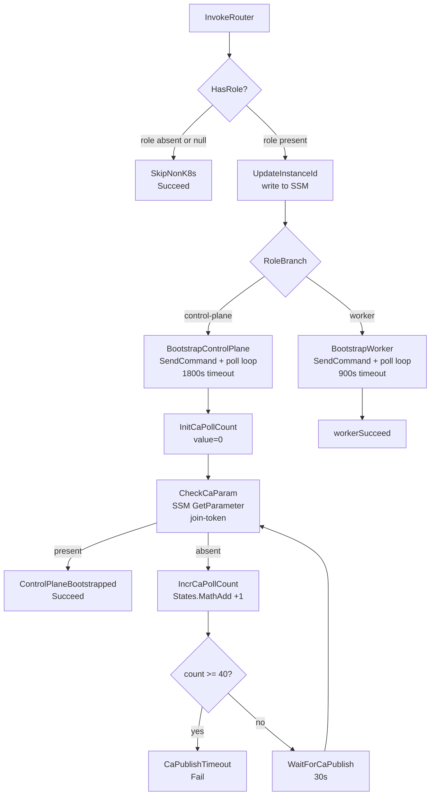

# SM-A Bootstrap Orchestrator

A single AWS Step Functions state machine that bootstraps every Kubernetes node (control plane and workers) on EC2 launch — triggered by EventBridge, routed by a Lambda reading ASG tags, and executed via SSM RunCommand with a 30-second poll loop rather than a fixed sleep.

## Architecture



### What SM-A is responsible for

| Responsibility | Owner |
|---------------|-------|
| kubeadm init, Calico, CCM, ArgoCD bootstrap | SM-A → control_plane.ts |
| kubeadm join, CloudWatch agent, PV cleanup | SM-A → worker.ts |
| Application Secrets/ConfigMaps | External Secrets Operator (declarative) |
| Application manifests (Deployments, Services) | ArgoCD reconciliation |
| Platform components (Traefik, monitoring) | ArgoCD App-of-Apps |
| AMI rolling refresh | cdk-monitoring AmiRefreshConstruct |

After SM-A succeeds, no chained orchestrator runs. ESO and ArgoCD converge the cluster to its declared state continuously.

## EventBridge trigger

A single EventBridge rule fires SM-A on every ASG instance launch ([`infra/lib/constructs/ssm/bootstrap-orchestrator.ts`](../../infra/lib/constructs/ssm/bootstrap-orchestrator.ts), line ~399):

```typescript
eventPattern: {
  source: ['aws.autoscaling'],
  detailType: ['EC2 Instance Launch Successful'],
  detail: {
    AutoScalingGroupName: [{ prefix: `${props.prefix}-` }],
  },
},
```

The ASG **name prefix** filter covers all K8s-project ASGs (control plane, general pool, monitoring pool) while silently ignoring non-K8s ASGs in the same account. One execution fires per launched instance — an ASG scaling from 0→3 triggers three independent parallel SM-A executions.

## Router Lambda

An inline Python 3.13 Lambda (128 MB, 30 s timeout) translates the EventBridge payload into the routing parameters Step Functions needs. The key insight: EC2 launch events contain the ASG name but not its tags, so a brief AWS SDK call is required:

```python
def handler(event, context):
    detail = event.get("detail", {})
    instance_id = detail.get("EC2InstanceId", "")
    asg_name = detail.get("AutoScalingGroupName", "")

    resp = asg_client.describe_auto_scaling_groups(AutoScalingGroupNames=[asg_name])
    tags = {t["Key"]: t["Value"] for t in resp["AutoScalingGroups"][0].get("Tags", [])}

    role       = tags.get("k8s:bootstrap-role")  # "control-plane" | "worker"
    ssm_prefix = tags.get("k8s:ssm-prefix")       # e.g. "/k8s/development"

    if not role or not ssm_prefix:
        return _skip(f"No k8s tags on ASG {asg_name}")

    s3_bucket = ssm_client.get_parameter(Name=f"{ssm_prefix}/scripts-bucket")["Parameter"]["Value"]
    return { "role": role, "instanceId": instance_id, "ssmPrefix": ssm_prefix, "s3Bucket": s3_bucket, ... }
```

If either tag is missing, the Lambda returns `role: None` and SM-A short-circuits to a `Succeed` state — no failure, no alert noise. This is what makes it safe to share an account with non-K8s ASGs.

**IAM grants:**
- `autoscaling:DescribeAutoScalingGroups` on `*` (tag lookup requires this)
- `ssm:GetParameter` scoped to `{ssmPrefix}/*`

## State machine flow



### Key timeouts

| Constant | Value | Rationale |
|----------|-------|-----------|
| State machine total | 2 hours | Hard ceiling on Lambda + SSM + script execution |
| `BootstrapControlPlane` RunCommand | 1800 s (30 min) | control_plane.ts budget (includes ArgoCD install) |
| `BootstrapWorker` RunCommand | 900 s (15 min) | worker.ts budget |
| CA poll max (`CA_POLL_MAX`) | 40 × 30 s = 20 min | Matches worst-case CP runtime |

Each SSM step uses `buildRunCommandChain()`, which builds its own inner poll loop — see [Step Functions SSM poll loop pattern](../concepts/step-functions-ssm-poll-loop.md) for the full per-step chain.

## SSM RunCommand execution

Each RunCommand invocation sends the `bootstrap-runner` document to the target instance with these parameters:

| Document Parameter | Value |
|-------------------|-------|
| `ScriptPath` | `sm-a/boot/steps/control_plane.ts` or `worker.ts` |
| `SsmPrefix` | `$.router.ssmPrefix` from Step Functions context |
| `S3Bucket` | `$.router.s3Bucket` |
| `Region` | `$.router.region` |

The runner document executes:
```bash
aws s3 sync s3://{S3Bucket}/sm-a/ /opt/k8s-bootstrap/sm-a/
tsx /opt/k8s-bootstrap/sm-a/boot/steps/orchestrator.ts --mode {control-plane|worker}
```

The S3 sync overlays hot-fixes over the AMI-baked copy at `/opt/k8s-bootstrap/`. Logs stream to CloudWatch.

## join-token poll loop (control plane path only)

After `BootstrapControlPlane` completes, SM-A does not immediately succeed. Instead it polls SSM for the `join-token` parameter that `control_plane.ts` writes after `kubeadm init`:

- `InitCaPollCount` — sets `$.CaPollCount.value = 0` (Pass state)
- `CheckCaParam` — `ssm:GetParameter` on `{ssmPrefix}/join-token`; success → `cpSucceed`; `ParameterNotFound` → increment
- `IncrCaPollCount` — `States.MathAdd($.CaPollCount.value, 1)` via CustomState
- `CaPollMaxCheck` — Choice on `$.CaPollCount.value >= 40` → Fail or Wait
- `WaitForCaPublish` — 30 s Wait state

This gate exists because workers may already be running their SM-A executions in parallel and need the join token before they can call `kubeadm join`. Without the gate, the CP execution would succeed immediately and workers would poll SSM with no visibility into when the control plane finished.

## Failure enrichment

When `BootstrapControlPlane` or `BootstrapWorker` fails (non-Success SSM status), SM-A does not emit a raw error. It runs a two-state enrichment chain:

1. **`{step}FetchOutput`** — `ssm:getCommandInvocation` fetches stdout + stderr + StatusDetails
2. **`{step}FormatCause`** — `States.Format` builds a rich failure message:

```
⚠ Bootstrap step BootstrapControlPlane FAILED.
SSM status: TimedOut.
CommandId: abc-123
InstanceId: i-0abc123

Tail full logs:
  aws logs tail /aws/ssm/k8s-dev-bootstrap --log-stream-name-prefix abc-123 --since 1h --follow

Or fetch invocation directly:
  aws ssm get-command-invocation --command-id abc-123 --instance-id i-0abc123

Query step status in SSM:
  aws ssm get-parameter --name /k8s/development/bootstrap/status/boot/<step-name>
  aws ssm get-parameter --name /k8s/development/bootstrap/status/argocd/<step-name>

─── stderr (full) ───
<stderr content>
```

The decision to omit stdout from the failure cause is deliberate — Step Functions truncates the Cause field and stderr is more diagnostic. Operators tail CloudWatch for full output.

## Order independence — CP and workers run in parallel

Workers can launch before, during, or after the control plane bootstrap completes. Inside `worker.ts`, the join sequence polls SSM for all dependencies:

```
worker.ts polls SSM for:
  {ssmPrefix}/ca-hash        — published by control_plane.ts after kubeadm init
  {ssmPrefix}/join-token     — re-fetched per join attempt (12-hour rotator aware)
```

The SSM parameter store is the rendezvous point — no direct networking, no cluster API calls during bootstrap. During a cold cluster boot (CP + 2 workers launched simultaneously), all three SM-A executions run in parallel. Workers spend ~30–60 s polling SSM until the control plane publishes its parameters, then complete their joins. Total wall-clock: ~10 min (CP-bound), not the sum of all three paths.

## ASG tag contract

For an ASG to participate in SM-A, it must carry both tags:

| Tag | Values | Purpose |
|-----|--------|---------|
| `k8s:bootstrap-role` | `control-plane` or `worker` | Routes to cpChain or workerChain |
| `k8s:ssm-prefix` | e.g. `/k8s/development` | Scopes all SSM reads/writes for this cluster |

An ASG missing either tag is silently ignored — there is no "default to worker" fallback.

## SM-B decommission

SM-B was a second state machine that ran after SM-A, injecting application secrets and ConfigMaps imperatively. It was fully decommissioned and replaced by ESO (External Secrets Operator) and ArgoCD reconciliation running continuously inside the cluster as native controllers. The shift: imperative orchestration (a state machine that knows step order) → declarative reconciliation (controllers that watch and reconcile). See `docs/superpowers/plans/2026-04-23-decommission-sm-b.md` for the migration plan.

## File map

| File | Role |
|------|------|
| `infra/lib/constructs/ssm/bootstrap-orchestrator.ts` | `BootstrapOrchestratorConstruct` — Lambda, state machine, EventBridge rule |
| `infra/lib/stacks/ssm-automation-stack.ts` | Stack instantiating SM-A + the SSM RunCommand document |
| `sm-a/boot/steps/orchestrator.ts` | TypeScript entry point: routes `--mode control-plane/worker` |
| `sm-a/boot/steps/control_plane.ts` | 10-step control plane bootstrap |
| `sm-a/boot/steps/worker.ts` | 6-step worker bootstrap |
| `sm-a/boot/steps/common.ts` | Shared helpers, step runner factory, polling |
| `sm-a/argocd/bootstrap_argocd.ts` | 31-step ArgoCD bootstrap (called from control_plane.ts step 7) |

## Related

- [Step Functions SSM poll loop pattern](../concepts/step-functions-ssm-poll-loop.md) — `buildRunCommandChain` internals, `States.MathAdd`, `States.Format`
- [Kubernetes Bootstrap Orchestrator](kubernetes-bootstrap-orchestrator.md) — TypeScript script internals (what runs inside the SSM command)
- [SSM Automation bootstrap integration](../concepts/ssm-automation-bootstrap.md) — SSM parameter layout, RunCommand document
- [Control plane vs worker join sequence](../concepts/cp-worker-join-sequence.md) — join token lifecycle and CA coordination

<!--
Evidence trail (auto-generated):
- Source: infra/lib/constructs/ssm/bootstrap-orchestrator.ts (read 2026-04-28, 606 lines — full construct including Router Lambda inline Python, buildRunCommandChain, CA poll loop, EventBridge rule, step timeouts CONTROL_PLANE_STEPS=1800s/WORKER_STEPS=900s, CA_POLL_MAX=40)
- Source: infra/lib/stacks/ssm-automation-stack.ts (read in prior session — stack instantiation, RunCommand document)
- Source: docs/sm-a-bootstrap-orchestrator.md (existing partial doc — lifecycle examples, SSM parameter table, SM-B decommission notes)
- Generated: 2026-04-28
-->
