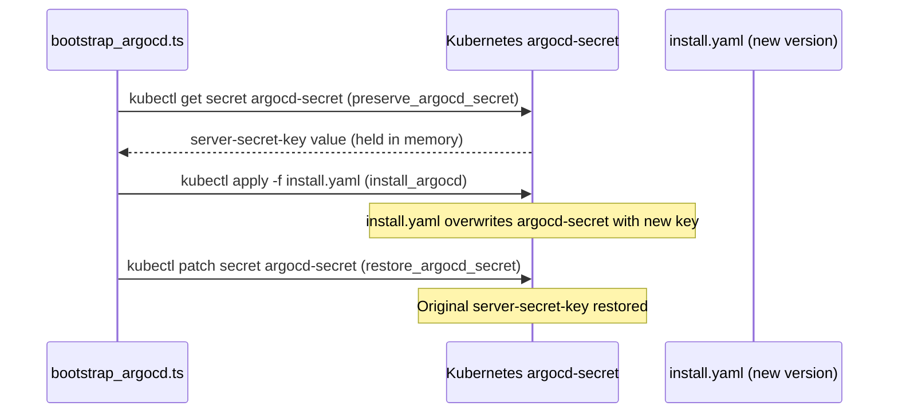

# ArgoCD Installation Runbook

Procedures for installing, upgrading, and managing the ArgoCD instance — including the vendored `install.yaml` modification, signing key lifecycle, and the 31-step bootstrap sequence that runs on first cluster boot.

## Current version

ArgoCD **v3.3.2**, last modified 2026-04-08 ([`sm-a/argocd/install.yaml`](../../sm-a/argocd/install.yaml), header comment line 5).

`install.yaml` is a **vendored** copy of the upstream ArgoCD manifest — not pulled from the upstream URL at install time. This is intentional: vendoring enables cluster-specific modifications and guarantees reproducible installs without network dependency.

## Vendored modification

The upstream `install.yaml` uses `workload: argocd` as a node selector label. The cluster uses `node-pool: monitoring` as its node affinity scheme. The vendor step replaces the label:

```bash
sed -i 's/workload: argocd/node-pool: general/g' install.yaml
```

This pins ArgoCD pods to the `node-pool=general` pool rather than a pool named `argocd`. Without this replacement, ArgoCD pods would be `Pending` indefinitely (no node matches the default label). The comment in line 3–4 of `install.yaml` preserves this instruction explicitly to prevent it being lost when upgrading.

ArgoCD was decoupled from `node-pool=monitoring` in 2025-04 and moved to `node-pool=general` — this is the current state as vendored.

## Upgrade procedure

1. Download new upstream `install.yaml` from the ArgoCD releases page for the target version.
2. Re-apply the sed replacement:
   ```bash
   sed -i 's/workload: argocd/node-pool: general/g' install.yaml
   ```
3. Update the version comment at line 5:
   ```
   # Last modified: YYYY-MM-DD | ArgoCD version: vX.Y.Z
   ```
4. Commit the updated `install.yaml` to the `sm-a/argocd/` path.
5. Trigger a cluster bootstrap or manually apply:
   ```bash
   kubectl apply -f sm-a/argocd/install.yaml -n argocd
   ```
6. Monitor ArgoCD pod restarts. The signing key must be preserved across the upgrade — see the signing key lifecycle section below.

**Do not skip the sed step.** The upstream label uses `workload: argocd`; the cluster's nodes are labeled `node-pool: general`. ArgoCD pods will not schedule without this replacement.

## Bootstrap sequence

On first cluster boot, `bootstrap_argocd.ts` ([`sm-a/argocd/bootstrap_argocd.ts`](../../sm-a/argocd/bootstrap_argocd.ts)) runs as step 7 of `control_plane.ts`. It executes 31 steps sequentially via `makeRunStep` idempotency markers — re-running the script skips already-completed steps.

The full sequence (line numbers reference `bootstrap_argocd.ts`):

| Step | Function | Purpose |
|------|----------|---------|
| 1 | `create_namespace` | Creates `argocd` namespace |
| 2 | `resolve_deploy_key` | Reads SSH deploy key from SSM |
| 3 | `create_repo_secret` | Applies `repo-secret.yaml` with the deploy key |
| 4 | `provision_image_updater_writeback` | Creates `argocd-image-updater-writeback-key` Secret for ECR tag Git writeback |
| 5 | `preserve_argocd_secret` | **Reads and holds current `argocd-secret` in memory** |
| 6 | `install_argocd` | `kubectl apply -f install.yaml` — installs/upgrades ArgoCD |
| 7 | `restore_argocd_secret` | **Re-applies the preserved signing key** |
| 8 | `create_default_project` | Creates ArgoCD default AppProject |
| 9 | `configure_argocd_server` | Patches ArgoCD server for insecure mode, sets admin password hash |
| 10 | `configure_health_checks` | Applies custom resource health check configs |
| 11 | `provision_arc_crds` | Applies Actions Runner Controller CRDs before root app (ordering constraint) |
| 12 | `apply_root_app` | Applies `platform-root-app.yaml` — ArgoCD takes control from here |
| 13 | `inject_monitoring_helm_params` | Seeds Helm parameters for monitoring stack |
| 14 | `seed_prometheus_basic_auth` | Seeds Prometheus basic auth Secret from SSM |
| 15 | `seed_ecr_credentials` | Seeds ECR docker-registry Secret in `argocd` namespace |
| 16 | `provision_crossplane_credentials` | Seeds Crossplane provider-aws credentials from SSM |
| 17 | `provision_arc_github_secret` | Seeds ARC GitHub App credentials |
| 18 | `restore_tls_cert` | Re-applies backed-up TLS certificate if present |
| 19–21 | `apply_cert_manager_issuer` | Non-fatal — applies ClusterIssuer; ArgoCD reconciles if this fails |
| 22–23 | `wait_for_argocd` | Waits for ArgoCD server to become ready |
| 24–25 | `apply_ingress` | Non-fatal — applies IngressRoute for ArgoCD UI |
| 26–27 | `create_argocd_ip_allowlist` | Creates Traefik IP allowlist Middleware for ArgoCD |
| 28 | `configure_webhook_secret` | Configures GitHub webhook HMAC secret |
| 29 | `provision_argocd_notifications_secret` | Seeds `argocd-notifications-secret` from SSM (GitHub App credentials) |
| 30 | `install_argocd_cli` | Downloads and installs ArgoCD CLI |
| 31–32 | `create_ci_bot` / `generate_ci_token` | Creates CI bot service account and token |
| 33 | `set_admin_password` | Sets ArgoCD admin password from SSM |
| 34 | `backup_tls_cert` | Backs up TLS certificate to SSM for cluster rebuilds |
| 35 | `backup_argocd_secret_key` | Backs up signing key to SSM |
| 36 | `print_summary` | Prints bootstrap completion summary |

Steps 19–21 (`apply_cert_manager_issuer`) and 24–25 (`apply_ingress`) are wrapped in `try/catch` with non-fatal handling. ArgoCD's continuous reconciliation will converge these resources after the bootstrap completes.

## Signing key lifecycle

The ArgoCD signing key lives in the `argocd-secret` Kubernetes Secret (`server-secret-key` field). It is used to sign ArgoCD JWTs and track managed resources. When ArgoCD is reinstalled without preserving this key, it generates a new one — all existing sessions are invalidated and resource tracking is disrupted.

**Bootstrap flow (steps 5–7):**



**Backup/restore for cluster rebuilds (steps 34–35 / step 18):**

After bootstrap completes, `backup_argocd_secret_key` writes the signing key to SSM. On a subsequent cluster rebuild, `restore_tls_cert` (step 18) and the equivalent SSM-backed restore steps re-apply the key before ArgoCD installs. This ensures sessions and resource tracking survive full cluster teardown-and-rebuild.

## Image Updater writeback key

Step 4 (`provision_image_updater_writeback`) creates the `argocd-image-updater-writeback-key` Secret in the `argocd` namespace. This Secret holds a write-enabled GitHub deploy key. ArgoCD Image Updater uses it to push `.argocd-source-*.yaml` tag writeback files to the `kubernetes-bootstrap` repository when it detects new ECR image builds.

The writeback key is separate from the read-only deploy key used for ArgoCD's own source tracking. Write access is scoped to this single key; the repo-secret deploy key for chart/manifests sync is read-only.

## Related

- [ArgoCD GitOps architecture](../concepts/argocd-gitops-architecture.md) — app-of-apps structure, sync waves, ApplicationSets
- [ArgoCD bootstrap pattern](../concepts/argocd-bootstrap-pattern.md) — ARC CRD ordering constraint, secret seeding, non-fatal step handling in detail
- [ArgoCD sync failures troubleshooting](../troubleshooting/argocd-sync-failures.md) — common failure modes during and after installation

<!--
Evidence trail (auto-generated):
- Source: sm-a/argocd/install.yaml (read 2026-04-28, header lines 1-5 — version v3.3.2, last modified 2026-04-08, vendored copy, sed replacement instruction for node-pool label)
- Source: sm-a/argocd/bootstrap_argocd.ts (read 2026-04-28, lines 62-138 — full 31-step sequence, preserve_argocd_secret line 66, restore_argocd_secret line 68, backup lines 136-137, non-fatal try/catch at lines 85-104)
- Generated: 2026-04-28
-->
