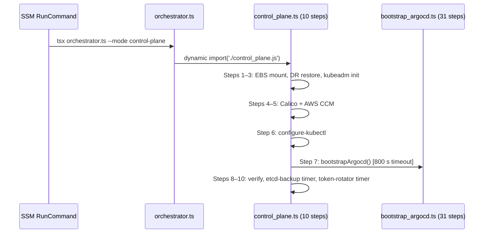

# kubeadm Control Plane Init — OS-Level Runbook

Operational reference for verifying and troubleshooting the kubeadm bootstrap sequence on the AL2023 single-node control plane. Companion to [`docs/projects/kubernetes-bootstrap-orchestrator.md`](../projects/kubernetes-bootstrap-orchestrator.md).

## Bootstrap execution model

SSM RunCommand fires `tsx orchestrator.ts --mode control-plane` on the instance after Step Functions SM-A receives an `EC2InstanceLaunchSuccessful` event. The script runs as root. Total 10 sequential idempotent steps on the control plane; 6 on workers.



---

## OS preparation — baked into Golden AMI

Everything in this section is written by EC2 Image Builder at AMI bake time
([`infra/lib/constructs/compute/build-golden-ami-component.ts`](../../infra/lib/constructs/compute/build-golden-ami-component.ts)). Nothing is installed at EC2 boot. The bootstrap script expects all of this to be present.

### Kernel modules

EC2 Image Builder step `KernelModulesAndSysctl` writes the persistence config and loads the modules immediately:

```conf
# /etc/modules-load.d/k8s.conf
overlay
br_netfilter
```

`modprobe overlay` and `modprobe br_netfilter` are also called inline at bake time so they are active in the build environment. On the final EC2 instance `systemd-modules-load.service` reads `/etc/modules-load.d/k8s.conf` at every boot.

**Verify at runtime:**
```bash
lsmod | grep -E '^(overlay|br_netfilter)'
# Expected: both lines present with non-zero size in column 2
cat /etc/modules-load.d/k8s.conf
```

### Sysctl settings

Same Image Builder step writes and immediately applies:

```conf
# /etc/sysctl.d/k8s.conf
net.bridge.bridge-nf-call-iptables  = 1
net.bridge.bridge-nf-call-ip6tables = 1
net.ipv4.ip_forward                 = 1
```

Applied at bake time with `sysctl --system`. Read at runtime by `worker.ts:validateAmi()` via `/proc/sys/<key>` — if any value is wrong the worker step throws before attempting `kubeadm join`.

**Verify at runtime:**
```bash
sysctl net.bridge.bridge-nf-call-iptables \
       net.bridge.bridge-nf-call-ip6tables \
       net.ipv4.ip_forward
# Expected: all = 1

# Direct proc read (used by validateAmi()):
cat /proc/sys/net/bridge/bridge-nf-call-iptables
cat /proc/sys/net/ipv4/ip_forward
```

### containerd

Installed from GitHub releases. The only non-default config change: `SystemdCgroup = true`.

```bash
# Image Builder step InstallContainerd:
containerd config default > /etc/containerd/config.toml
sed -i 's/SystemdCgroup = false/SystemdCgroup = true/' /etc/containerd/config.toml
systemctl enable containerd
crictl config --set runtime-endpoint=unix:///run/containerd/containerd.sock
```

**Verify at runtime:**
```bash
systemctl is-active containerd                   # active
grep SystemdCgroup /etc/containerd/config.toml   # SystemdCgroup = true
crictl info | python3 -c "import sys,json; d=json.load(sys.stdin); print(d['config']['containerd']['runtimes']['runc']['options']['SystemdCgroup'])"
# true
```

### Kubernetes binaries

Installed via dnf from `pkgs.k8s.io` using a repo pinned to minor version `1.35`. Kubelet is enabled but **not started** — `kubeadm init` starts it.

```bash
# /etc/yum.repos.d/kubernetes.repo pins to v1.35 repo
dnf install kubelet-1.35.1 kubeadm-1.35.1 kubectl-1.35.1 --disableexcludes=kubernetes
systemctl enable kubelet
# kubelet is intentionally left inactive pre-init
```

**Verify at runtime:**
```bash
kubeadm version -o short                                # v1.35.1
kubelet --version                                       # Kubernetes v1.35.1
kubectl version --client -o yaml | grep gitVersion     # v1.35.1
systemctl is-enabled kubelet                            # enabled
```

### ECR credential provider

Binary at `/usr/local/bin/ecr-credential-provider`. Config written at bake time by step `InstallEcrCredentialProvider`:

```yaml
# /etc/kubernetes/image-credential-provider-config.yaml
apiVersion: kubelet.config.k8s.io/v1
kind: CredentialProviderConfig
providers:
  - name: ecr-credential-provider
    matchImages:
      - "*.dkr.ecr.*.amazonaws.com"
    defaultCacheDuration: "12h"
    apiVersion: credentialprovider.kubelet.k8s.io/v1
```

Kubelet reads this config via `--image-credential-provider-config` and `--image-credential-provider-bin-dir` flags set at runtime in `/etc/sysconfig/kubelet` (see [Step 3](#step-3--kubeadm-init)).

**Verify at runtime:**
```bash
ls -la /usr/local/bin/ecr-credential-provider
cat /etc/kubernetes/image-credential-provider-config.yaml
```

### Pre-cached Calico manifests

Downloaded at bake time to eliminate a network fetch during bootstrap:

```bash
/opt/calico/tigera-operator.yaml   # applied in Step 4
/opt/calico/calico.yaml
/opt/calico/version.txt            # e.g. "v3.29.3"
```

**Verify at runtime:**
```bash
ls /opt/calico/
cat /opt/calico/version.txt
```

### Bootstrap scripts

Synced from S3 to the AMI during the `BakeBootstrapScripts` Image Builder step, then node_modules are installed. At EC2 boot the SSM RunCommand document syncs again from S3 over the baked copy — this allows hot-fixes without a full AMI re-bake.

**Verify at runtime:**
```bash
ls /opt/k8s-bootstrap/sm-a/boot/steps/
test -f /opt/k8s-bootstrap/sm-a/boot/steps/orchestrator.ts && echo "scripts present"
ls /opt/k8s-bootstrap/sm-a/boot/steps/node_modules/.bin/tsx
```

---

## Runtime bootstrap — control plane

### Kubelet extra args (written before kubeadm init)

`control_plane.ts:initCluster()` writes `/etc/sysconfig/kubelet` before calling `kubeadm init`:

```
KUBELET_EXTRA_ARGS=--cloud-provider=external \
  --node-ip=<private-ip> \
  --image-credential-provider-config=/etc/kubernetes/image-credential-provider-config.yaml \
  --image-credential-provider-bin-dir=/usr/local/bin
```

`--cloud-provider=external` prevents kubelet from using the built-in AWS cloud provider (the AWS CCM pod handles that in Step 5). `--node-ip` pins the node to the private ENI.

**Verify:**
```bash
cat /etc/sysconfig/kubelet
```

### Step 1 — Mount data volume

**Marker:** `/etc/kubernetes/.data-mounted`

`resolveNvmeDevice()` checks in order:
1. `/dev/xvdf` — Xen paravirtual (legacy instance types)
2. `/dev/nvme[1-9]n1` sorted — Nitro NVMe (current EC2 default)

On first run:
1. `mkfs.ext4 -F <device>`
2. `mount <device> /data`
3. Adds fstab entry: `<device>  /data  ext4  defaults,nofail  0  2`
4. Creates: `/data/kubernetes`, `/data/k8s-bootstrap`, `/data/app-deploy`

The `nofail` mount option is intentional — if the EBS volume fails to attach, the instance will still boot so the SSM command can report the failure rather than silently hanging.

**Verify:**
```bash
mount | grep /data
# Expected: /dev/nvme... on /data type ext4

ls /data/
# kubernetes/ k8s-bootstrap/ app-deploy/

grep /data /etc/fstab
ls /etc/kubernetes/.data-mounted
```

### Step 2 — DR restore (conditional)

**Marker:** `/etc/kubernetes/.dr-restored`

Checks for an etcd snapshot key in S3 under `{s3Bucket}/dr/etcd-snapshot.db.gz`. Skipped on fresh deployments when no snapshot exists.

**Verify:**
```bash
ls /etc/kubernetes/.dr-restored 2>/dev/null \
  && echo "DR restore ran" \
  || echo "DR restore skipped (normal for fresh cluster)"
```

### Step 3 — kubeadm init

No marker file — `initOrReconstruct()` branches on existence of `/etc/kubernetes/admin.conf`.

#### Fresh cluster init

Full `kubeadm init` command (source: `control_plane.ts:initCluster()`):

```bash
kubeadm init \
  --kubernetes-version=1.35.1 \
  --pod-network-cidr=192.168.0.0/16 \
  --service-cidr=10.96.0.0/12 \
  --control-plane-endpoint=k8s-api.k8s.internal:6443 \
  --apiserver-cert-extra-sans=127.0.0.1,<private-ip>,k8s-api.k8s.internal[,<public-ip>] \
  --upload-certs
```

After `kubeadm init` the script performs four additional operations:

**1. kubeconfig distribution:**
```bash
cp /etc/kubernetes/admin.conf /root/.kube/config
cp /etc/kubernetes/admin.conf /home/ec2-user/.kube/config
```

**2. kube-apiserver resource patch** — adds CPU and memory limits to the static pod manifest:
```bash
# Adds to kube-apiserver.yaml containers[0].resources:
#   requests: { cpu: 250m, memory: 512Mi }
#   limits:   { cpu: 250m, memory: 512Mi }
```

**3. CA hash computation:**
```bash
openssl x509 -pubkey -in /etc/kubernetes/pki/ca.crt \
  | openssl rsa -pubin -outform der 2>/dev/null \
  | openssl dgst -sha256 -hex \
  | awk '{print $2}'
# Output prefixed with "sha256:" → stored in SSM
```

**4. SSM parameter publication:**

| SSM parameter | Content | Type |
|--------------|---------|------|
| `{ssmPrefix}/join-token` | kubeadm bootstrap token | SecureString |
| `{ssmPrefix}/ca-hash` | `sha256:<hex>` | String |
| `{ssmPrefix}/control-plane-endpoint` | `k8s-api.k8s.internal:6443` | String |
| `{ssmPrefix}/instance-id` | EC2 instance ID | String |
| `{ssmPrefix}/kubeconfig` | admin.conf with server=`127.0.0.1:6443` | String |

The kubeconfig variant stored in SSM uses `127.0.0.1:6443` so it is usable over an SSM port-forward tunnel.

**Verify after fresh init:**
```bash
kubectl get nodes
kubectl cluster-info
ls /etc/kubernetes/pki/        # ca.crt, ca.key, apiserver*.crt, etcd/ ...
cat /var/lib/kubelet/config.yaml | grep clusterDNS
# Expected: [10.96.0.10]

# Verify SSM params:
aws ssm get-parameter --name /k8s/development/ca-hash
aws ssm get-parameter --name /k8s/development/control-plane-endpoint
aws ssm get-parameter --name /k8s/development/join-token --with-decryption
```

#### Second-run maintenance path

When `/etc/kubernetes/admin.conf` already exists, `reconstructCluster()` runs instead of `initCluster()`. This is safe to re-run across reboots and SSM re-invocations.

**`ensureApiserverCertCurrent()`** — reads the current SAN list from the apiserver certificate, compares to the expected list `[127.0.0.1, privateIp, apiDnsName, publicIp]`. If stale:
1. Deletes `/etc/kubernetes/pki/apiserver.{crt,key}`
2. `kubeadm init phase certs apiserver ...`
3. `crictl stop <apiserver-container-id>` — kills the static pod container
4. `systemctl restart kubelet` — kubelet re-creates the apiserver pod with the new cert

**Verify cert SANs:**
```bash
openssl x509 -noout -ext subjectAltName \
  -in /etc/kubernetes/pki/apiserver.crt
# Should include: IP:127.0.0.1, IP:<private-ip>, DNS:k8s-api.k8s.internal
```

**Bootstrap token restore** — creates a new kubeadm token and publishes to SSM:
```bash
kubeadm token list                   # shows current tokens and TTL
aws ssm get-parameter \
  --name /k8s/development/join-token \
  --with-decryption \
  --query 'Parameter.LastModifiedDate'
```

### Step 4 — Install Calico

**Marker:** `/etc/kubernetes/.calico-installed`

1. Applies Tigera operator from `/opt/calico/tigera-operator.yaml`
2. Waits for `tigera-operator` deployment to be ready
3. Applies `Installation` CR with VXLAN encapsulation and BGP disabled:

```yaml
spec:
  calicoNetwork:
    bgp: Disabled
    ipPools:
      - cidr: 192.168.0.0/16
        encapsulation: VXLAN
        natOutgoing: Enabled
        blockSize: 26
  cni:
    type: Calico
  linuxDataplane: Iptables
  controlPlaneReplicas: 1
  componentResources:
    - componentName: Node
      resourceRequirements:
        requests:
          cpu: "25m"
          memory: "160Mi"
```

BGP is disabled because this is a single-node cluster behind AWS VPC routing — VXLAN handles pod-to-pod encapsulation without requiring BGP peering. `linuxDataplane: Iptables` matches the kernel capabilities on AL2023 (no eBPF requirement).

4. Polls up to 6 minutes for `calico-node` DaemonSet to reach `Ready` with stale-state detection (re-reads DaemonSet status until `desiredNumberScheduled == updatedNumberScheduled == numberReady`).

**Verify:**
```bash
kubectl get pods -n calico-system
kubectl get pods -n tigera-operator
kubectl get installation default -o jsonpath='{.spec.calicoNetwork.bgp}'
# Disabled

ls /etc/kubernetes/.calico-installed
```

### Step 5 — Install AWS CCM

**Marker:** `/etc/kubernetes/.ccm-installed`

Installs `aws-cloud-controller-manager` via Helm. Key values:

```yaml
args:
  - --v=2
  - --cloud-provider=aws
  - --configure-cloud-routes=false
tolerations:
  - key: node.cloudprovider.kubernetes.io/uninitialized
    effect: NoSchedule
    value: "true"
```

`--configure-cloud-routes=false` disables AWS route table management — Calico VXLAN handles all pod routing. Without this flag the CCM would attempt to add routes for `192.168.0.0/16` to the AWS route table, which is unnecessary and would fail. The toleration allows the CCM pod to schedule on the node before the `node.cloudprovider.kubernetes.io/uninitialized` taint is removed.

**Verify:**
```bash
kubectl get pods -n kube-system | grep cloud-controller
kubectl get node $(hostname -f) \
  -o jsonpath='{.spec.providerID}'
# Expected: aws:///<az>/<instance-id>

kubectl get node $(hostname -f) \
  -o jsonpath='{.spec.taints}' | grep -c Uninitialized
# Expected: 0 (taint removed by CCM after init)

ls /etc/kubernetes/.ccm-installed
```

### Step 10 — Token rotator

**Marker:** `/etc/systemd/system/kubeadm-token-rotator.timer`

Creates two systemd unit files and enables the timer:

```ini
# /etc/systemd/system/kubeadm-token-rotator.service
[Unit]
Description=Rotate kubeadm bootstrap token and update SSM

[Service]
Type=oneshot
ExecStart=/bin/bash -c '<kubeadm token create, then aws ssm put-parameter SecureString>'
```

```ini
# /etc/systemd/system/kubeadm-token-rotator.timer
[Unit]
Description=Rotate kubeadm bootstrap token every 12 hours

[Timer]
OnBootSec=10min
OnUnitActiveSec=12h
RandomizedDelaySec=5m
Persistent=true

[Install]
WantedBy=timers.target
```

`OnBootSec=10min` ensures a fresh token is in SSM before any workers attempt to join (workers start shortly after the control plane reports healthy). `OnUnitActiveSec=12h` matches the kubeadm token TTL. `RandomizedDelaySec=5m` prevents thundering-herd if multiple instances reset simultaneously.

**Verify:**
```bash
systemctl status kubeadm-token-rotator.timer
systemctl list-timers kubeadm-token-rotator.timer
# Next trigger: ~10min from last boot or ~12h from last rotation
```

---

## Runtime bootstrap — worker

### Step 1 — Validate Golden AMI

`worker.ts:validateAmi()` runs before any join attempt and fails fast with a classified error if anything is missing. Checks three categories:

| Category | Items checked | Check method |
|----------|--------------|-------------|
| Binaries | `containerd`, `kubeadm`, `kubelet`, `kubectl`, `helm` | `which <bin>` |
| Kernel modules | `overlay`, `br_netfilter` | `/proc/modules` |
| Sysctl | `net.bridge.bridge-nf-call-iptables=1`, `net.bridge.bridge-nf-call-ip6tables=1`, `net.ipv4.ip_forward=1` | `/proc/sys/<key>` |

On any failure: throws with "Rebuild the Golden AMI with the missing components." The Step Functions state machine catches this and surfaces the failure in the execution cause.

### Step 2 — Join cluster

**Idempotency gate:** skips if `/etc/kubernetes/kubelet.conf` already exists.

**Kubelet extra args** — written to `/etc/sysconfig/kubelet` before joining:
```
KUBELET_EXTRA_ARGS=--cloud-provider=external \
  --node-ip=<private-ip> \
  --node-labels=<labels> \
  --image-credential-provider-config=/etc/kubernetes/image-credential-provider-config.yaml \
  --image-credential-provider-bin-dir=/usr/local/bin
```

**CA mismatch check** — compares local `/etc/kubernetes/pki/ca.crt` hash against SSM `{ssmPrefix}/ca-hash`. On mismatch, runs `kubeadm reset -f` and deletes stale certs before retrying. Handles recycled instances with PKI from a previous cluster lifetime.

**Join command:**
```bash
kubeadm join k8s-api.k8s.internal:6443 \
  --token <token-from-ssm> \
  --discovery-token-ca-cert-hash sha256:<hash-from-ssm>
```

**Retry loop behaviour:**
- CA hash: fetched once before the loop (stable for cluster lifetime)
- Join token: re-fetched from SSM per attempt (rotated every 12h)
- API server probe: `node:net` TCP probe to port 6443 (5s timeout) before each attempt
- Token expiry detection: looks for `"expired"` / `"not found"` / `"unknown bootstrap token"` in stderr; runs `kubeadm reset -f` and waits for rotator
- Max 5 attempts, 30s interval

**Post-join:**
1. Polls for kubelet active + `/etc/kubernetes/kubelet.conf` present (60s deadline)
2. Patches `spec.providerID` = `aws:///{az}/{instanceId}` using `kubelet.conf` (not admin.conf)

**Verify:**
```bash
# On worker:
ls /etc/kubernetes/kubelet.conf
systemctl is-active kubelet
cat /etc/sysconfig/kubelet

# On control plane:
kubectl get nodes
kubectl get node <worker-hostname> \
  -o jsonpath='{.spec.providerID}'
# aws:///<az>/<instance-id>
```

---

## Observability during bootstrap

### SSM status parameters

`makeRunStep()` writes per-step status to SSM before and after each step:

```bash
aws ssm get-parameters-by-path \
  --path /k8s/development/bootstrap/status/boot \
  --recursive \
  --query 'Parameters[*].[Name,Value]' \
  --output text
# Each value is JSON: { status: running|success|degraded|failed, startedAt, duration? }
```

### Run summary file

Accumulated JSON at `/var/lib/k8s-bootstrap/run_summary.json` — one object per completed step:

```bash
cat /var/lib/k8s-bootstrap/run_summary.json | python3 -m json.tool
```

### Marker file inventory

| Marker path | Step that writes it |
|-------------|---------------------|
| `/etc/kubernetes/.data-mounted` | Step 1: mount-data-volume |
| `/etc/kubernetes/.dr-restored` | Step 2: dr-restore |
| `/etc/kubernetes/.calico-installed` | Step 4: install-calico |
| `/etc/kubernetes/.ccm-installed` | Step 5: install-ccm |
| `/etc/systemd/system/kubeadm-token-rotator.timer` | Step 10: install-token-rotator |
| `/tmp/.cw-agent-installed` | Worker step 4: install-cloudwatch-agent |
| `/tmp/.stale-pv-cleanup-done` | Worker step 5: clean-stale-pvs |

```bash
ls /etc/kubernetes/.*
```

---

## Common failure scenarios

### kubeadm init fails: "port 6443 already in use"

Previous kubeadm run left stale state:
```bash
kubeadm reset -f
rm -rf /etc/kubernetes /var/lib/kubelet /var/lib/etcd
systemctl stop kubelet
# Then re-trigger SSM RunCommand
```

### containerd not running

```bash
systemctl start containerd
journalctl -u containerd -n 50 --no-pager
# Typical cause: config.toml parse error after manual edit
```

### Calico DaemonSet stuck Pending after step 4

```bash
kubectl describe pod -n calico-system <pod-name> | grep -A10 Events
# Typical: node not Ready (control plane taint still present) or CNI binaries absent

# Check control-plane taint:
kubectl get node $(hostname -f) -o jsonpath='{.spec.taints}'

# Check CNI binaries:
ls /opt/cni/bin/
```

### Worker: "Join token not available" on all attempts

Token rotator fires 10 minutes post-boot on the control plane. If workers launch early they may wait:
```bash
# On control plane: check when token was last rotated
aws ssm get-parameter \
  --name /k8s/development/join-token \
  --with-decryption \
  --query 'Parameter.LastModifiedDate'

# Manually trigger rotation if needed:
systemctl start kubeadm-token-rotator.service

# Verify timer is scheduled:
systemctl status kubeadm-token-rotator.timer
```

### Worker: kubeadm join fails with "x509: certificate signed by unknown authority"

CA mismatch — control plane was replaced with a new CA:
```bash
# The checkCaMismatch() function handles this automatically.
# Verify it ran by checking the SSM step status:
aws ssm get-parameter \
  --name /k8s/development/bootstrap/status/boot/join-cluster

# Manual reset if needed:
kubeadm reset -f
rm -f /etc/kubernetes/pki/ca.crt /etc/kubernetes/kubelet.conf
# Then re-trigger the bootstrap
```

### Apiserver cert SAN stale (maintenance path)

```bash
openssl x509 -noout -ext subjectAltName \
  -in /etc/kubernetes/pki/apiserver.crt

# Force SAN regeneration manually:
rm /etc/kubernetes/pki/apiserver.{crt,key}
kubeadm init phase certs apiserver \
  --control-plane-endpoint=k8s-api.k8s.internal:6443 \
  --apiserver-cert-extra-sans=127.0.0.1,<private-ip>,k8s-api.k8s.internal
APISERVER=$(crictl pods --namespace kube-system --name kube-apiserver -q)
crictl stopp "$APISERVER"
systemctl restart kubelet
```

---

## Related

- [Kubernetes Bootstrap Orchestrator](../projects/kubernetes-bootstrap-orchestrator.md) — Step Functions state machine, full 10-step + 6-step sequence, `makeRunStep` idempotency factory
- [kubeadm init flow — concept](../concepts/kubeadm-init-flow.md) — layer model, AMI toolchain versions, second-run maintenance internals, Calico VXLAN rationale
- [SSM Automation bootstrap](../concepts/ssm-automation-bootstrap.md) — cross-stack service registry, RunCommand document lifecycle, 3600 s timeout incident
- [Deployment pipeline order](../concepts/deployment-pipeline-order.md) — when each phase runs relative to CDK provisioning

<!--
Evidence trail (auto-generated):
- Source: infra/lib/constructs/compute/build-golden-ami-component.ts (read 2026-04-28 — KernelModulesAndSysctl step lines 153–169, InstallContainerd step lines 171–201, InstallKubeadmKubeletKubectl lines 202–216, InstallEcrCredentialProvider lines 218–241, PreloadCalicoCNI lines 243–251, BakeBootstrapScripts lines 330–363)
- Source: sm-a/boot/steps/control_plane.ts (read 2026-04-28, 1573 lines — initOrReconstruct() on ADMIN_CONF, initCluster() kubeadm flags, kubelet extra args, CA hash openssl pipeline, SSM param publication, reconstructCluster() ensureApiserverCertCurrent(), Calico Installation CR YAML, CCM_HELM_VALUES constant, token rotator timer content, 10-step main() sequence)
- Source: sm-a/boot/steps/worker.ts (read 2026-04-28, 1221 lines — validateAmi() lines 623–675 with REQUIRED_BINARIES/REQUIRED_KERNEL_MODULES/REQUIRED_SYSCTL constants, joinCluster() outer flow, doJoin() inner retry loop lines 703–832, checkCaMismatch() CA hash comparison, waitForKubelet() early-exit logic, patchProviderId() providerID format)
- Source: sm-a/boot/steps/common.ts (read 2026-04-28, 724 lines — makeRunStep SSM status paths, RUN_SUMMARY_FILE, StepDegraded class, marker file list)
- Source: docs/projects/kubernetes-bootstrap-orchestrator.md (read 2026-04-28 — companion doc marker file table, step numbering verification)
- Generated: 2026-04-28
-->
