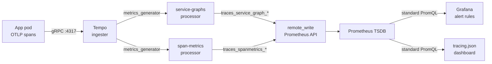

# Loki + Tempo Pipeline

How Loki (log aggregation) and Tempo (distributed tracing) are configured in this stack — covering Loki's tsdb schema v13 and compaction retention, Tempo's OTLP ingest and 72-hour block lifecycle, the `metrics_generator` that writes span-derived RED metrics back into Prometheus, and why span metrics enable standard Prometheus alerting on trace data without querying Tempo directly.

## Loki — log aggregation

Loki is deployed as a single-instance `Deployment` ([`charts/monitoring/chart/templates/loki/configmap.yaml`](../../charts/monitoring/chart/templates/loki/configmap.yaml)) using filesystem storage on a 10Gi EBS PVC (5Gi in development).

### Storage schema

```yaml
schema_config:
  configs:
    - from: "2024-01-01"
      store: tsdb
      object_store: filesystem
      schema: v13
      index:
        prefix: index_
        period: 24h
```

Schema `v13` with `tsdb` store is Loki's current recommended index format — it replaces the older `boltdb-shipper` approach with a more compact index structure. Index is partitioned into 24-hour periods (`period: 24h`). All index and chunk data lives on the local filesystem (`/loki/chunks`, `/loki/rules`) on the EBS PVC.

`auth_enabled: false` — single-tenant mode. The cluster has one team and one environment per cluster; multi-tenancy overhead is not justified.

### Ingest limits

```yaml
limits_config:
  reject_old_samples: true
  reject_old_samples_max_age: 168h    # 7 days
  ingestion_rate_mb: 10
  ingestion_burst_size_mb: 20
  max_streams_per_user: 10000
```

`reject_old_samples_max_age: 168h` protects against Promtail or Alloy sending stale logs (e.g., after a node restart) that would be rejected at query time anyway. Logs older than 7 days at ingest time are dropped at the distributor rather than written to storage.

### Compaction and retention

```yaml
compactor:
  working_directory: /loki/compactor
  compaction_interval: 10m
  retention_enabled: true
  retention_delete_delay: 2h
  delete_request_store: filesystem
```

The compactor runs every 10 minutes, merging small chunk files and applying retention. `retention_delete_delay: 2h` creates a 2-hour window between a chunk being marked for deletion and being physically removed — provides a recovery window if a retention policy is misconfigured.

No explicit retention duration is set in the configmap. Retention is bounded by PVC capacity: at the development ingestion rate (~10 MB/s burst, much lower steady-state), 5Gi covers multiple weeks of logs.

### Loki → Grafana correlation

The Grafana Loki datasource has a `derivedField` configured:

```yaml
derivedFields:
  - datasourceUid: tempo
    matcherRegex: '"traceID":"(\w+)"'
    name: TraceID
    url: "${__value.raw}"
```

When a log line contains `"traceID":"<hex>"` (emitted by structured loggers like Pino or Winston with OpenTelemetry correlation), Grafana renders a clickable link inline in the log line. Clicking it opens the trace in Tempo. The regex targets the JSON key `"traceID"` specifically — services must emit trace IDs under this exact key for correlation to work.

## Tempo — distributed tracing

Tempo ingests traces over OTLP from application pods and from the Alloy Faro collector (browser spans). It stores traces on local filesystem and generates span-derived metrics.

### OTLP ingest

```yaml
distributor:
  receivers:
    otlp:
      protocols:
        grpc:
          endpoint: "0.0.0.0:4317"
        http:
          endpoint: "0.0.0.0:4318"
```

Both OTLP gRPC (`:4317`) and HTTP (`:4318`) are exposed. Application pods instrument with any OTLP-compatible SDK (OpenTelemetry, Pino-opentelemetry, etc.) and send to `tempo.monitoring.svc.cluster.local:4317`. The Alloy Faro collector uses gRPC (`:4317`) for client-side spans.

### Block lifecycle

```yaml
ingester:
  trace_idle_period: 30s
  max_block_bytes: 1073741824   # 1 GB
  max_block_duration: 5m
compactor:
  compaction:
    block_retention: 72h
```

Trace data lives on a 10Gi EBS PVC (5Gi dev). The ingester flushes traces to disk after 30s of inactivity or when a block reaches 1 GB or 5 minutes, whichever comes first. The compactor deletes blocks older than 72 hours — a rolling 3-day trace window.

`max_bytes_per_trace: 5000000` (5 MB) caps individual trace size. A single unbounded trace with thousands of spans (e.g., a pathological DynamoDB fan-out) would spike Tempo's working memory. The 5 MB cap drops oversized traces at ingest time rather than letting them degrade the service.

### Metrics generator — span metrics as Prometheus data

This is the most architecturally significant part of the Tempo configuration. The `metrics_generator` derives two metric streams from ingested spans and writes them directly into Prometheus:

```yaml
metrics_generator:
  processor:
    service_graphs:
      dimensions:
        - http.method
        - http.status_code
    span_metrics:
      dimensions:
        - service.name
        - http.method
        - http.status_code
      enable_target_info: true
  storage:
    path: /var/tempo/generator/wal
    remote_write:
      - url: http://prometheus.monitoring.svc.cluster.local:9090/prometheus/api/v1/write
        send_exemplars: true
```

**`service_graphs` processor** — walks the parent/child span relationships in traces to derive inter-service request metrics. Produces:
- `traces_service_graph_request_total` — request count per `(client, server)` pair
- `traces_service_graph_request_failed_total` — failed requests per pair
- `traces_service_graph_request_duration_seconds` — duration histograms

These are the metrics that power the **Service Graph panel** in `tracing.json`. Without the service_graphs processor, building a service dependency map would require querying Tempo directly with TraceQL.

**`span_metrics` processor** — aggregates every span into RED metrics (Rate, Errors, Duration):
- `traces_spanmetrics_calls_total` — labelled by `service_name`, `span_name`, `status_code`
- `traces_spanmetrics_duration_seconds` — histogram bucket for latency percentile calculation
- `traces_spanmetrics_latency_bucket` — alias used by older queries

These are queryable in Prometheus exactly like any other metric. The DynamoDB alert rules in `alerting-configmap.yaml` use them directly:

```yaml
# Alert: DynamoDB Error Rate High
expr: (sum(rate(traces_spanmetrics_calls_total{db_system="dynamodb", status="STATUS_CODE_ERROR"}[5m]))
       / sum(rate(traces_spanmetrics_calls_total{db_system="dynamodb"}[5m]))) * 100 > 5
```



The `remote_write` target is `http://prometheus.monitoring.svc.cluster.local:9090/prometheus/api/v1/write` — Prometheus must be started with `--web.enable-remote-write-receiver` for this to work (confirmed in [`templates/prometheus/deployment.yaml`](../../charts/monitoring/chart/templates/prometheus/deployment.yaml), line 51). `send_exemplars: true` carries the original trace ID through to Prometheus, enabling exemplar-to-trace links in Grafana panels.

### Why span metrics instead of querying Tempo directly

Tempo supports TraceQL for direct trace queries, but using it for alerting would require Grafana Mimir or a separate alerting layer that speaks TraceQL. Prometheus alert rules speak PromQL only.

By writing span metrics into Prometheus, all observability signals — host metrics, Kubernetes state, application traces, logs (via Loki) — converge into a single query layer for alerting. The `alerting-configmap.yaml` DynamoDB and span-ingestion alerts work identically to CPU or memory alerts; no special Tempo-aware infrastructure is needed.

## Promtail — log collection

Promtail runs as a DaemonSet on every node ([`templates/promtail/configmap.yaml`](../../charts/monitoring/chart/templates/promtail/configmap.yaml)), collecting from two sources:

**Pod logs** — `/var/log/pods/*<uid>/<container>/*.log` via `kubernetes_sd role: pod`. The `cri: {}` pipeline stage parses CRI log format (the container runtime log wrapper). Labels attached per log stream:

| Label | Source |
|-------|--------|
| `namespace` | `__meta_kubernetes_namespace` |
| `pod` | `__meta_kubernetes_pod_name` |
| `container` | `__meta_kubernetes_pod_container_name` |
| `app` | `__meta_kubernetes_pod_label_app` |

**Systemd journal** — `/var/log/journal`, max_age 12h, labelled `job=systemd-journal`. Filtered by `__journal__systemd_unit` so individual systemd units (kubelet, containerd, etc.) are distinguishable in Loki.

These labels are the filter dimensions used by the `cloudwatch.json` and `cluster.json` dashboards' Loki panels — e.g., `{namespace="ingestion", container="ingestion"}`.

## Related

- [Observability stack](../projects/observability-stack.md) — full component inventory and architecture
- [RUM pipeline](rum-pipeline.md) — how Alloy feeds browser spans and logs into the same Tempo and Loki targets
- [Grafana datasources](../tools/grafana-datasources.md) — Loki → Tempo derived field configuration, Tempo serviceMap/nodeGraph

<!--
Evidence trail (auto-generated):
- Source: charts/monitoring/chart/templates/loki/configmap.yaml (read 2026-04-28 — tsdb schema v13, auth_enabled false, reject_old_samples_max_age 168h, compactor 10m, retention_delete_delay 2h, limits_config)
- Source: charts/monitoring/chart/templates/tempo/configmap.yaml (read 2026-04-28 — OTLP gRPC/HTTP endpoints, block_retention 72h, trace_idle_period 30s, max_block_bytes 1GB, metrics_generator service-graphs + span-metrics processors, remote_write URL, send_exemplars true, max_bytes_per_trace 5MB)
- Source: charts/monitoring/chart/templates/promtail/configmap.yaml (read 2026-04-28 — kubernetes-pods job, CRI parser, relabel sources, journal job)
- Source: charts/monitoring/chart/templates/grafana/configmap.yaml (read 2026-04-28 — Loki derivedField matcherRegex traceID)
- Source: charts/monitoring/chart/templates/prometheus/deployment.yaml (read 2026-04-28 — --web.enable-remote-write-receiver flag)
- Source: charts/monitoring/chart/templates/grafana/alerting-configmap.yaml (read 2026-04-28 — DynamoDB alert rules using traces_spanmetrics_* metrics)
- Generated: 2026-04-28
-->
