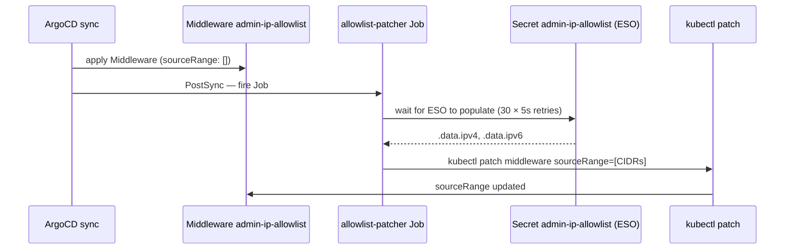

# Traefik

Traefik runs as a DaemonSet with `hostNetwork: true` — one pod per node bound directly to the node's ethernet interface on ports 80/443. This architecture enables seamless EIP failover across nodes, wildcard TLS termination via a cert-manager-issued certificate stored in etcd, and a consistent Middleware-based access control model for all admin endpoints.

## Installation

[`argocd-apps/traefik.yaml`](../../argocd-apps/traefik.yaml) installs from the official `https://traefik.github.io/charts` chart at version `36.*` (ArgoCD wave 2, namespace `kube-system`).

The Application uses ArgoCD's **multi-source** pattern:

```yaml
sources:
  - repoURL: git@github.com:Nelson-Lamounier/kubernetes-bootstrap.git
    targetRevision: develop
    ref: values                              # Source 1: values ref (no path rendered)

  - repoURL: https://traefik.github.io/charts
    chart: traefik
    targetRevision: "36.*"
    helm:
      valueFiles:
        - $values/charts/traefik/traefik-values.yaml  # Source 2: chart + values ref
```

`$values` resolves to the first source's checkout. The Helm chart is fetched from the upstream registry; the values file is read from Git. This keeps the chart upstream while pinning all configuration in the repository.

## DaemonSet + hostNetwork architecture

```yaml
# charts/traefik/traefik-values.yaml
deployment:
  kind: DaemonSet
  dnsPolicy: ClusterFirstWithHostNet

hostNetwork: true

service:
  enabled: false
```

**Why DaemonSet:** Every cluster node listens on ports 80 and 443. When the Elastic IP (EIP) moves to a different EC2 node (failover), the new node already has Traefik running and bound to those ports. A single-replica Deployment would require the pod to schedule onto the new node and restart first — a gap of 30–60 seconds under EIP failover. DaemonSet eliminates that gap.

**Why hostNetwork:** Traefik binds directly to the node's network interface rather than going through kube-proxy. Port 80/443 on the host IS port 80/443 to Traefik — no Service, no NodePort, no iptables rules. The cluster's `service.enabled: false` removes the Traefik Service object entirely.

**dnsPolicy: ClusterFirstWithHostNet** — required when `hostNetwork: true`. Without it, DNS resolution inside the Traefik pod uses the host's `/etc/resolv.conf` (typically an AWS VPC resolver), which cannot resolve Kubernetes Service names like `grafana.monitoring.svc.cluster.local`.

### Rolling update constraint

```yaml
updateStrategy:
  type: RollingUpdate
  rollingUpdate:
    maxUnavailable: 1
    maxSurge: 0
```

Two DaemonSet pods cannot coexist on the same node with `hostNetwork: true` — both would attempt to bind port 80/443 on the same interface. `maxSurge: 0` ensures the old pod terminates before the new pod starts. `maxUnavailable: 1` allows the update to proceed one node at a time.

### Tolerations — all nodes required

```yaml
tolerations:
  - key: node-role.kubernetes.io/control-plane
    operator: Exists
    effect: NoSchedule
  - key: dedicated
    value: monitoring
    operator: Equal
    effect: NoSchedule
```

Traefik must run on the control-plane and monitoring nodes, not just worker nodes. The EIP may be assigned to any of the cluster's EC2 instances — Traefik must be present on all of them.

### PodDisruptionBudget disabled

```yaml
podDisruptionBudget:
  enabled: false
```

The values file explains: Kubernetes' PDB controller does not count DaemonSet-owned pods when computing `disruptionsAllowed`. The PDB always reports `disruptionsAllowed: 0` regardless of pod health. ArgoCD v3's PDB health check marks any Application with `disruptionsAllowed: 0` as Degraded — causing the `traefik` Application to show Degraded permanently even with all pods Running. Rolling maintenance is controlled by `updateStrategy.rollingUpdate.maxUnavailable: 1` instead.

### Security context — NET_BIND_SERVICE

```yaml
securityContext:
  allowPrivilegeEscalation: false
  capabilities:
    drop: [ALL]
    add: [NET_BIND_SERVICE]
  readOnlyRootFilesystem: true

podSecurityContext:
  runAsUser: 0
```

Binding to ports below 1024 (80/443) requires either root or the `NET_BIND_SERVICE` capability. The chart defaults to non-root (uid 65532) with all capabilities dropped. Adding `NET_BIND_SERVICE` and running as uid 0 permits privileged port binding while keeping `allowPrivilegeEscalation: false`.

## TLS termination via cert-manager

Traefik's built-in ACME resolver stores the certificate on disk at the node's EBS volume path — only the node with that EBS volume can serve TLS. In a DaemonSet topology where any node may receive the EIP, this is unusable. cert-manager solves this by storing the certificate in etcd as a Kubernetes Secret (`ops-tls-cert` in `kube-system`), accessible from all nodes.

### Why DNS-01 (not HTTP-01)

[`gitops/cert-manager/cluster-issuer.yaml`](../../gitops/cert-manager/cluster-issuer.yaml) documents the reason:

```
# DNS-01 was chosen over HTTP-01 because:
#   - Traefik uses hostNetwork:true + EIP, causing hairpin NAT failure
#     (cert-manager self-check can't reach the EIP from inside the cluster)
#   - DNS-01 creates a TXT record in Route 53 — no HTTP connectivity needed
#   - Works for privately accessible domains (ops.* is not publicly routable)
```

HTTP-01 requires cert-manager to serve a challenge token over HTTP on the cluster's public IP. The hairpin NAT failure means the cluster cannot reach its own EIP from inside — the self-check fails. DNS-01 bypasses HTTP entirely: cert-manager creates a `_acme-challenge` TXT record in the Route 53 public hosted zone, Let's Encrypt verifies it, and the certificate is issued.

### Cross-account DNS assumption

The ClusterIssuer uses a cross-account Route 53 role:

```yaml
spec:
  acme:
    server: https://acme-v02.api.letsencrypt.org/directory
    email: lamounierleao2025@outlook.com
    solvers:
      - dns01:
          route53:
            region: eu-west-1
            hostedZoneID: ${PUBLIC_HOSTED_ZONE_ID}   # substituted at bootstrap
            role: ${CROSS_ACCOUNT_DNS_ROLE_ARN}       # substituted at bootstrap
```

The ClusterIssuer is **not managed by ArgoCD** — it is applied once during bootstrap by `bootstrap_argocd.ts` step 5d, which substitutes the SSM-stored values for the hosted zone ID and cross-account role ARN. ArgoCD would overwrite the substituted values if it managed this resource.

cert-manager assumes the cross-account role via the control-plane EC2 instance profile to write the TXT record.

### Certificate resource

[`gitops/cert-manager/ops-certificate.yaml`](../../gitops/cert-manager/ops-certificate.yaml):

```yaml
apiVersion: cert-manager.io/v1
kind: Certificate
metadata:
  name: ops-tls-cert
  namespace: kube-system
spec:
  secretName: ops-tls-cert
  duration: 2160h    # 90 days
  renewBefore: 720h  # renew 30 days before expiry
  dnsNames:
    - ops.nelsonlamounier.com
  issuerRef:
    name: letsencrypt
    kind: ClusterIssuer
```

cert-manager renews automatically 30 days before expiry. The issued certificate is stored as `ops-tls-cert` in `kube-system`.

### Traefik tlsStore default

```yaml
# charts/traefik/traefik-values.yaml
tlsStore:
  default:
    defaultCertificate:
      secretName: ops-tls-cert
```

The `tlsStore.default` configures the certificate Traefik uses when no explicit TLS configuration is specified on an IngressRoute. Any IngressRoute with `tls: {}` (empty TLS block) automatically serves `ops-tls-cert`. This means all admin endpoints share the same certificate without each IngressRoute referencing it by name.

## IngressRoute pattern

Traefik uses its own CRD `IngressRoute` (`traefik.io/v1alpha1`) rather than the standard Kubernetes `Ingress` resource. The CRD provides first-class middleware references, rule priorities, and per-route TLS configuration — none of which are available in the Ingress spec.

### Admin services (websecure + TLS)

```yaml
# charts/monitoring/chart/templates/grafana/ingressroute.yaml
apiVersion: traefik.io/v1alpha1
kind: IngressRoute
metadata:
  name: grafana-ingress
  namespace: monitoring
spec:
  entryPoints:
    - websecure         # port 443, TLS termination at Traefik
  routes:
    - match: Host(`ops.nelsonlamounier.com`) && PathPrefix(`/grafana`)
      kind: Rule
      priority: 100
      middlewares:
        - name: admin-ip-allowlist
        - name: rate-limit
      services:
        - name: grafana
          port: 3000
  tls: {}              # use tlsStore.default (ops-tls-cert)
```

`tls: {}` inherits from `tlsStore.default` — no explicit secretName needed. Priority 100 is the standard priority for admin service routes; Alloy Faro uses 110 to match before any lower-priority wildcards.

### Middleware application per endpoint

| Endpoint | Entry point | admin-ip-allowlist | rate-limit | basic-auth |
|----------|------------|-------------------|-----------|-----------|
| Grafana (`/grafana`) | websecure | ✓ | ✓ | — |
| Prometheus (`/prometheus`) | websecure | ✓ | ✓ | ✓ |
| Alloy Faro (`/faro`) | websecure | — | — | — (CORS only) |
| Next.js (public frontend) | web | — | — | — |

Prometheus carries `basic-auth` in addition to the IP allowlist because it exposes raw metrics including infrastructure topology — more sensitive than Grafana's already-authenticated UI. The Faro endpoint is intentionally public (no allowlist, no auth) because it receives browser telemetry from end-user sessions.

### Next.js IngressRoute (HTTP + CloudFront origin secret)

```yaml
# charts/nextjs/chart/templates/ingressroute.yaml
spec:
  entryPoints:
    - web              # port 80 — CloudFront terminates TLS, origin over HTTP
  routes:
    - match: "Host(`nelsonlamounier.com`) && PathPrefix(`/`) && HeaderRegexp(`X-CloudFront-Origin-Secret`, `<value>`)"
      kind: Rule
      services:
        - name: nextjs
          port: 3000
```

The Next.js IngressRoute uses `web` (HTTP port 80) because CloudFront terminates TLS at the edge and forwards requests to the origin over HTTP. The `HeaderRegexp` check on `X-CloudFront-Origin-Secret` prevents direct access to the origin — requests without the correct header are rejected. The actual secret value cannot live in Git; it is injected via a PostSync Job (see below).

## Middleware definitions

All three access-control Middlewares are defined in the `monitoring` chart under `charts/monitoring/chart/templates/traefik/` and are guarded by `{{ if .Values.adminAccess.enabled }}`. They apply cluster-wide via Traefik's namespace cross-reference (IngressRoutes in `monitoring` namespace reference middlewares in `monitoring` namespace).

### admin-ip-allowlist

```yaml
apiVersion: traefik.io/v1alpha1
kind: Middleware
metadata:
  name: admin-ip-allowlist
  namespace: monitoring
spec:
  ipAllowList:
    sourceRange: []   # rendered empty — patched by allowlist-patcher Job
```

The `sourceRange` array is rendered as empty (`[]`) by Helm. The real CIDR list is injected by the PostSync Job after every ArgoCD sync. Requests from IPs not in the allowlist receive HTTP 403.

### rate-limit

```yaml
spec:
  rateLimit:
    average: 100   # requests per second (averaged)
    burst: 50      # allowed burst above average
```

Applied to Grafana and Prometheus. Protects admin services from automated scanning or credential stuffing against the basic-auth prompt.

### basic-auth

```yaml
spec:
  basicAuth:
    secret: prometheus-basic-auth-secret
    removeHeader: true
```

Reads the htpasswd-formatted credential from the `prometheus-basic-auth-secret` Kubernetes Secret (ESO-managed from SSM `/k8s/{env}/monitoring/prometheus-basic-auth`). `removeHeader: true` strips the `Authorization` header before forwarding to Prometheus — prevents the raw credential from appearing in Prometheus access logs.

## Allowlist-patcher PostSync Job

ESO cannot write directly into Traefik CRD spec fields — it creates Kubernetes Secrets only. The IP allowlist CIDRs live in SSM and are synced by ESO into the `admin-ip-allowlist` Secret, but the `Middleware.spec.ipAllowList.sourceRange` field must be populated separately.

The allowlist-patcher ([`charts/monitoring/chart/templates/traefik/allowlist-patcher.yaml`](../../charts/monitoring/chart/templates/traefik/allowlist-patcher.yaml)) is an ArgoCD PostSync hook Job that bridges ESO-managed Secrets into Traefik CRD spec fields:

```yaml
metadata:
  annotations:
    argocd.argoproj.io/hook: PostSync
    argocd.argoproj.io/hook-delete-policy: BeforeHookCreation
spec:
  ttlSecondsAfterFinished: 300
  backoffLimit: 5
```

**Flow on every ArgoCD sync:**



The Job waits up to 150 seconds for ESO to populate the Secret (30 attempts × 5 seconds). It reads `.data.ipv4` and `.data.ipv6` (comma-separated CIDR strings), builds a JSON array, and patches the Middleware with `--type=json`:

```bash
kubectl -n monitoring patch middleware.traefik.io admin-ip-allowlist --type=json \
  -p '[{"op":"replace","path":"/spec/ipAllowList/sourceRange","value":["1.2.3.4/32","::1/128"]}]'
```

Uses `alpine/k8s:1.31.4` — the upstream `registry.k8s.io/kubectl` image is distroless (no `/bin/sh`) and cannot run the shell script.

### ignoreDifferences prevents selfHeal revert

After the Job patches the Middleware, ArgoCD's selfHeal would detect the `sourceRange` field as drift from the Helm-rendered empty array and revert it. Two settings in `argocd-apps/monitoring.yaml` prevent this:

```yaml
ignoreDifferences:
  - group: traefik.io
    kind: Middleware
    name: admin-ip-allowlist
    jsonPointers:
      - /spec/ipAllowList/sourceRange

syncOptions:
  - RespectIgnoreDifferences=true
```

`RespectIgnoreDifferences=true` is required — without it, `ignoreDifferences` affects only the diff display but ArgoCD still overwrites the field during sync.

**IP rotation procedure:** Update SSM `/k8s/{env}/monitoring/allow-ipv4` and `/allow-ipv6`, then trigger a manual ArgoCD sync of the `monitoring` Application. ESO picks up the new values within 5 minutes (5m `refreshInterval`); the Job re-patches the Middleware. selfHeal does not auto-trigger on Secret content changes, so the manual sync is the required trigger.

## Observability

### Prometheus metrics

```yaml
ports:
  metrics:
    port: 9100
    expose:
      default: false   # not exposed externally

metrics:
  prometheus:
    entryPoint: metrics
    addEntryPointsLabels: true
    addRoutersLabels: true
    addServicesLabels: true
```

Traefik exposes metrics on port 9100 (not 9100 of the host interface — `expose: false` keeps this internal). Prometheus scrapes it via pod-role service discovery ([`charts/monitoring/chart/templates/prometheus/configmap.yaml`](../../charts/monitoring/chart/templates/prometheus/configmap.yaml), `traefik` scrape job). The `addRoutersLabels: true` setting adds the router name as a label — `traefik_service_request_duration_seconds` carries `router="grafana-ingress@kubernetescrd"`, enabling per-route latency panels in Grafana.

Note: port 9100 was chosen to match existing Prometheus scrape targets. In development, Node Exporter runs on port 9101 to avoid conflict.

### OTLP tracing to Tempo

```yaml
tracing:
  otlp:
    grpc:
      endpoint: "tempo.monitoring.svc.cluster.local:4317"
      insecure: true
```

Traefik sends spans to Tempo via OTLP gRPC. Every request processed by Traefik generates a span with router, service, and status code attributes. These spans appear in Grafana Tempo's trace search and, when the downstream application also instruments with OpenTelemetry, the trace includes both the ingress span and application spans in the same trace tree.

## Resource footprint

```yaml
resources:
  requests:
    cpu: 10m
    memory: 64Mi
  limits:
    cpu: 200m
    memory: 128Mi
```

Values file comment: observed actual usage is approximately 1m CPU and 42Mi memory per pod (from `kubectl top`). Requests are set to 120% of observed p50; limits are generous for traffic burst headroom.

## Related

- [Traefik middleware not applying](../troubleshooting/traefik-middleware-not-applying.md) — diagnosing 403/401 from empty allowlist, patcher failures, selfHeal revert, namespace cross-reference errors
- [EIP and node availability](../concepts/eip-failover.md) — static EIP as CloudFront origin, worker bootstrap EIP association step, DaemonSet topology for traffic resumption on node replacement
- [Monitoring access control](../concepts/monitoring-access-control.md) — per-endpoint middleware table, `seedPrometheusBasicAuth` bootstrap step, allowlist-patcher interaction
- [Observability stack](../projects/observability-stack.md) — Traefik's role as the ingress layer for all monitoring endpoints
- [RUM pipeline](../concepts/rum-pipeline.md) — Alloy Faro IngressRoute, `faro-stripprefix` and `faro-cors` middlewares, why `/faro` bypasses auth
- [ArgoCD GitOps architecture](../concepts/argocd-gitops-architecture.md) — wave 2 placement, multi-source Application pattern

<!--
Evidence trail (auto-generated):
- Source: argocd-apps/traefik.yaml (read 2026-04-28 — wave 2, chart 36.*, multi-source $values pattern, kube-system namespace, charts/traefik/traefik-values.yaml path)
- Source: charts/traefik/traefik-values.yaml (read 2026-04-28 — DaemonSet, hostNetwork: true, dnsPolicy: ClusterFirstWithHostNet, service.enabled: false, maxUnavailable: 1 maxSurge: 0, tolerations control-plane + monitoring, ports 80/443/9100, tlsStore.default ops-tls-cert, NET_BIND_SERVICE, resources 10m/64Mi req 200m/128Mi lim, PDB disabled with full explanation, OTLP Tempo endpoint, addRoutersLabels, observed 1m/42Mi comment)
- Source: charts/monitoring/chart/templates/traefik/basicauth-middleware.yaml (read 2026-04-28 — basicAuth.secret: prometheus-basic-auth-secret, removeHeader: true, adminAccess.enabled guard)
- Source: charts/monitoring/chart/templates/traefik/ip-allowlist-middleware.yaml (read 2026-04-28 — ipAllowList.sourceRange rendered from values, empty default, adminAccess.enabled guard)
- Source: charts/monitoring/chart/templates/traefik/rate-limit-middleware.yaml (read 2026-04-28 — rateLimit.average: 100, burst: 50)
- Source: charts/monitoring/chart/templates/traefik/allowlist-patcher.yaml (read 2026-04-28 — PostSync hook, BeforeHookCreation, ttlSecondsAfterFinished 300, backoffLimit 5, alpine/k8s:1.31.4, 30x5s retry loop, JSON array CIDR build, kubectl patch --type=json, SERVICE_ACCOUNT + RBAC for get secret and get/patch middleware, full comment block explaining ESO gap and rotation procedure)
- Source: gitops/cert-manager/cluster-issuer.yaml (read 2026-04-28 — ClusterIssuer letsencrypt, DNS-01 Route53, hairpin NAT failure explanation, cross-account role ARN, NOT ArgoCD managed, bootstrap_argocd.ts step 5d)
- Source: gitops/cert-manager/ops-certificate.yaml (read 2026-04-28 — Certificate ops-tls-cert, kube-system, 2160h/720h duration/renewBefore, dnsNames ops.nelsonlamounier.com)
- Source: charts/nextjs/chart/templates/ingressroute.yaml (read 2026-04-28 — entryPoints: web, HeaderRegexp X-CloudFront-Origin-Secret match, placeholder pattern)
- Source: charts/monitoring/chart/templates/grafana/ingressroute.yaml (read 2026-04-28 — websecure, admin-ip-allowlist + rate-limit, priority 100, tls: {})
- Source: charts/monitoring/chart/templates/prometheus/ingressroute.yaml (read 2026-04-28 — websecure, admin-ip-allowlist + rate-limit + basic-auth, priority 100, tls: {})
- Source: charts/monitoring/chart/templates/alloy/ingressroute.yaml (read 2026-04-28 — websecure, faro-stripprefix + faro-cors, priority 110, no auth, faro-cors CORS headers)
- Source: argocd-apps/monitoring.yaml (read 2026-04-28 — ignoreDifferences on Middleware admin-ip-allowlist /spec/ipAllowList/sourceRange, RespectIgnoreDifferences=true)
- Generated: 2026-04-28
-->
