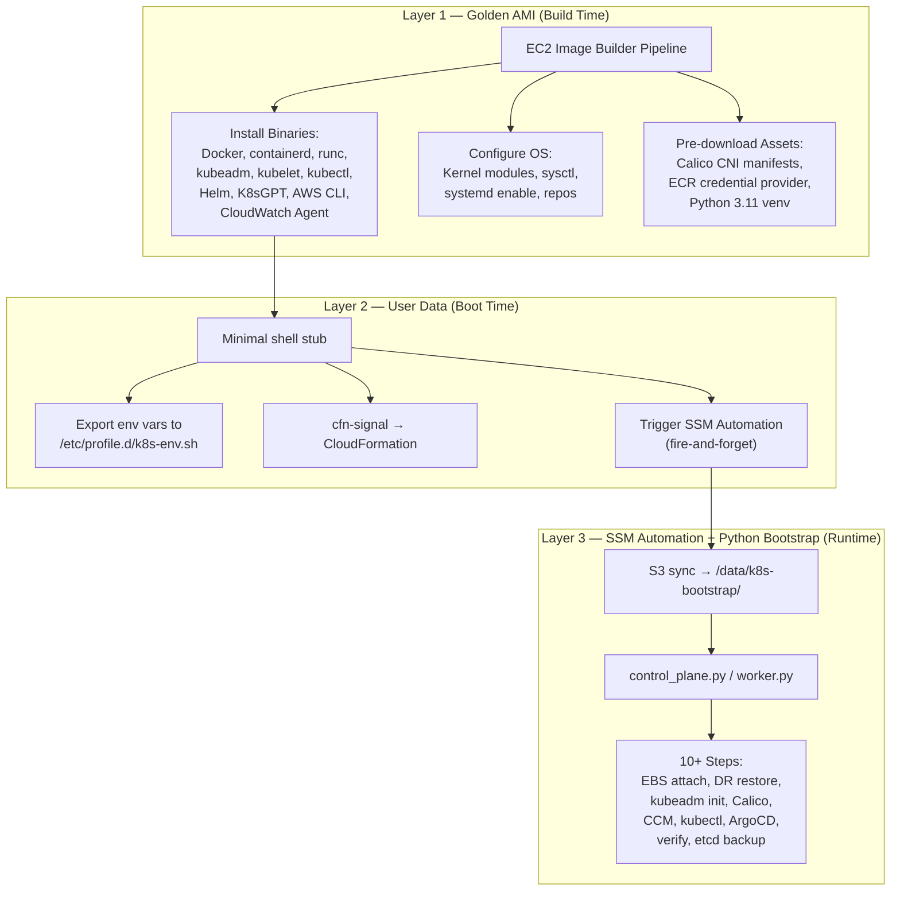
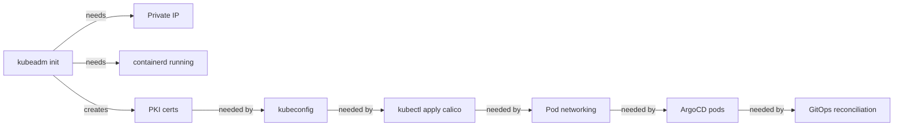
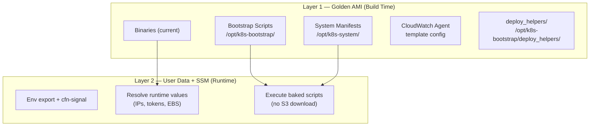

# Golden AMI & Control-Plane Bootstrap — Architectural Review

> **Scope:** [golden-ami-stack.ts](file:///Users/nelsonlamounier/Desktop/portfolio/cdk-monitoring/infra/lib/stacks/kubernetes/golden-ami-stack.ts), [golden-ami-image.ts](file:///Users/nelsonlamounier/Desktop/portfolio/cdk-monitoring/infra/lib/constructs/compute/constructs/golden-ami-image.ts), [build-golden-ami-component.ts](file:///Users/nelsonlamounier/Desktop/portfolio/cdk-monitoring/infra/lib/constructs/compute/utils/build-golden-ami-component.ts), [kubernetes-app/](file:///Users/nelsonlamounier/Desktop/portfolio/cdk-monitoring/kubernetes-app), [k8s-bootstrap/](file:///Users/nelsonlamounier/Desktop/portfolio/cdk-monitoring/kubernetes-app/k8s-bootstrap)

---

## 1. Current Architecture Overview

Your bootstrap architecture follows a **3-layer design**:



---

## 2. Responsibility Matrix — Who Handles What?

| Concern | Layer 1: Golden AMI | Layer 2: User Data | Layer 3: SSM/Bootstrap | Notes |
|---|---|---|---|---|
| **Operating System** | ✅ Base AL2023 + `dnf update` + kernel modules (`overlay`, `br_netfilter`), sysctl | ❌ | ❌ | OS is fully baked. No runtime patching. |
| **Application Stack** | ✅ Binary installation only (containerd, kubeadm, kubelet, kubectl, Docker, Helm) | ❌ | ✅ `kubeadm init`, Calico apply, CCM Helm install, ArgoCD deploy | **Split concern:** AMI installs tools, bootstrap *runs* them. |
| **Configuration** | ⚠️ Partial — containerd `config.toml`, ECR credential provider config, repos | ✅ Env vars exported, cfn-signal | ✅ kubeadm configs, kubelet args, DNS records, kubeconfig distribution, RBAC | Heaviest layer. ~1,917 lines in `control_plane.py` alone. |
| **Security Patches** | ✅ `dnf update -y` during Image Builder build | ❌ | ❌ | Patches are frozen at AMI bake time. No runtime patching. |
| **Dependencies** | ✅ All binaries + Python venv (`boto3`, `pyyaml`, `kubernetes`, `bcrypt`) | ❌ | ⚠️ Downloads bootstrap scripts from S3 at every boot | Scripts are fetched at runtime, not baked. |

> [!IMPORTANT]
> **Key finding:** The AMI handles the **static infrastructure layer** (OS + binaries), but the entire **Kubernetes cluster lifecycle** — from `kubeadm init` through ArgoCD — is deferred to Layer 3 runtime scripts. This is an intentional design choice, but it creates a large runtime dependency footprint.

---

## 3. Why the AMI Does NOT Handle Full Cluster Bootstrap

### 3.1 Fundamental Constraint: Instance-Specific State

The AMI is a **generic, immutable image** shared across all nodes (control plane + workers). Cluster initialisation requires **instance-specific runtime values** that cannot be baked:

| Runtime Value | Source | Why It Can't Be Baked |
|---|---|---|
| Private IP address | EC2 IMDS | Changes on every ASG replacement |
| kubeadm join token | SSM Parameter | Rotated every 20 hours |
| Route 53 DNS record | API call | Points to current instance IP |
| API server certificate SANs | kubeadm certs | Must include current IPs |
| EBS volume device name | NVMe enumeration | Varies per Nitro instance |
| etcd data | Persistent EBS volume | Survives instance replacement |

### 3.2 The Bootstrap-Time Chicken-and-Egg Problem



Every step depends on the previous one's output. The AMI can pre-install the *tools*, but the *orchestration sequence* — with its branching DR/fresh-boot logic — must run live.

### 3.3 DR Reconstruction Branching

The control plane has two distinct boot paths ([control_plane.py:L647-L786](file:///Users/nelsonlamounier/Desktop/portfolio/cdk-monitoring/kubernetes-app/k8s-bootstrap/boot/steps/control_plane.py#L647-L786)):

1. **Fresh boot** → `_init_cluster()` → full `kubeadm init`
2. **ASG replacement (DR)** → `_handle_second_run()` → `_reconstruct_control_plane()` from restored PKI

This branching logic requires runtime state detection (does `admin.conf` exist? is the API server responding?), which is fundamentally incompatible with a static AMI.

---

## 4. Gap Analysis

### Gap 1: Bootstrap Scripts Downloaded at Runtime from S3

> [!WARNING]
> **Risk:** Every boot depends on S3 availability and script integrity. A corrupt S3 upload or network partition during boot causes a silent failure.

**Current flow:**
```
User Data → S3 sync → /data/k8s-bootstrap/ → python3 control_plane.py
```

**Files involved:**
- [s3_sync.py](file:///Users/nelsonlamounier/Desktop/portfolio/cdk-monitoring/kubernetes-app/k8s-bootstrap/boot/steps/cp/s3_sync.py) — Step 6 downloads manifests
- [user-data-builder.ts](file:///Users/nelsonlamounier/Desktop/portfolio/cdk-monitoring/infra/lib/constructs/compute/builders/user-data-builder.ts) — SSM trigger fires script download
- [automation-document.ts](file:///Users/nelsonlamounier/Desktop/portfolio/cdk-monitoring/infra/lib/constructs/ssm/automation-document.ts) — SSM document syncs from S3

**Impact:** If the bootstrap Python scripts were baked into the AMI at `/opt/k8s-bootstrap/`, you would:
- Eliminate the S3 runtime dependency for the core orchestrator
- Make boot deterministic — the scripts and the binaries are version-locked in the same AMI
- Reduce boot time by ~5-10s (S3 sync latency)

---

### Gap 2: System Manifests Not Baked

The `system/` directory contains critical Day-1 manifests:

| Manifest | Currently | Gap |
|---|---|---|
| `system/argocd/install.yaml` (~1.8MB) | Downloaded from S3 at boot | Could be baked at `/opt/k8s-system/argocd/` |
| `system/traefik/traefik-values.yaml` | Downloaded from S3 at boot | Could be baked |
| `system/cert-manager/*.yaml` | Downloaded from S3 at boot | Could be baked |
| `system/dr/*.sh` | Downloaded from S3 at boot | Could be baked |
| `system/priority-classes.yaml` | Downloaded from S3 at boot | Could be baked |
| Calico manifests | ✅ Already baked at `/opt/calico/` | No gap |

The Calico manifests are already baked via [PreloadCalicoCNI](file:///Users/nelsonlamounier/Desktop/portfolio/cdk-monitoring/infra/lib/constructs/compute/utils/build-golden-ami-component.ts#L263-L274) — this pattern should be extended to **all** Day-1 manifests.

---

### Gap 3: The `control_plane.py` Monolith

[control_plane.py](file:///Users/nelsonlamounier/Desktop/portfolio/cdk-monitoring/kubernetes-app/k8s-bootstrap/boot/steps/control_plane.py) is a 1,917-line consolidated file that duplicates most of the logic in the modular `cp/` steps:

| Module | Lines | `control_plane.py` duplicates? |
|---|---|---|
| `cp/__init__.py` | 62 | ✅ Calls modular steps |
| `cp/kubeadm_init.py` | 826 | ⚠️ `control_plane.py` has its own `_init_cluster()` (lines 788-1917) |
| `cp/dr_restore.py` | 158 | ⚠️ `control_plane.py` has `_handle_second_run()` |
| `cp/calico.py` | 190 | ⚠️ Duplicated inline |

**Impact:** Two parallel execution paths exist:
- **Modular path:** `cp/__init__.py` → `cp/*.py` (the intended future)
- **Monolith path:** `control_plane.py` → inline functions (the current SSM entry point)

The SSM Automation still calls `python3 control_plane.py`, which runs the monolithic code, **not** the clean modular `cp.main()`.

---

### Gap 4: No AMI Versioning in CloudWatch/SSM Tags

The current AMI tags ([golden-ami-stack.ts:L143-L147](file:///Users/nelsonlamounier/Desktop/portfolio/cdk-monitoring/infra/lib/stacks/kubernetes/golden-ami-stack.ts#L143-L147)):

```typescript
amiTags: {
    'Purpose': 'GoldenAMI',
    'KubernetesVersion': configs.cluster.kubernetesVersion,
    'Component': 'ImageBuilder',
},
```

**Missing tags:**
- `ContainerdVersion` — critical for diagnosing CRI issues
- `CalicoVersion` — critical for CNI debugging
- `BootstrapScriptsVersion` — if scripts are baked, tracks which version is on the AMI
- `BuildDate` — the distribution config has it in the name but not as a queryable tag

---

### Gap 5: CloudWatch Agent Config Deferred to Runtime

[build-golden-ami-component.ts:L122-L133](file:///Users/nelsonlamounier/Desktop/portfolio/cdk-monitoring/infra/lib/constructs/compute/utils/build-golden-ami-component.ts#L122-L133) installs the binary but defers config:

```yaml
# The agent config is NOT baked into the AMI — boot step
# 08_install_cloudwatch_agent.py writes the final config at runtime
# with the correct LOG_GROUP_NAME resolved from the environment.
```

**Why this is a gap:** The `LOG_GROUP_NAME` is deterministic from the environment (it's `${namePrefix}-bootstrap-logs`). A template config could be baked with a `__LOG_GROUP_NAME__` placeholder, and a single `sed` at boot would resolve it — eliminating the runtime Python dependency for CW agent setup.

---

### Gap 6: `deploy_helpers/` runtime dependency

The [deploy_helpers/](file:///Users/nelsonlamounier/Desktop/portfolio/cdk-monitoring/kubernetes-app/k8s-bootstrap/deploy_helpers) package (`bff.py`, `k8s.py`, `ssm.py`, `s3.py`, `runner.py`) provides application deployment utilities used by SSM RunCommand scripts. These are downloaded from S3 at runtime and are **not** baked into the AMI.

---

## 5. AMI-First Migration Proposal

### Goal

Shift the bootstrap architecture from a **3-layer** to a **2-layer** model:



### What Changes

| Item | Current | Proposed | Files Impacted |
|---|---|---|---|
| Bootstrap scripts | S3 → `/data/k8s-bootstrap/` | Baked → `/opt/k8s-bootstrap/` | [build-golden-ami-component.ts](file:///Users/nelsonlamounier/Desktop/portfolio/cdk-monitoring/infra/lib/constructs/compute/utils/build-golden-ami-component.ts), [automation-document.ts](file:///Users/nelsonlamounier/Desktop/portfolio/cdk-monitoring/infra/lib/constructs/ssm/automation-document.ts) |
| System manifests | S3 → `/data/k8s-bootstrap/system/` | Baked → `/opt/k8s-system/` | [build-golden-ami-component.ts](file:///Users/nelsonlamounier/Desktop/portfolio/cdk-monitoring/infra/lib/constructs/compute/utils/build-golden-ami-component.ts), [argocd.py](file:///Users/nelsonlamounier/Desktop/portfolio/cdk-monitoring/kubernetes-app/k8s-bootstrap/boot/steps/cp/argocd.py) |
| `control_plane.py` monolith | Active SSM entry point | **DELETE** — replaced by `cp.main()` | [control_plane.py](file:///Users/nelsonlamounier/Desktop/portfolio/cdk-monitoring/kubernetes-app/k8s-bootstrap/boot/steps/control_plane.py), SSM document |
| `worker.py` monolith | Active SSM entry point | **DELETE** — replaced by `wk.main()` | [worker.py](file:///Users/nelsonlamounier/Desktop/portfolio/cdk-monitoring/kubernetes-app/k8s-bootstrap/boot/steps/worker.py), SSM document |
| S3 sync step (Step 6) | Downloads scripts at boot | **DELETE** — scripts already on disk | [s3_sync.py](file:///Users/nelsonlamounier/Desktop/portfolio/cdk-monitoring/kubernetes-app/k8s-bootstrap/boot/steps/cp/s3_sync.py) |
| CW agent config | Runtime Python script | Baked template + `sed` at boot | [common.py](file:///Users/nelsonlamounier/Desktop/portfolio/cdk-monitoring/kubernetes-app/k8s-bootstrap/boot/steps/common.py) |
| AMI tags | 3 tags | 6+ tags (versions, build date) | [golden-ami-stack.ts](file:///Users/nelsonlamounier/Desktop/portfolio/cdk-monitoring/infra/lib/stacks/kubernetes/golden-ami-stack.ts#L143-L147) |

### What Does NOT Change

| Item | Reason |
|---|---|
| `kubeadm init` / `kubeadm join` | Instance-specific (IP, tokens) — must run live |
| DR restore branching | Requires runtime state detection |
| DNS record updates | Instance-specific IP |
| SSM parameter publishing | Instance-specific values |
| etcd backup timer | Already idempotent, runs post-boot |
| ArgoCD orchestration | Requires live cluster API |

---

## 6. Implementation Plan (Phased)

### Phase 1: Bake Bootstrap Scripts into AMI

Add a new Image Builder step in [build-golden-ami-component.ts](file:///Users/nelsonlamounier/Desktop/portfolio/cdk-monitoring/infra/lib/constructs/compute/utils/build-golden-ami-component.ts) to copy the `boot/` and `system/` directories into the AMI:

```yaml
- name: BakeBootstrapScripts
  action: ExecuteBash
  inputs:
    commands:
      - |
        # Bake bootstrap scripts into the AMI
        # Version-locked to the same commit as the AMI binaries
        mkdir -p /opt/k8s-bootstrap /opt/k8s-system
        
        # Scripts are uploaded to S3 by CDK BucketDeployment,
        # then downloaded during Image Builder build (not at boot)
        aws s3 sync s3://${SCRIPTS_BUCKET}/k8s-bootstrap/boot/ /opt/k8s-bootstrap/boot/
        aws s3 sync s3://${SCRIPTS_BUCKET}/k8s-bootstrap/system/ /opt/k8s-system/
        aws s3 sync s3://${SCRIPTS_BUCKET}/k8s-bootstrap/deploy_helpers/ /opt/k8s-bootstrap/deploy_helpers/
        
        chmod -R +x /opt/k8s-bootstrap/
        echo "Bootstrap scripts baked into AMI at /opt/k8s-bootstrap/"
```

### Phase 2: Delete Monolith Entry Points

1. **Delete** [control_plane.py](file:///Users/nelsonlamounier/Desktop/portfolio/cdk-monitoring/kubernetes-app/k8s-bootstrap/boot/steps/control_plane.py) (1,917 lines)
2. **Delete** [worker.py](file:///Users/nelsonlamounier/Desktop/portfolio/cdk-monitoring/kubernetes-app/k8s-bootstrap/boot/steps/worker.py) (641 lines)
3. **Update** [orchestrator.py](file:///Users/nelsonlamounier/Desktop/portfolio/cdk-monitoring/kubernetes-app/k8s-bootstrap/boot/steps/orchestrator.py) to import from `cp` and `wk` directly
4. **Update** SSM Automation document to call `python3 /opt/k8s-bootstrap/boot/steps/orchestrator.py`

### Phase 3: Remove S3 Download Step

1. **Delete** [s3_sync.py](file:///Users/nelsonlamounier/Desktop/portfolio/cdk-monitoring/kubernetes-app/k8s-bootstrap/boot/steps/cp/s3_sync.py)
2. **Update** [cp/__init__.py](file:///Users/nelsonlamounier/Desktop/portfolio/cdk-monitoring/kubernetes-app/k8s-bootstrap/boot/steps/cp/__init__.py) to remove `step_sync_manifests`
3. **Update** paths in `argocd.py`, `calico.py` etc. to reference `/opt/k8s-system/` instead of `/data/k8s-bootstrap/system/`

### Phase 4: Enrich AMI Tags

Update [golden-ami-stack.ts](file:///Users/nelsonlamounier/Desktop/portfolio/cdk-monitoring/infra/lib/stacks/kubernetes/golden-ami-stack.ts#L143-L147):

```typescript
amiTags: {
    'Purpose': 'GoldenAMI',
    'KubernetesVersion': configs.cluster.kubernetesVersion,
    'ContainerdVersion': configs.image.bakedVersions.containerd,
    'CalicoVersion': configs.image.bakedVersions.calico,
    'HelmVersion': 'latest',
    'K8sGPTVersion': configs.image.bakedVersions.k8sgpt,
    'Component': 'ImageBuilder',
    'BootstrapBaked': 'true',
},
```

---

## 7. Files to Remove After Migration

| File | Lines | Reason |
|---|---|---|
| [control_plane.py](file:///Users/nelsonlamounier/Desktop/portfolio/cdk-monitoring/kubernetes-app/k8s-bootstrap/boot/steps/control_plane.py) | 1,917 | Monolith duplicate of `cp/*.py` |
| [worker.py](file:///Users/nelsonlamounier/Desktop/portfolio/cdk-monitoring/kubernetes-app/k8s-bootstrap/boot/steps/worker.py) | 641 | Monolith duplicate of `wk/*.py` |
| [s3_sync.py](file:///Users/nelsonlamounier/Desktop/portfolio/cdk-monitoring/kubernetes-app/k8s-bootstrap/boot/steps/cp/s3_sync.py) | 81 | S3 download replaced by baked scripts |
| **Total removed** | **~2,639 lines** | |

---

## 8. Risk Assessment

| Risk | Mitigation |
|---|---|
| AMI rebuild required for every bootstrap script change | ✅ Already the case today for binary changes. CI pipeline rebuilds AMI automatically. Content-hash versioning in Image Builder handles this. |
| Stale scripts on running instances | ⚠️ Existing instances keep the baked version until ASG replacement. This is identical to how binary updates work today. |
| S3 still needed for DR backups | ✅ DR backup/restore uses S3 for etcd snapshots, which is orthogonal to bootstrap scripts. |
| Larger AMI size | ⚠️ `system/argocd/install.yaml` is ~1.8MB. Total scripts are ~5MB. Negligible vs the 8GB root volume. |

---

## 9. Summary

Your Golden AMI implementation is **well-architected for its stated scope** — it cleanly separates the generic Image Builder construct from K8s-specific domain logic, uses content-hash versioning, and validates installations thoroughly.

The primary gap is that the AMI stops at **binary installation** and defers the entire orchestration layer to runtime S3 downloads. By baking the bootstrap scripts and Day-1 manifests into the AMI, you:

1. **Eliminate** the S3 runtime dependency for the core bootstrap path
2. **Version-lock** scripts to AMI binaries (no drift between containerd 1.7.24 and its bootstrap logic)
3. **Remove** ~2,639 lines of monolithic duplicate code (`control_plane.py` + `worker.py`)
4. **Simplify** Step 6 (S3 sync) out of the control plane bootstrap entirely
5. **Reduce** boot time by eliminating the S3 download step

The `kubeadm init`, DR branching, DNS updates, and SSM parameter publishing **must** remain runtime operations — they are inherently instance-specific and cannot be baked.
